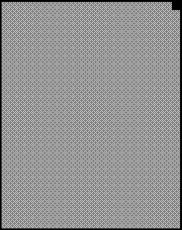
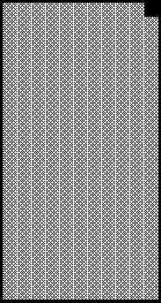
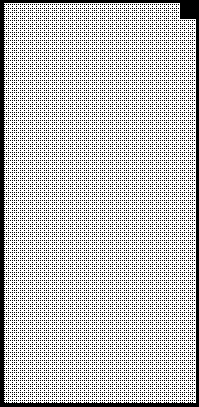

2020 HUNGARIAN GRAND PRIX

16 - 19 July 2020

From The FIA Formula One Race Director Document 31

To All Teams, All Officials Date 19 July 2020

Time 11:38

Title Race Directors' Note - Podium Procedure and Post Race Interviews

Description Podium Procedure and Interviews

Enclosed 2020 Hungarian F1 Grand Prix - Podium Procedure Doc 31 190720.pdf

Michael Masi

The FIA Formula One Race Director

2020 H G P UNGARIAN RAND RIX

16 – 19 July 2020

From The FIA Formula One Race Director Document 31

To All Teams, All Officials Date 19 July 2020

Time 11:40

In addition to the provisions of the 2020 Formula One Sporting Regulations – Appendix 3 Podium

Ceremony, as this is a Closed Event the Podium Ceremony procedure detailed below must be followed.

Podium Ceremony and Post Race Interview Procedure:

• The master of ceremonies will be appointed by the FIA to conduct and take responsibility for the

entire podium ceremony.

• Drivers who finish the race in the top three positions will be required to return to Pit Lane, where they

will find the boards showing positions from 1,2 3 located in front of the FIA Garages.

• Other than the team mechanics (with cooling fans if necessary), officials and FIA pre-approved

television crews and the three FIA approved photographers, no one else will be allowed in the

designated area at this time (no driver physios nor team PR personnel).

• Once out of their cars, the top three Drivers will be weighed by the FIA near their cars. Each Driver

must remain fully attired until after they have been weighed (e.g: Helmet, Gloves, etc).

• After the Drivers have been weighed, the post-race interviews will take place in this designated area,

and the interviewer will be Martin Brundle.

• Drivers must not interfere with Parc Fermé protocols in any way.

• During this time, team members of the top three drivers will be permitted to access their allocated

areas in the Pit Lane.

• Once the interviews have been completed, the cool down area where water and towels will be

positioned for each Driver will be located in the vicinity of the F1 Pit Lane Garage. No other drinks

are permitted in the Parc Fermé area.

• Each Driver will be given their Pirelli Caps which will also contain a Medical Face Mask both of which

must be worn during the Podium Ceremony.

• The drivers will then be escorted to the 1st Floor of the Race Control Building to the permanent

Podium area where the 1, 2, 3 Rostrum and Dias will be located.

• When the Drivers are ready, an announcement for the Podium Ceremony will take place with the 2nd

and 3rd placed Drivers introduced to move to their respective Podium Dias steps.

• The Winning Constructor representative be announced and will move to their step in the Pit Lane

and the Winning car will be pushed by a maximum of four team members into the winning car location

in front of they LED screen.

• The Winning Driver will then be announced who will move to his position on the Podium.

• The National Anthems will then take place and flags will be displayed.

• The Trophy Presentations will take place in the following order however no dignitaries will be

involved:

o Winning Driver (On the Podium)

o A representative of the Winning Constructor (In the Pit Lane)

o 2nd Place Driver (On the Podium)

o 3rd Place Driver (On the Podium)

1/2

• The Champagne Celebrations will the take place.

• Following the Podium Ceremony, the top three drivers will be escorted by the FIA Media Delegate

to the TV pen located in the Paddock behind the Race Control Building and where they may be

accompanied by their press officers.

• At the end of the TV pen, the top three drivers will go to the FIA Press Conference, located on the

2nd floor of the Race Control Building.

• Parc Fermé for all finishers outside of the top three will be located at the Pit Entry.

• Drivers classified from 4th and beyond must proceed directly to the TV pen immediately after they

have been weighed in the Parc Fermé, located in the FIA garage. Each Driver must remain fully

attired until after they have been weighed (e.g: Helmet, Gloves, etc).

• Drivers who retired during the race are required to go to the TV pen as soon as they have come back

into the paddock.

Please see the attached Post Race Podium Ceremony and Parc Fermé Diagram.

2/2

ecaR

0202 - emreF yluJ 81– 1 noisreV craP gniniameR srehsinif s’rehpargotohP aera ecneF ereh

gnitiaw

0 xirP

dnarG 1

scinahcem

nairagnuH

x 4

0202

dr dn 3 2 ts 1

)pordkcab e muidoP c n sa( e neercS F s’rehpargotohP

DEL

rotcurtsnoC gninniW

reweivretnI

pordkcaB

ecneF
