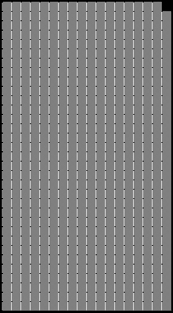
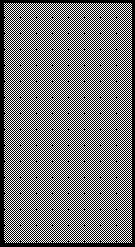
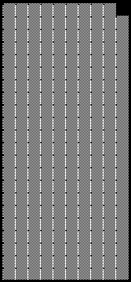
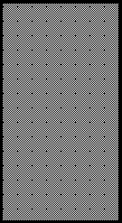
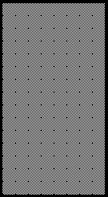

2020 STYRIAN GRAND PRIX

9 - 12 July 2020

From The FIA Formula One Race Director Document 36

To All Teams, All Officials Date 12 July 2020

Time 10:47

Title Race Directors Note - Post Race Podium Procedure

Description Post Race Podium Procedure

Enclosed 2020 Styrian F1 Grand Prix Post Race Podium Procedure DOC 36 120720.pdf

Michael Masi

The FIA Formula One Race Director

2020 S G P TYRIAN RAND RIX

9 – 12 July 2020

From The FIA Formula One Race Director Document 36

To Formula One Team Managers Date 12 July 2020

Time 10:50

In addition to the provisions of the 2020 Formula One Sporting Regulations – Appendix 3 Podium

Ceremony, as this is a Closed Event the Podium Ceremony procedure detailed below must be followed.

Podium Ceremony and Post Race Interview Procedure:

• The master of ceremonies will be appointed by the FIA to conduct and take responsibility for the

entire podium ceremony.

• Drivers who finish the race in the top three positions will be required to return to Pit Lane, where they

will find the boards showing positions from 1,2 3 located in front of the FIA Garages.

• Other than the team mechanics (with cooling fans if necessary), officials and FIA pre-approved

television crews and the three FIA approved photographers, no one else will be allowed in the

designated area at this time (no driver physios nor team PR personnel).

• Once out of their cars, the top three Drivers will be weighed by the FIA near their cars. Each Driver

must remain fully attired until after they have been weighed (e.g: Helmet, Gloves, etc)

• After the Drivers have been weighed, the post-race interviews will take place in this designated area,

and the interviewer will be Martin Brundle.

• Drivers must not interfere with Parc Fermé protocols in any way.

• During this time, team members of the top three drivers will be permitted to access their allocated

areas on the Track.

• Once the interviews have been completed the cool down area where water and towels will be

positioned for each Driver will be located in the FIA Garages. No other drinks are permitted in the

Parc Fermé area.

• Each Driver will be given their Pirelli Caps which will also contain a Medical Face Mask both of which

must be worn during the Podium Ceremony.

• The drivers will then be escorted to the gate in the pit wall. The 1, 2, 3 Rostrum and Dias will be

located on the Track.

• When the Drivers are ready, an announcement for the Podium Ceremony will take place which each

Driver introduced to move to their respective Podium Dias steps.

• The National Anthems will then take place and flags will be displayed.

• The Trophy Presentations will take place in the following order however no dignitaries will be

involved:

o Winning Driver

o A representative of the Winning Constructor

o 2nd Place Driver

o 3rd Place Driver

• The Champagne Celebrations will the take place.

1/2

• Following the Podium Ceremony, the top three drivers will be escorted by the FIA Media Delegate

to the TV pen at the Pit Entry end of the Paddock behind the Race Control Building and where they

may be accompanied by their press officers.

• At the end of the TV pen, the top three drivers will go to the FIA Press Conference, located on the

ground floor of the Media Centre Building, using the tunnel underneath the pit building.

• Parc Fermé for all finishers outside of the top three will be located at the Pit Entry.

• Drivers classified from 4th and beyond must proceed directly to the TV pen immediately after they

have been weighed in the Parc Fermé, located in the FIA garage. Each Driver must remain fully

attired until after they have been weighed (e.g: Helmet, Gloves, etc).

• Drivers who retired during the race are requested to go to the TV pen as soon as they have come

back into the paddock.

Please see the attached Post Race Podium Ceremony and Parc Fermé Diagram.

2/2

ecaR

0202 srehsinif - yluJ emreF ereh 11– 1 noisreV gniniameR dekrap craP

llaW

tiP

dn dr 2 ts 3 1 xirP

dnarG namaremaC reweivretnI FR VT

nairytS

srebmem

dn2 maet

0202

dn s’rehpargotohP 2

srebmem gninniW ts 1 maet

dr 3

srebmem

dr3 maet

aera

gnitiaw

srehpargotohP
