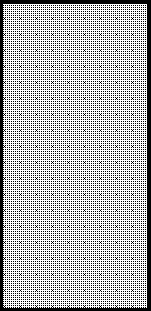
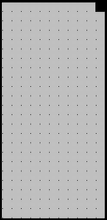

2020 TUSCAN GRAND PRIX

10 - 13 September 2020

From The FIA Formula One Race Director Document 32

To All Teams, All Officials Date 13 September 2020

Time 12:29

Title Race Directors' Note - Podium Procedure and Post Race Interviews

Description Podium Procedure and Post Race Interviews

Enclosed 2020 Tuscan F1 Grand Prix Post Race Procedure & Podium Ceremony Doc 32 130920.pdf

Michael Masi

The FIA Formula One Race Director

2020 T G P USCAN RAND RIX

10 - 13 September 2020

From The FIA Formula One Race Director Document 32

To All Teams, All Officials Date 13 September 2020

Time 12:30

In addition to the provisions of the 2020 Formula One Sporting Regulations – Appendix 3 Podium

Ceremony, as this is a Closed Event the Podium Ceremony procedure detailed below must be followed.

Podium Ceremony and Post Race Interview Procedure:

• The master of ceremonies will be appointed by the FIA to conduct and take responsibility for the

entire podium ceremony.

• Drivers who finish the race in the top three positions will be required to stay on the track and proceed

to the Pirelli Bridge, where they will find the boards showing positions from 1, 2, 3 located underneath

the start lights.

• Other than officials and FIA pre-approved television crews and the three FIA approved

photographers, no one else will be allowed on the track.

• Once out of their cars, the top three Drivers should wave to the crowd and must then proceed to the

pit wall gate opposite the podium into the interview area where they will be weighed by the FIA. Each

Driver must remain fully attired until after they have been weighed (e.g.: Helmet, Gloves, etc.).

• After the Drivers have left the track, mechanics will be permitted to put cooling fans into the cars and

they need to push their cars directly to the Parc Fermé using the track and through the pit wall gate

adjacent to grid position 26, opposite the FIA weighbridge.

• After the Drivers have been weighed, the post-race interviews will take place in this designated area,

and the interviewer will be David Coulthard.

• Drivers must not interfere with Parc Fermé protocols in any way.

• During this time, team members of the top three drivers will be permitted to access their allocated

areas in the Pit Lane.

• Once the interviews have been completed, the cool down area, where water and towels will be

positioned for each Driver, will be located underneath the podium. No other drinks are permitted in

the Parc Fermé area.

• Each Driver will be given their Pirelli Caps which will also contain a Medical Face Mask both of which

must be worn during the Podium Ceremony.

• The drivers will then be escorted to the permanent Podium area where the 1, 2, 3 Rostrum and Dias

will be located.

• When the Drivers are ready, an announcement for the Podium Ceremony will take place with the 2nd

and 3rd placed Drivers introduced to move to their respective Podium Dias steps.

• The Winning Constructor representative be announced and will move to their position on the podium.

• The Winning Driver will then be announced who will move to his position on the Podium.

• The National Anthems will then take place and flags will be displayed.

• The Trophy Presentations will take place in the following order however no dignitaries will be

involved:

1/3

o Winning Driver (On the Podium)

o A representative of the Winning Constructor (On the Podium)

o 2nd Place Driver (On the Podium)

o 3rd Place Driver (On the Podium)

• The Champagne Celebrations will the take place.

• Following the Podium Ceremony, the top three drivers will be escorted using a shuttle bus by the

FIA Media Delegate to the TV pen located at the Pit Entry end of the Formula 1 Paddock behind the

Race Control Building and where they may be accompanied by their press officers.

• At the end of the TV pen, the top three drivers will go to the FIA Press Conference, again via shuttle

bus, located on the second floor at the pit exit end of the pit building.

• Parc Fermé for all finishers outside of the top three will be located at the Pit Entry.

• Drivers classified from 4th and beyond must proceed directly to the TV pen immediately after they

have been weighed in the Parc Fermé, located in the FIA garage. Each Driver must remain fully

attired until after they have been weighed (e.g.: Helmet, Gloves, etc.).

• Drivers who retired during the race are required to go to the TV pen as soon as they have come back

into the paddock.

Please see the attached Post Race Podium Ceremony and Parc Fermé Diagram.

Michael Masi

FIA Formula One Race Director

2/3

ecaR 0202

- rebmetpeS emreF

21– 2 craP noisreV

llaW

tiP

xirP s’rehpargotohP aera devorppA

1F gnitiaw dnarG muidoP pordkcaB namaremaC e FR c n e VT nacsuT sthgiL tratS F

sthgiL tratS ecneF

ts dn 1 dr 0202 2 3

llaW

tiP

srac egaraG

gniniameR

AIF

ta
