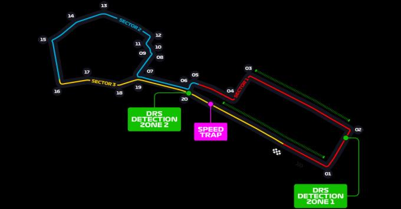
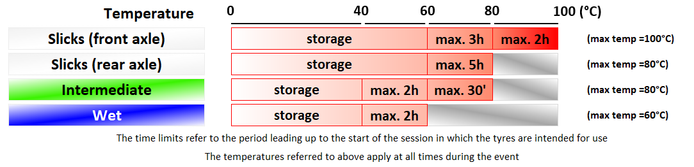

2021 AZERBAIJAN GRAND PRIX

3 - 6 June 2021

From The FIA Formula One Race Director Document 19

To All Teams, All Officials Date 05 June 2021

Time 10:57

Title Race Directors' Event Notes Version 4

Description Event Notes Version 4

Enclosed 2021 Azerbaijan F1 Grand Prix Event Notes Version 4 Doc 19.pdf

Michael Masi

The FIA Formula One Race Director

2021 A G P ZERBAIJAN RAND RIX

3 – 6 June 2021

From The FIA Formula One Race Director Document 19

To All Teams, All Officials Date 5 June 2021

Time 10:55

EVENT NOTES VERSION 4 General Instructions

1) Pit lane map

1.1 Safety Car lines.

1.2 The location of the pit entry and the pit exit.

1.3 Designated garage areas.

1.4 Safety Car position for first lap and rest of race.

1.5 Blue flag marshal at the pit exit.

1.6 Track light panels displaying pit entry status.

2) Pirelli Event Preview (UPDATED PREVIEW ATTACHED)

2.1 With reference to Article 24.4(a) of the Sporting Regulations see the attached updated document provided by the official tyre supplier.

3) Red zones for photographers in the pit lane during practice sessions

3.1 See the attached drawing.

4) Track light panels

4.1 The FIA track light panels have been installed in the positions shown on the circuit map. In accordance with Appendix H to the ISC the light signals have the same meaning as flag signals.

5) Track light panel displaying pit entry status

5.1 The light panel indicated on the pit lane map will display a flashing yellow arrow if cars are required to use the pit lane once the Safety Car has been deployed during the race.

5.2 The light panel indicated on the pit lane map will display a flashing red cross if the pit lane is closed at any point during the race.

6) Drivers leaving their pit stop position in the pit lane

6.1 For safety reasons, no car should be driven from its pit stop position at any time unless:

a) It has first been driven into the pit stop position having just entered the pit lane from the track,

and;

b) It is then driven immediately back onto the track from the pit stop position.

1/6

7) Observing yellow flags during free practice and qualifying

7.1 Double waved: Any driver passing through a double waved yellow marshalling sector must reduce speed significantly and be prepared to change direction or stop. In order for the stewards to be

satisfied that any such driver has complied with these requirements it must be clear that he has not

attempted to set a meaningful lap time, for practical purposes this means the driver should abandon

the lap (this does not necessarily mean he has to pit as the track could well be clear the following

lap).

7.2 Single waved: Drivers should reduce their speed and be prepared to change direction. It must be clear that a driver has reduced speed and, in order for this to be clear, a driver would be expected

to have braked earlier and/or discernibly reduced speed in the relevant marshalling sector.

Drivers should not overtake any car in a single waved yellow marshalling sector unless it is clear that

a car is slowing with a completely obvious problem, e.g. obvious accident damage or a deflated tyre.

8) In laps during qualifying and reconnaissance laps

8.1 In order to ensure that cars are not driven unnecessarily slowly on in laps during and after the end of qualifying or during reconnaissance laps when the pit exit is opened for the race, drivers must stay

below the maximum time set by the FIA between the Safety Car lines shown on the pit lane map.

You will be informed of the maximum time after the first day of practice.

9) Parc Fermé Cameras

9.1 To assist with the revised FIA Event procedures, the Parc Fermé cameras must be uncovered and operational at all times during the Event.

10) Operational personnel curfew

10.1 Boards warning anyone attempting to enter the paddock that the curfew is in operation will be placed immediately before the turnstiles at the appropriate times.

10.2 At this Event, Personnel will be permitted to enter the Paddock 30 minutes prior to the curfew to assist social distancing. No work is permitted to be undertaken until the curfew has ended.

11) Tyre Blanket Usage during Pit Stops in the Race

11.1 For reasons of safety, tyre blankets are not permitted in the Pit Lane at any time during the race.

12) Lapping during the race

12.1 The ISC requires drivers who are caught by another car about to lap him to allow the faster driver past at the first available opportunity. The F1 Marshalling System has been developed in order to

ensure that the point at which a driver is shown blue flags is consistent, rather than trusting the ability

of marshals to identify situations that require blue flags.

As it was at the end of last season the system will be set to give a pre-warning when the faster car

is within 3.0s of the car about to be lapped, this should be used by the team of the slower car to warn

their driver he is soon going to be lapped and that allowing the faster car through should be

considered a priority. When the faster car is within 1.2s of the car about to be lapped blue flags will

be shown to the slower car (in addition to blue light panels, blue cockpit lights and a message on the

timing monitors) and the driver must allow the following driver to overtake at the first available

opportunity.

It should be noted that the aim of using F1MS is to ensure consistent application of the rules,

additional instructions may also be given by race control when necessary.

2/6

Event Specific Instructions

13) Formula 1 Sporting Regulations Article 21.6

13.1 In accordance with the provisions of Article 21.6a) i), this Event is a Closed Event.

14) Changes to the circuit

14.1 The barrier and Tecpro separating the pit lane exit and the track has been extended by approximately 20m.

14.2 The right-hand vehicle opening opposite the pit exit has been realigned to run more parallel to the track edge.

14.3 A Barrier has been installed in front of the Pit Lane Garage Complex at the pit exit.

14.4 The left-hand wall at the entry to Turn 2 has been realigned closer to the track edge line.

14.5 The left-hand wall at the entry to Turn 3 has been realigned closer to the track edge line.

14.6 The right-hand wall at the entry to Turn 4 has been realigned closer to the track edge line.

14.7 The Tecpro barrier configuration at the exit of Turn 5 has been upgraded.

14.8 The opening in the communal debris fence between Turn 6-7 and Turn 19-20 have been closed.

14.9 The apex kerb at Turn 8 has been removed and replaced with a painted kerb.

14.10 The painted kerb at the exit of Turn 12 has been removed.

15) Specific Technical Procedures for Closed Events

15.1 The provisions of Technical Directive Ref: TD012 Issue A and TD003 Issue B must be complied with at all times during the Event.

15.2 Any tyres that are removed from a car and could be re-used during a session should be presented for scanning before being rewrapped and reheated. If time constraints do not permit this then all

tyres used during a session must be presented to the tyre checker at the front of the garage at the

end of any session. This applies to dry, wet and intermediate tyres.

15.3 Both TD012 Issue: A and TD003 Issue B will be amended after the Event to reflect any additional operational requirements as required.

16) Weighing and weighing platform

16.1 The FIA weighing platform will be available for teams to use at the following times, however, no more than 8 team personnel may be present during any visit. Each visit should last no more than 10

minutes unless no other team is waiting in the pit lane:

a) From 12:30 on Thursday until 11:30 on Friday.

b) From 13:30 on Friday until 15:30 on Saturday (between 14:00 and 15:30 on Saturday each

visit will be restricted to five (5) minutes).

c) From when the cars are returned to the teams after qualifying until 20:30 on Saturday.

d) From 11:00 until 12:00 and 14:00 until 15:20 on Sunday.

Any team found to be abusing the time limits set out above, which we will be enforced by FIA security

personnel and our own CCTV, will not be permitted to use the weighbridge again during the Event.

16.2 Whilst waiting in the pit lane, the use of tyre blankets is not permitted.

17) Support Races

17.1 Team Barrier placement

a) Team barrier placement prior to and during all support category practice sessions and races:

No more than four (4) metres from the garages.

3/6

b) It is not permitted to push cars to the weighing area at any time a support category is in pit

lane.

17.2 Support Category Movements

a) Support Crews and Trolleys will be released into Pit Lane no earlier than 20 minutes prior to

the opening of Pit Exit for their respective sessions.

b) Support Category competition vehicles will be released from the marshalling area no earlier

than 15 minutes prior to the opening of Pit Exit for their respective sessions.

18) Practice starts

18.1 During Practice Sessions

a) Practice starts may only be carried out in the pit exit on the left-hand side after the corner but

before the dashed white line across the pit exit.

b) Drivers should leave sufficient space on their right to allow other cars to pass.

18.2 During the time the pit exit is open for reconnaissance laps

a) Practice starts may only be carried out on the left-hand side no further forward than the end of

the painted kerb separating the pit lane exit and the track.

b) Drivers should always keep to the left and leave sufficient space on their right to allow other

cars to pass.

18.3 At all times a) For reasons of safety and sporting equity, cars may not stop in the fast lane at any time the pit

exit is open without a justifiable reason (a practice start is not considered a justifiable reason).

19) Lines or bollards at the Pit Entry and Pit Exit

19.1 In accordance with Chapter 4 (Section 5) of Appendix L to the ISC drivers must keep to the left of the solid white line after the red/white chevron at the pit exit when leaving the pits.

19.2 For safety reasons, drivers must keep to the right-hand side of the bollard located at the apex of the pit exit when exiting the pit lane. Furthermore, the limits of the pit exit should not be exceeded to the

right of the white line boarding the painted red/white chevron separating the track and the pit exit

with any part of a car.

19.3 For safety reasons, when entering the pit lane, drivers must keep to the left of the solid white line on the track before the start of the pit entry. Any car with all four (4) wheels to the left of the solid white

line must enter the pit lane, if in the opinion of the Stewards, the driver has committed to entering

the pit lane, except in the cases of force majeure accepted as such by the Stewards. The dotted line

prior to this solid white line is to assist drivers to better identify where the solid white line starts.

19.4 The dotted white lines across the pit exit and the pit entry define the track edges.

20) DRS

20.1 DRS Detection will be automatically disabled in each individual zone if any of the light panels in that particular zone are displaying yellow. The zone and corresponding light panels are as follows:

a) Zone 1: Panels 3, 4, 5

b) Zone 2: Panels 21, 1, 2

21) Fire extinguishers around the circuit

21.1 Indicated by fluorescent orange boards with a white letter “F” attached to the debris fences and barriers.

22) Places where drivers can leave the track

22.1 Indicated by white panels with a green “running man” attached to the debris fences.

4/6

23) Places to remove cars from the track

23.1 Indicated by 2m long fluorescent orange panels on the barriers. Due to the nature of the track, there are limited places where cars can be recovered, it is therefore extremely important that the drivers

are familiar with these locations. In addition to openings in the walls, cars can be pushed away from

the back of the escape roads in turns 1, 2, 3, 4, 6, 7, 8, 12, 15 and 16.

23.2 This is not a track where a driver should take any risks to get back to the pits if he has a serious mechanical problem or damage to his car. The stewards will be asked to strictly enforce Article 22.11

of the Sporting Regulations at all times.

23.3 Should a car stop on the track during a session, the driver must keep all of their protective clothing (Helmet, Gloves, etc) on until they have returned to their garage.

24) Driving Unnecessarily Slowly - Article 27.4

24.1 General

a) Each Competitor and Driver is reminded of the provisions of Article 27.4 of the Formula 1

Sporting Regulations.

b) For reasons of safety, during each practice session, acts such as weaving across the track to

hinder another car may be referred to the stewards.

c) During Free Practice session 3 and the Qualifying Practice, the time published in accordance

with Item 8 of the Race Directors Event Notes will be used as a guide by the stewards to

determine if a Driver is considered to be driving unnecessarily slowly on an out lap or any other

lap that is not a fast lap or in lap.

d) For the avoidance of doubt, the pit exit, as defined in Article 28.2 of the F1 Sporting Regulations

is considered a part of the track and the provisions of Article 27.4 apply in this area.

24.2 Turns 17-20

a) During any practice session, any driver intending to create a gap in front of him in order to get

a clear lap should not attempt to do this between the entry to Turn 17 through to the exit of

Turn 20. Any driver seen to have done this will be reported to the stewards as being in breach

of Article 27.4 of the Sporting Regulations.

25) Sporting Regulations Article 36.4

25.1 In addition to the provisions of Article 36.4, and for reasons of safety, tyre blankets must be disconnected from any power supply at the five-minute signal and must not be reconnected during

the start procedure, unless the delayed start signal is shown.

26) Access to the grid prior to the Start Procedure

26.1 To assist social distancing in accessing the grid prior to the commencement of the start procedure, Team personnel and equipment will be granted access to the grid from 1500hrs on Sunday 6th June.

27) Removing cars from the grid

27.1 Through the two gates in the pit wall, the first located adjacent to grid position 1 and the second located adjacent to grid position 14.

28) Car number light panels for the start

28.1 On the left-hand side of the grid.

29) Post-race parc fermé

29.1 All cars must enter the pit lane and, with the exception of the first three (3), should be driven directly to the weighing area at the pit entry. The first three (3) cars must follow the post-race procedure

which will be distributed prior to the start of the race.

5/6

30) Any other business

Michael Masi

FIA Formula One Race Director

6/6

2021 Azerbaijan Grand Prix Pit Lane

SAFETY CAR Line 2

PIT LANE Starts Pit Entry Status panel SAFETY CAR Line 1 PIT LANE Ends PIT EXIT

CARS RECOVERED FROM SAFETY CAR TRACK PLACED HERE Race

SAFETY CAR First Lap

F1 Garages

X

PIT ENTRY

|  | 1 | 2 | 3 | 4 | 5 | 6 | 7 | 8 | 9 | 10 | 11 | 12 | 13 | 14 | 15 | 16 | 17 | 18 | 19 | 20 |  | 1 22 |  | 23 | 24 |  |  | 25 |  | 26 | 27 |  | 28 |  | 29 | 30 | 31 | 32 | 33 | 34 | 35 |  | 36 | 37 | 38 | 39 |  | 40 |  | 41 |  | 42 | 43 |  | 44 |
| --- | --- | --- | --- | --- | --- | --- | --- | --- | --- | --- | --- | --- | --- | --- | --- | --- | --- | --- | --- | --- | --- | --- | --- | --- | --- | --- | --- | --- | --- | --- | --- | --- | --- | --- | --- | --- | --- | --- | --- | --- | --- | --- | --- | --- | --- | --- | --- | --- | --- | --- | --- | --- | --- | --- | --- |
| lortnoC rewoT ecaR | AIF | AIF | AIF | AIF | 1 alumroF | 1 alumroF | sedecreM | sedecreM | sedecreM | lluB deR/sedecreM | lluB deR | lluB deR | lluB deR | neraLcM | neraLcM | neraLcM | notsA/neraLcM nitraM | nitraM notsA | nitraM notsA | nitraM notsA | yawklaW | eniplA eniplA | eniplA |  | irarreF/eniplA |  | irarreF |  | irarreF |  | irarreF | iruaTahplA |  |  | iruaTahplA | iruaTahplA | .R aflA/iruaT#ahplA | oemoR aflA | oemor aflA | oemoR aflA | saaH |  | saaH | saaH | smailliW/saaH | smailliW |  | smailliW | smailliW |  | illeriP |  | illeriP | illeriP |  |
| Designated Garage Areas |  | Pit Stop Position |  |  |  | Mercedes |  |  |  | Red Bull |  |  |  | McLaren |  |  |  | Aston Martin |  |  |  | Alpine |  |  |  | Ferrari |  |  |  |  |  |  |  | AlphaTauri |  |  |  | Alfa Romeo |  |  |  | Haas |  |  |  |  | Williams |  |  |  |  |  |  |  |  |

FAST LANE FAST LANE

Team Personnel Control Line (Race Start ONLY) Pole Position

Version 1 – 3 June 2021

| Grand Prix of Azerbaijan 04/06-06/06/2021 (21R06BAK) |  |  |  |  |  |  |
| --- | --- | --- | --- | --- | --- | --- |
| Compounds selection |  |  |  |  |  |  |
| Compound C3 | FL 3W1 | FR 3W2 | RL 3W3 | RR 3W4 | Mandatory race tyres C3 C4 Q3 tyre | Mandatory race tyres C3 |
| C4 | 4Y1 | 4Y2 | 4Y3 | 4Y4 |  | C4 |
| C5 | 5R1 | 5R2 | 5R3 | 5R4 |  |  |
| Intermediate | 33X | 35X | 37X | 39X |  | Q3 tyre |
| Wet | 34Y | 36Y | 37Y | 39Y |  | C5 |

Running prescriptions

| Minimum Starting P |  |  | Camber limit -3.50 ° | Blistering sensitivity Low |
| --- | --- | --- | --- | --- |
| Slicks 20.0 psi | Inter 20.5 psi | Wet 19.5 psi |  |  |

Front Rear 20.0 psi 21.0 psi 20.0 psi -2.00 ° Low

Tyre heating strategy (tread & sidewall)

| Tyres notes |  |
| --- | --- |
| • Not permitted to switch tyres from their originally allocated position. • Do not subject tyres to large deformation or heavy impact. • Do not leave fitted tyres exposed at an air temperature lower than 15°C and/or any UV emission. • Revised prescriptions could be issued during the race weekend in accordance with TD/036-18. | • All temperature limits apply to the actual tyre surface temperature, measured with the IR gun detailed in the Appendix to the Technical and Sporting regulations. • STORAGE temperature is the recommended temperature the tyre can stay in blankets without time limit. • BLANKET HEATING TIME for each temperature range to be counted from the moment the blanket control unit is set to reach its targeted temperature within its correspondent interval. |

General notes

Teams are kindly reminded that the following parameters will be subjected to FIA checks during the event: - Starting pressure. - Camber at maximum speed. - Maximum blanket temperature. - Tyre swapping.

