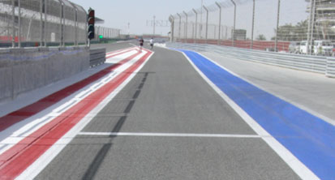
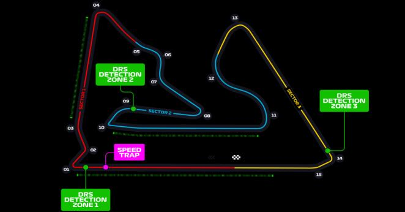
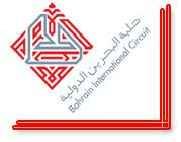
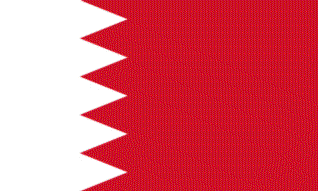

2021 BAHRAIN GRAND PRIX

25 - 28 March 2021

From The FIA Formula One Race Director Document 2

To All Teams, All Officials Date 25 March 2021

Time 14:59

Title Race Directors' Event Notes

Description Event Notes

Enclosed 2021 Bahrain F1 Grand Prix Event Notes Doc 02.pdf

Michael Masi

The FIA Formula One Race Director

2021 B G P AHRAIN RAND RIX

25 – 28 March 2021

From The FIA Formula One Race Director Document 2

To All Teams, All Officials Date 25 March 2021

Time 15:00

EVENT NOTES General Instructions

1) Pit lane map

1.1 Safety Car lines.

1.2 The location of the pit entry and the pit exit.

1.3 Designated garage areas.

1.4 Safety Car position for first lap and rest of race.

1.5 Blue flag marshal at the pit exit.

1.6 Track light panels displaying pit entry status.

2) Pirelli Event Preview

2.1 With reference to Article 24.4(a) of the Sporting Regulations see the attached document provided by the official tyre supplier.

3) Red zones for photographers in the pit lane during practice sessions

3.1 See the attached drawing.

4) Track light panels

4.1 The FIA track light panels have been installed in the positions shown on the circuit map. In accordance with Appendix H to the ISC the light signals have the same meaning as flag signals.

5) Track light panel displaying pit entry status

5.1 The light panel indicated on the pit lane map will display a flashing yellow arrow if cars are required to use the pit lane once the Safety Car has been deployed during the race.

5.2 The light panel indicated on the pit lane map will display a flashing red cross if the pit lane is closed at any point during the race.

6) Drivers leaving their pit stop position in the pit lane

6.1 For safety reasons, no car should be driven from its pit stop position at any time unless:

a) It has first been driven into the pit stop position having just entered the pit lane from the track,

and;

b) It is then driven immediately back onto the track from the pit stop position.

1/5

7) Observing yellow flags during free practice and qualifying

7.1 Double waved: Any driver passing through a double waved yellow marshalling sector must reduce speed significantly and be prepared to change direction or stop. In order for the stewards to be

satisfied that any such driver has complied with these requirements it must be clear that he has not

attempted to set a meaningful lap time, for practical purposes this means the driver should abandon

the lap (this does not necessarily mean he has to pit as the track could well be clear the following

lap).

7.2 Single waved: Drivers should reduce their speed and be prepared to change direction. It must be clear that a driver has reduced speed and, in order for this to be clear, a driver would be expected

to have braked earlier and/or discernibly reduced speed in the relevant marshalling sector.

Drivers should not overtake any car in a single waved yellow marshalling sector unless it is clear that

a car is slowing with a completely obvious problem, e.g. obvious accident damage or a deflated tyre.

8) In laps during qualifying and reconnaissance laps

8.1 In order to ensure that cars are not driven unnecessarily slowly on in laps during and after the end of qualifying or during reconnaissance laps when the pit exit is opened for the race, drivers must stay

below the maximum time set by the FIA between the Safety Car lines shown on the pit lane map.

You will be informed of the maximum time after the first day of practice.

9) Parc Fermé Cameras

9.1 To assist with the revised FIA Event procedures, the Parc Fermé cameras must be uncovered and operational at all times during the Event.

10) Operational personnel curfew

10.1 Boards warning anyone attempting to enter the paddock that the curfew is in operation will be placed immediately before the turnstiles at the appropriate times.

10.2 At this Event, Personnel will be permitted to enter the Paddock 30 minutes prior to the curfew to assist social distancing. No work is permitted to be undertaken until the curfew has ended.

11) Tyre Blanket Usage during Pit Stops in the Race

11.1 For reasons of safety, tyre blankets are not permitted in the Pit Lane at any time during the race.

12) Lapping during the race

12.1 The ISC requires drivers who are caught by another car about to lap him to allow the faster driver past at the first available opportunity. The F1 Marshalling System has been developed in order to

ensure that the point at which a driver is shown blue flags is consistent, rather than trusting the ability

of marshals to identify situations that require blue flags.

As it was at the end of last season the system will be set to give a pre-warning when the faster car

is within 3.0s of the car about to be lapped, this should be used by the team of the slower car to warn

their driver he is soon going to be lapped and that allowing the faster car through should be

considered a priority. When the faster car is within 1.2s of the car about to be lapped blue flags will

be shown to the slower car (in addition to blue light panels, blue cockpit lights and a message on the

timing monitors) and the driver must allow the following driver to overtake at the first available

opportunity.

It should be noted that the aim of using F1MS is to ensure consistent application of the rules,

additional instructions may also be given by race control when necessary.

2/5

Event Specific Instructions

13) Formula 1 Sporting Regulations Article 21.6

13.1 In accordance with the provisions of Article 21.6a) i), this Event is a Closed Event.

14) Changes to the circuit

14.1 The Turn 4 exit kerb painting has been extended across the alternative track layout.

15) Specific Technical Procedures for Closed Events

15.1 The provisions of Technical Directive Ref: TD/039-20 C and the “Pirelli HSE procedures” must be complied with at all times during the Event.

15.2 Any tyres that are removed from a car and could be re-used during a session should be presented for scanning before being rewrapped and reheated. If time constraints do not permit this then all

tyres used during a session must be presented to the tyre checker at the front of the garage at the

end of any session. This applies to dry, wet and intermediate tyres.

15.3 Both TD/039-20 C and the “Pirelli HSE procedures” will be amended after the Event to reflect any additional operational requirements as required.

16) Weighing and weighing platform

16.1 The FIA weighing platform will be available for teams to use at the following times, however, no more than 8 team personnel may be present during any visit. Each visit should last no more than 10

minutes unless no other team is waiting in the pit lane:

a) From 14:30 on Thursday until 13:30 on Friday.

b) From 15:30 on Friday until 17:30 on Saturday (between 16:00 and 17:30 each visit will be

restricted to five minutes).

c) From when the cars are returned to the teams after qualifying until 22:30 on Saturday.

d) From 13:00 until 14:00 and 16:00 until 17:30 on Sunday.

Any team found to be abusing the time limits set out above, which we will be enforced by FIA security

personnel and our own CCTV, will not be permitted to use the weighbridge again during the Event.

17) Support Races

17.1 Team Barrier placement

a) Team barrier placement prior to and during all support category practice sessions and races:

No more than four metres from the garages.

b) It is not permitted to push cars to the weighing area at any time a support category is in pit

lane.

17.2 Support Category Movements

a) Support Crews and Trolleys will be released into Pit Lane no earlier than 20 minutes prior to

the opening of Pit Exit for their respective sessions.

b) Support Category competition vehicles will be released from the marshalling area no earlier

than 15 minutes prior to the opening of Pit Exit for their respective sessions.

18) Practice starts

18.1 Practice starts may only be carried out on the right-hand side (concrete apron area) after the pit exit lights but before the end of the pit signalling wall. For the avoidance of doubt, this includes any time

the pit exit is open for the race.

Drivers must leave adequate room on their left for another driver to pass.

3/5

18.2 For reasons of safety and sporting equity, cars may not stop in the fast lane at any time the pit exit is open without a justifiable reason (a practice start is not considered a justifiable reason).

19) Lines or bollards at the Pit Entry and Pit Exit

19.1 In accordance with Chapter 4 (Section 5) of Appendix L to the ISC drivers must keep to the right of the solid white line at the pit exit when leaving the pits.

19.2 For safety reasons drivers must keep to the right of the bollard at the pit entry when they are entering the pits.

19.3 Except in the cases of force majeure (accepted as such by the Stewards), the crossing by any part of the car, in any direction, of the red and white painted area, between the pit entry and the track, by

a driver who, in the opinion of the Stewards, had committed to entering the pit lane is prohibited.

19.4 The dotted white line across the pit entry and the pit exit is the track edge line.

20) DRS

20.1 DRS Detection will be automatically disabled in each individual zone if any of the light panels in that particular zone are displaying yellow. The zone and corresponding light panels are as follows:

a) Zone 1: Panels 3, 4

b) Zone 2: Panels 11, 12

c) Zone 3: Panels 18, 1, 2

21) Track Limits

21.1 The track limits at the exit of Turn 4 will not be monitored with regard to setting a lap time, as the defining limits are the artificial grass and the gravel trap in that location.

21.2 In all cases during the race, Drivers are reminded of the provisions of Article 27.3 of the Sporting Regulations.

22) Fire extinguishers around the circuit

22.1 Indicated by white boards with a red fire extinguisher image attached to the debris fences and barriers.

23) Places to remove cars from the track

23.1 Indicated by fluorescent orange panels on the barriers.

23.2 Should a car stop on the track during a session, the driver must keep all of their protective clothing (Helmet, Gloves, etc) on until they have returned to their garage.

24) Sporting Regulations Article 36.4

24.1 In addition to the provisions of Article 36.4, and for reasons of safety, tyre blankets must be disconnected from any power supply at the five-minute signal and must not be reconnected during

the start procedure, unless the delayed start signal is shown.

25) Access to the grid prior to the Start Procedure

25.1 To assist social distancing in accessing the grid prior to the commencement of the start procedure, Team personnel and equipment will be granted access to the grid from 1700hrs on Sunday 28th

March.

26) Removing cars from the grid

26.1 Through the two gates in the pit wall, the first located adjacent to grid position 2 and the 2nd located adjacent to grid position 18.

4/5

27) Car number light panels for the start

27.1 On the right-hand side of the grid.

28) Post-race parc fermé

28.1 All cars must enter the pit lane and, with the exception of the first three, should be driven directly to the weighing area at the pit entry. The first three must follow the post-race procedure which will be

distributed prior to the start of the race.

29) Any other business

Michael Masi

FIA Formula One Race Director

5/5

eniL enaL X yrtnE sutatS slenap lortnoC 1202 saerA RAC tiP detangiseD tiP paL hcraM YTEFAS egaraG tsriF 52– 1 noisreV

| A | AIF |
| --- | --- |
| B | AIF |
| C | 1 alumroF |

| 0 | sedecreM |  |
| --- | --- | --- |
| 1 | sedecreM | sedecreM |
| 2 | sedecreM |  |
| 3 | sedecreM |  |
| 4 | lluB deR |  |
| 5 | lluB deR | lluB deR |
| 6 | lluB deR |  |
| 7 | neraLcM |  |
| 8 | neraLcM | neraLcM |
| 9 | neraLcM |  |
| 01 | neraLcM |  |
| 11 | nitraM notsA | nitraM notsA |
| 21 | nitraM notsA |  |
| 31 | nitraM notsA |  |
| 41 | eniplA |  |
| 51 | eniplA | eniplA |
| 61 | eniplA |  |
| 71 | eniplA |  |
| 81 | irarreF | irarreF |
| 91 | irarreF |  |
| 02 | irarreF |  |
| 12 | irarreF |  |
| 22 | iruaTahplA | iruaTahplA |
| 32 | iruaTahplA |  |
| 42 | iruaTahplA |  |
| 52 | oemoR aflA |  |
| 62 | oemoR aflA | oemoR aflA |
| 72 | oemoR aflA |  |
| 82 | saaH/aflA |  |
| 92 | saaH | saaH |
| 03 | saaH |  |
| 13 | saaH |  |
| 23 | smailliW |  |
| 33 | smailliW | smailliW |
| 43 | smailliW |  |
| 53 | egarotS maeT |  |

X

1 eniL

RAC

YTEFAS

stratS ENAL YRTNE ENAL TSAF TIP TIP

MORF xirP EREH )YLNO lennosreP DEREVOCER DECALP tratS dnarG maeT ecaR( KCART SRAC

niarhaB segaraG noitisoP

eloP

1F 1202

sdnE

ENAL

TIP

ENAL

RAC TSAF YTEFAS ecaR

TIXE

TIP

2 eniL

RAC

GALF YTEFAS lahsraM EULB

noitisoP

potS

tiP

| Grand Prix of Bahrain 26/03-28/03/2021 (21R01BAH) |  |  |  |  |  |  |  |
| --- | --- | --- | --- | --- | --- | --- | --- |
| Compounds selection | pound |  |  |  |  |  |  |
| C2 |  | FL 2W1 | FR 2W2 | RL 2W3 | RR 2W4 | Mandatory race tyres C2 C3 Q3 tyre C4 | Mandatory race tyres C2 |
| C3 |  | 3Y1 | 3Y2 | 3Y3 | 3Y4 |  | C3 |
| C4 Intermediate |  | 4R1 | 4R2 | 4R3 | 4R4 |  |  |
| Wet |  | 33X 34Y | 35X 36Y | 37X 37Y | 39X 39Y |  | Q3 tyre C4 |

| Running prescriptions |  |  |  |  |  |  |  |  |  |
| --- | --- | --- | --- | --- | --- | --- | --- | --- | --- |
|  |  | Slicks | Inter | Wet | Slicks | Inter | Wet |  |  |
| t n | Minimum Starting P | 21.0 psi | 20.5 psi | 19.5 psi | 19.0 psi | 19.0 psi | 18.0 psi | Minimum Starting P | r |
| o r | Camber limit | -3.50 ° |  |  | -2.00 ° |  |  | Camber limit | a e |
| F | Blistering sensitivity | Low | - | - | Low | - | - | Blistering sensitivity | R |
| Tyre heating strategy (tread & sidewall) |  |  |  |  |  |  |  |  |  |

| Tyres notes |  |
| --- | --- |
| • Not permitted to switch tyres from their originally allocated position. • Do not subject tyres to large deformation or heavy impact. • Do not leave fitted tyres exposed at an air temperature lower than 15°C and/or any UV emission. • Revised prescriptions could be issued during the race weekend in accordance with TD/036-18. | • All temperature limits apply to the actual tyre surface temperature, measured with the IR gun detailed in the Appendix to the Technical and Sporting regulations. • STORAGE temperature is the recommended temperature the tyre can stay in blankets without time limit. • BLANKET HEATING TIME for each temperature range to be counted from the moment the blanket control unit is set to reach its targeted temperature within its correspondent interval. |

General notes

Teams are kindly reminded that the following parameters will be subjected to FIA checks during the event: - Starting pressure. - Camber at maximum speed. - Maximum blanket temperature. - Tyre swapping.

A3

veR FOOR OT TCUD

STN 0 12_ENOZDER_NIARHAB elacS 1 enoZ

2 121082 deR

3 etaD 4 NOTRUB E rebmuN 5 N eltiT O gniwarD gniwarD Z nwarD .J D E 6 R

7 G N 8 I D L 9 I U B .detibihorp 01 T yltcirts I P 11 NOISULCXE si tnesnoc

nettirw

roirp 21 tuohtiw E 1202 82 mrof 31 N niarhaB yna O ni Z noitcudorpeR 41 RAM D E 51 R XIRP .dtL pihsnoipmahC SREHPARGOTOHP 61 - - 62 dlroW rihkaS 71 DNARG enO alumroF RAM

fo ytreporp 81 eht ENOZ - si niereht 91 tiucriC NIARHAB deniatnoc 02 noitamrofni 12 DER eht dna lanoitanretnI 2 gniward 2

sihT ENOZ 32 .dtL pihsnoipmahC RIA

DER dlroW 42 FLUG enO alumroF G 5 2 thgirypoC N 62 I D niarhaB 1 L 72 I U ALUMROF B 82 T I P 9 2 1 O gpj.niarhaB-fo-galf\SGALF\.

R 03

E 13 N O 23 Z D E 33 R

43

53

3A
