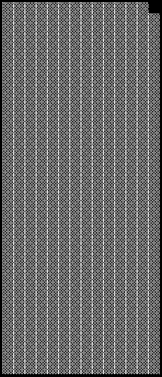

2021 BRAZILIAN GRAND PRIX

11 - 14 November 2021

From The FIA Formula One Race Director Document 40

To All Teams, All Officials Date 14 November 2021

Time 10:58

Title Race Directors' Note - Post Race Procedure

Description Post Race Procedure

Enclosed 2021 Brazilian F1 Grand Prix Post Race Procedure Doc 40.pdf

Michael Masi

The FIA Formula One Race Director

2021 B G P RAZILIAN RAND RIX

11 – 14 November 2021

From The FIA Formula One Race Director Document 40

To All Teams, All Officials Date 14 November 2021

Time 10:55

NOTE TO TEAMS: POST RACE INTERVIEW & PODIUM CEREMONY PROCEDURE

In addition to the provisions of the 2021 Formula One Sporting Regulations – Appendix 3 Podium

Ceremony, as this is a Closed Event the Podium Ceremony procedure detailed below must be followed.

Post Race Interview and Podium Ceremony Procedure:

• The master of ceremonies will be appointed by the FIA to conduct and take responsibility for the

entire podium ceremony.

• Drivers who finish the race in the top three (3) positions will be required to return to Pit Lane without

dropping back in order to return to the Pit Lane amongst the ‘first’ cars, where they will find

the boards showing positions from 1, 2, 3 located at the pit lane entry in front of the FIA Garages.

• All other cars that finished the race are required to return to the Pit Lane and line up along the wall

in the Pit Entry road.

• Other than the team mechanics (with cooling fans if necessary), officials and FIA pre-approved

television crews and the four FIA approved photographers, no one else will be allowed in the

designated area at this time (no driver physios nor team PR personnel). At the sole discretion of the

FIA Media Delegate, the team-embedded photographer of the winning driver may also be permitted

in the designated area.

• Once out of their cars, the top three Drivers will be weighed by the FIA near their cars. Each Driver

must remain fully attired until after they have been weighed (e.g.: Helmet, Gloves, etc.).

• For the duration of the Post Race Interviews and Podium Ceremony Procedure, the Drivers finishing

in race in positions 1, 2, 3 must remain attired only in their Driving Suits, 'done up' to the neck, not

opened to the waist. Face masks may be removed during the Post Race Interviews and Podium

Ceremony.

• After the Drivers have been weighed, the post-race interviews will take place in this designated area,

and the interviewer will be Felippe Massa.

• Drivers must not interfere with Parc Fermé protocols in any way.

• During this time, team members of the top three (3) drivers will be permitted to access their allocated

areas in the Pit Lane.

• Once the interviews have been completed, the cool down area, where water and towels will be

positioned for each Driver, will be located in the Parc Fermé Area. No other drinks are permitted in

the Parc Fermé area.

• Each Driver will be given their Pirelli Caps which will also contain a Face Mask both of which must

be worn during the Podium Ceremony.

• The drivers will then be escorted to the permanent Podium area where the 1, 2, 3 Rostrum and Dias

will be located.

• When the Drivers are ready, an announcement for the Podium Ceremony will take place with the 3rd

and 2nd placed Drivers introduced to move to their respective Podium Dias steps.

1/3

• The Winning Driver will then be announced who will move to his position on the Podium.

• Once the driver has taken their position on the podium step, the Face Mask can be removed.

• The National Anthems will then take place and flags will be displayed.

• Four (4) dignitaries will present all 4 trophies on the podium.

• The Trophy Presentations will take place in the following order:

o Winning Driver (On the Podium)

o A representative of the Winning Constructor (On the Podium)

o 2nd Place Driver (On the Podium)

o 3rd Place Driver (On the Podium)

• The Sparkling Wine Podium Celebrations will the take place.

• For the duration of the TV pen interviews and FIA Post Race Press Conference, all Drivers finishing

must remain attired in their respective teams’ uniform only. For the avoidance of doubt this includes

a Medical Face Mask or Team Branded Face Mask in the Press Conference Room.

• Following the Podium Ceremony, the top three (3) drivers will be escorted by the FIA Media Delegate

to the TV pen located at the Pit Entry end of the Formula 1 Paddock where they may be accompanied

by their press officers.

• At the end of the TV pen, the top three (3) drivers will go to the FIA Press Conference, located on

the lower ground floor of the Paddock Building.

• Drivers classified from 4th and beyond must proceed directly to the TV pen immediately after they

have been weighed in the Parc Fermé, located in the FIA garage. Each Driver must remain fully

attired until after they have been weighed (e.g.: Helmet, Gloves, etc.).

• Any Driver classified from 4th and beyond who does not have a virtual session for the written media

organized after the race must be available for interview at the written media zone adjacent to the TV

pen once their TV interviews have concluded.

• Drivers who retired during the race are required to go to the TV pen as soon as they have come back

into the paddock.

Please see the attached Post Race Podium Ceremony and Parc Fermé Diagram.

Michael Masi

FIA Formula One Race Director

2/3

2021 Brazilian Grand Prix Parc Ferme - Race

0 1

Other drivers exit here

e 3rd c n TV RF e F Remaining finishers Cameraman 1st parked along fence

2nd

Pit Wall

Version 2 – 11 November 2021

