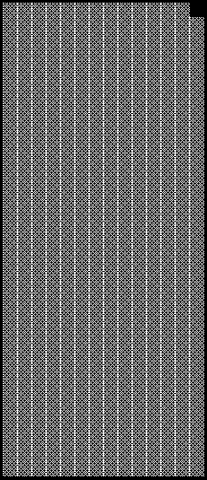

2021 BRAZILIAN GRAND PRIX

11 - 14 November 2021

From The FIA Formula One Race Director Document 25

To All Teams, All Officials Date 13 November 2021

Time 13:11

Title Race Directors' Note - Post Sprint Qualifying Procedure

Description Post Sprint Qualifying Procedure

Enclosed 2021 Brazilian F1 Grand Prix Post Sprint Qualifying Procedure Doc 25.pdf

Michael Masi

The FIA Formula One Race Director

2021 B G P RAZILIAN RAND RIX

11 – 14 November 2021

From The FIA Formula One Race Director Document 25

To All Teams, All Officials Date 13 November 2021

Time 13:10

NOTE TO TEAMS: POST SPRINT QUALIFYING PROCEDURE

The Post Sprint Qualifying session interview procedure requires the top three (3) drivers to be interviewed

on the permanent Podium structure once they have got out of their cars.

Should either of your drivers be among the top three (3) at the end of the Sprint Qualifying session we

would like to ask for your co-operation in following the procedure below:

• Once they receive the chequered flag, Drivers who finish the Sprint Qualifying session in the top three

(3) positions will be required to return to Pit Lane without dropping back in order and return to the Pit

Lane amongst the ‘first’ cars, where they will find the boards showing positions from 1, 2, 3 located at

the Pit Lane entry in front of the FIA Garages.

• All remaining cars must enter Pit Lane and should park along the wall at the pit entry.

• Other than the team mechanics (with cooling fans if necessary), officials and FIA pre-approved

television crews and the four (4) FIA approved photographers, no one else will be allowed in this

designated area at this time (no driver physios nor team PR personnel). At the sole discretion of the

FIA Media Delegate, the team-embedded photographer of the pole position driver may also be

permitted in the Parc Fermé area at this time.

• Once out of their cars, the top three (3) Drivers will be weighed by the FIA. Each Driver must remain

fully attired until after they have been weighed (e.g: Helmet, Gloves, etc).

• Drivers must not interfere with Parc Fermé protocols in any way.

• After the Drivers have been weighed, they will be escorted to the permanent podium structure to

undertake the “Sprint Ceremony”. During the Sprint Ceremony, the Drivers will be interviewed by

Felippe Massa and presented with their Sprint wreaths.

• Once the interviews are concluded, the top three (3) Drivers will be escorted by the FIA Media Delegate

to the FIA Press Conference located on the lower ground level of the paddock building.

• At the end of the FIA Press Conference, the top three (3) drivers will go to the TV pen, located at the

Pit Entry end of the Paddock behind the FIA Garages and they may be accompanied by their press

officers, who should wait to collect their drivers at the back of the press conference room.

• Drivers classified from 4th and beyond must proceed directly to the TV pen immediately after they have

been weighed in the Parc Fermé, located in the FIA garage. Each Driver must remain fully attired until

after they have been weighed (e.g.: Helmet, Gloves, etc.).

• Any Driver classified from 4th and beyond who does not have a virtual session for the written media

organized after the Sprint Qualifying session must be available for interviews at the written media zone

adjacent to the TV pen once their TV interviews have concluded.

1/3

• Drivers who retired during the Sprint Qualifying session are required to go to the TV pen as soon as

they have come back into the paddock.

Please see the attached Sprint Qualifying - Parc Fermé Diagram.

Michael Masi

FIA Formula One Race Director

2/3

2021 Brazilian Grand Prix Parc Ferme - Sprint

0 1

Other drivers exit here

e 3rd c n TV RF e F Remaining finishers Cameraman 1st parked along fence

2nd

Pit Wall

Version 2 – 12 November 2021

