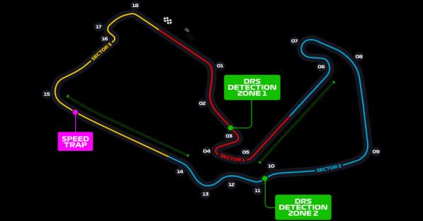
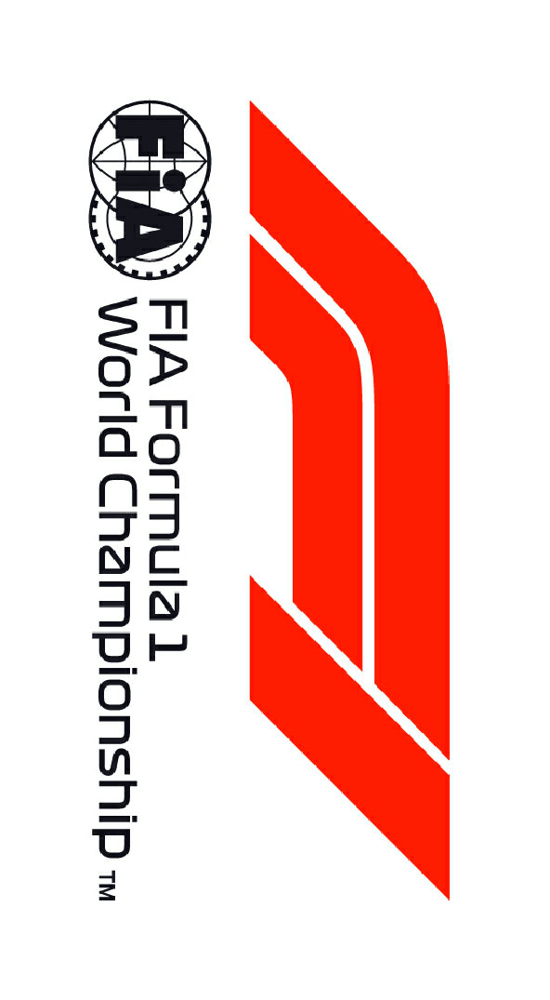

2021 BRITISH GRAND PRIX

15 - 18 July 2020

From The FIA Formula One Race Director Document 4

To All Teams, All Officials Date 15 July 2021

Time 18:29

Title Race Directors' Event Notes Version 2

Description Event Notes Version 2

Enclosed 2021 British F1 Grand Prix Event Notes V2 Doc 4.pdf

Michael Masi

The FIA Formula One Race Director

2021 B G P RITISH RAND RIX

15 – 18 July 2021

From The FIA Formula One Race Director Document 4

To All Teams, All Officials Date 15 July 2021

Time 18:30

EVENT NOTES VERSION 2 General Instructions

1) Pit lane map

1.1 Safety Car lines.

1.2 The location of the pit entry and the pit exit.

1.3 Designated garage areas.

1.4 Safety Car position for first lap and rest of race.

1.5 Blue flag marshal at the pit exit.

1.6 Track light panels displaying pit entry status.

2) Pirelli Event Preview

2.1 With reference to Article 24.4(a) of the Sporting Regulations see the attached document provided by the official tyre supplier.

3) Red zones for photographers in the pit lane during practice sessions

3.1 See the attached drawing.

4) Track light panels

4.1 The FIA track light panels have been installed in the positions shown on the circuit map. In accordance with Appendix H to the ISC the light signals have the same meaning as flag signals.

5) Track light panel displaying pit entry status

5.1 The light panel indicated on the pit lane map will display a flashing yellow arrow if cars are required to use the pit lane once the Safety Car has been deployed during the race.

5.2 The light panel indicated on the pit lane map will display a flashing red cross if the pit lane is closed at any point during the race.

6) Drivers leaving their pit stop position in the pit lane

6.1 For safety reasons, no car should be driven from its pit stop position at any time unless:

a) It has first been driven into the pit stop position having just entered the pit lane from the track,

and;

b) It is then driven immediately back onto the track from the pit stop position.

1/6

7) Observing yellow flags during free practice and qualifying

7.1 Double waved: Any driver passing through a double waved yellow marshalling sector must reduce speed significantly and be prepared to change direction or stop. In order for the stewards to be

satisfied that any such driver has complied with these requirements it must be clear that he has not

attempted to set a meaningful lap time, for practical purposes this means the driver should abandon

the lap (this does not necessarily mean he has to pit as the track could well be clear the following

lap).

7.2 Single waved: Drivers should reduce their speed and be prepared to change direction. It must be clear that a driver has reduced speed and, in order for this to be clear, a driver would be expected

to have braked earlier and/or discernibly reduced speed in the relevant marshalling sector.

Drivers should not overtake any car in a single waved yellow marshalling sector unless it is clear that

a car is slowing with a completely obvious problem, e.g. obvious accident damage or a deflated tyre.

8) In laps during qualifying and reconnaissance laps

8.1 In order to ensure that cars are not driven unnecessarily slowly on in laps during and after the end of qualifying or during reconnaissance laps when the pit exit is opened for the race, drivers must stay

below the maximum time set by the FIA between the Safety Car lines shown on the pit lane map.

You will be informed of the maximum time after the first free practice session.

9) Parc Fermé Cameras

9.1 To assist with the revised FIA Event procedures, the Parc Fermé cameras must be uncovered and operational at all times during the Event.

10) Operational personnel curfew

10.1 Boards warning anyone attempting to enter the paddock that the curfew is in operation will be placed immediately before the turnstiles at the appropriate times.

10.2 At this Event, Personnel will be permitted to enter the Paddock 30 minutes prior to the curfew to assist social distancing. No work is permitted to be undertaken until the curfew has ended.

11) Tyre Blanket Usage during Pit Stops in the Sprint Qualifying session and the Race

11.1 For reasons of safety, tyre blankets are not permitted in the Pit Lane at any time during the sprint qualifying session or the race.

12) Lapping during the Sprint Qualifying session and the Race

12.1 The ISC requires drivers who are caught by another car about to lap him to allow the faster driver past at the first available opportunity. The F1 Marshalling System has been developed in order to

ensure that the point at which a driver is shown blue flags is consistent, rather than trusting the ability

of marshals to identify situations that require blue flags.

The system is set to give a pre-warning when the faster car is within 3.0s of the car about to be

lapped, this should be used by the Competitor of the slower car to warn their driver he is soon going

to be lapped and that allowing the faster car through should be considered a priority. When the faster

car is within 1.2s of the car about to be lapped blue flags will be shown to the slower car (in addition

to blue light panels, blue cockpit lights and a message on the timing monitors) and the driver must

allow the following driver to overtake at the first available opportunity.

It should be noted that the aim of using F1MS is to ensure consistent application of the rules,

additional instructions may also be given by race control when necessary.

2/6

Event Specific Instructions

13) Formula 1 Sporting Regulations Article 21.6

13.1 In accordance with the provisions of Article 21.6a)i), this Event is a Closed Event.

14) Changes to the circuit

14.1 The run off area behind the Turn 1 exit kerb has been grooved to assist drainage.

14.2 A number of kerbs have been sandblasted back to bare concrete and repainted.

14.3 Additional concrete bumps have been added behind the apex of Turn 11.

14.4 A tyre barrier has been installed on the right-hand side at the entry of Turn 6.

14.5 The barrier has been realigned at the rear of the Turn 7 runoff to assist vehicle recovery.

14.6 The drainage in the run-off area at the exit of Turn 9 has been removed and is now underground.

14.7 The tyre barrier on the left-hand side between Turn 10 and Turn 11 has been extended.

14.8 A concrete lead in has been added to the Turn 13 exit kerb / T14 apex kerb.

14.9 The drainage in the run off area on the left-hand side at Turn 15 has been replaced.

14.10 The pit entry road has been resurfaced.

14.11 A tyre barrier has been installed on the right-hand side at the exit of Turn 18.

14.12 A number of tyre barriers around the venue have been removed and replaced.

14.13 The debris fence has been upgraded and added to in a number of locations.

15) Specific Technical Procedures for Closed Events

15.1 The provisions of Technical Directive Ref: TD012 Issue A and TD003 Issue E must be complied with at all times during the Event.

15.2 Any tyres that are removed from a car and could be re-used during a session should be presented for scanning before being rewrapped and reheated. If time constraints do not permit this then all

tyres used during a session must be presented to the tyre checker at the front of the garage at the

end of any session. This applies to dry, wet and intermediate tyres.

15.3 Both TD012 Issue: A and TD003 Issue E will be amended after the Event to reflect any additional operational requirements as required.

16) Weighing and weighing platform

16.1 The FIA weighing platform will be available for teams to use at the following times, however, no more than 8 team personnel may be present during any visit. Each visit should last no more than 10

minutes unless no other team is waiting in the pit lane:

a) From 14:30 on Thursday until 13:30 on Friday.

b) From 15:30 until 17:30 on Friday (each visit will be restricted to five (5) minutes).

c) From when the cars are returned to the teams after the qualifying practice session until 22:30

on Friday.

d) From 09:00 until 15:30 on Saturday (between 13:00 and 15:30 on Saturday each visit will be

restricted to five (5) minutes).

e) From when the cars are returned to the teams after the sprint qualifying session until 20:30 on

Saturday.

f) From 10:00 until 11:00 and 13:00 until 14:20 on Sunday.

Any team found to be abusing the time limits set out above, which we will be enforced by FIA security

personnel and our own CCTV, will not be permitted to use the weighbridge again during the Event.

16.2 Whilst waiting in the pit lane, the use of tyre blankets is not permitted.

3/6

17) Support Races

17.1 Team Barrier placement

a) Team barrier placement prior to and during all support category practice sessions and races:

No more than one (1) metre from the garages.

b) It is not permitted to push cars to the weighing area at any time a support category is in pit

lane.

17.2 Support Category Movements

a) Support Crews and Trolleys will be released into Pit Lane no earlier than 20 minutes prior to

the opening of Pit Exit for their respective sessions.

b) Support Category competition vehicles will be released from the marshalling area no earlier

than 15 minutes prior to the opening of Pit Exit for their respective sessions.

18) Practice starts

18.1 Practice starts may be carried out on the track at the end of each free practice session, none may be carried out in the pit lane. Any car on the track when the chequered flag is shown may then

complete another lap and, instead of entering the pits, proceed to the grid and carry out a practice

start.

All drivers carrying out a practice must do so by pulling as far forward on the grid as possible and, if

necessary, should wait for others to carry out a start before getting to a grid position further forward.

Under no circumstances should a driver make a practice start if another car is still stationary in front

of him on the same side of the grid.

If any driver appears to be disregarding any of the above a red flag will be displayed and the

possibility to carry out any further starts will be immediately terminated.

18.2 For reasons of safety and sporting equity, cars may not stop in the fast lane at any time the pit exit is open without a justifiable reason (a practice start is not considered a justifiable reason).

19) Lines or bollards at the Pit Entry and Pit Exit

19.1 In accordance with Chapter 4 (Section 5) of Appendix L to the ISC drivers must keep to the right of the solid white line at the pit exit when leaving the pits.

19.2 For safety reasons drivers must keep to the right of the bollard the pit entry when they are entering the pits.

19.3 Except in the cases of force majeure (accepted as such by the Stewards), the crossing by any part of the car, in any direction, of the chevron/grass between the pit entry and the track, by a driver who,

in the opinion of the Stewards, had committed to entering the pit lane is prohibited.

20) DRS

20.1 DRS Detection will be automatically disabled in each individual zone if any of the light panels in that particular zone are displaying yellow. The zone and corresponding light panels are as follows:

a) Zone 1: Panels 5, 6, 7

b) Zone 2: Panels 12, 13, 14

21) Track Limits

21.1 Turns 9 Exit

a) A lap time achieved during any practice session, sprint qualifying session or the race by leaving

the track and cutting behind the black and white kerb on the exit of Turn 9, will result in that

lap time being invalidated by the stewards.

4/6

21.2 Turn 15 Exit

a) A lap time achieved during any practice session, sprint qualifying session or the race by leaving

the track and cutting behind the black and white kerb on the exit of Turn 15, will result in that

lap time and the immediately following lap time being invalidated by the stewards.

21.3 General – Turn 9 Exit, Turn 15 Exit

a) Each time any car fails to negotiate Turn 9 Exit and/or Turn 15 Exit by using the track as

described above, teams will be informed via the official messaging system.

b) On the third occasion of a driver failing to negotiate Turn 9 Exit and/or Turn 15 Exit by using

the track as described above during sprint qualifying session or the race, he will be shown a

black and white flag, any further cutting will then be reported to the stewards.

c) In all cases detailed above, the driver must only re-join the track when it is safe to do so and

without gaining a lasting advantage.

d) The above requirements will not automatically apply to any driver who is judged to have been

forced off the track, each such case will be judged individually.

22) Fire extinguishers around the circuit

22.1 Indicated by white boards with a red fire extinguisher image attached to the debris fences and barriers.

23) Places where drivers can leave the track

23.1 Indicated by white panels with a green “running man” attached to the debris fences.

24) Places to remove cars from the track

24.1 Indicated by fluorescent orange panels on the barriers.

24.2 Should a car stop on the track during a session, the driver must keep all of their protective clothing (Helmet, Gloves, etc) on until they have returned to their garage

25) Access to the grid prior to the Start Procedure

25.1 To assist social distancing in accessing the grid prior to the commencement of the start procedure, Team personnel and equipment will be granted access to the grid from:

a) 15:45hrs on Saturday 17th July

b) 14:00hrs on Sunday 18th July.

26) Removing cars from the grid

26.1 Through the two gates in the pit wall, the first is located adjacent to grid position 1 and the second located adjacent to grid position 12.

26.2 The pit lane has a small ramp down from the track which may result in cars grounding when pushed off the grid. It is therefore important that someone from your team is present, close to the gate nearest

your grid positions, to assist marshals if a car has to be pushed off the grid after the start of the

formation lap or after the start of the race

27) Car number light panels for the start

27.1 On the right-hand side of the grid.

28) Finishing the Race

28.1 In the interests of sporting fairness and to facilitate the orderly conduct of the Event in accordance with the provisions of the FIA International Sporting Code, any car which does not cross the Control

Line on the track to finish the sprint qualifying session or the race will be referred to the Stewards.

5/6

29) Post-race parc fermé

29.1 All cars must enter the pit lane and, with the exception of the first three (3), should be driven directly to the weighing area at the pit entry. The first three (3) cars must follow the post-race procedure

which will be distributed prior to the start of the race.

30) Any other business

Michael Masi

FIA Formula One Race Director

6/6

2021 British Grand Prix Pit Lane

Pit Entry Status panel X SAFETY CAR First Lap Pit Entry Bollard

SAFETY CAR Line 2 SAFETY CAR Line 1

PIT ENTRY PIT LANE Starts

PIT LANE Ends

PIT EXIT

SAFETY CAR Race Blue Flag CARS RECOVERED FROM Marshal TRACK PLACED HERE

F1 Garages RC

|  | 41 | 40 | 39 | 38 |  |  |  |  |  |  |  |  |  |  |  |  | 26 |  | 25 | 24 | 23 | 22 | 21 | 20 | 19 | 18 | 17 |  | 16 |  | 15 |  | 14 | 13 | 12 | 11 | 10 | 09 | 08 | 07 | 06 | 05 | 04 | 03 | 02 | 10A1 |
| --- | --- | --- | --- | --- | --- | --- | --- | --- | --- | --- | --- | --- | --- | --- | --- | --- | --- | --- | --- | --- | --- | --- | --- | --- | --- | --- | --- | --- | --- | --- | --- | --- | --- | --- | --- | --- | --- | --- | --- | --- | --- | --- | --- | --- | --- | --- |
|  |  | oemoR aflA | oemoR aflA | oemoR aflA | smailliW | smailliW | smailliW | irarreF |  | irarreF | irarreF | neraLcM | neraLcM | neraLcM | neraLcM | nitraM notsA | nitraM notsA |  | nitraM notsA | nitraM notsA | lluB deR | lluB deR | lluB deR | lluB deR | sedecreM | sedecreM | sedecreM | sedecreM |  |  | iruaTahplA | iruaTahplA |  | iruaTahplA | saaH | saaH | saaH | eniplA | eniplA | eniplA | AIF | AIF | AIF | AIF | 1F | 1F |
| Pit Stop Position |  | Alfa Romeo |  |  |  | Williams |  |  | Ferrari |  |  |  | McLaren |  |  |  |  | Aston Martin |  |  | Red Bull |  |  |  | Mercedes |  |  |  |  | AlphaTauri |  |  |  | Haas |  |  |  | Alpine |  |  |  |  | Designated Garage Areas |  |  |  |

FAST LANE FAST LANE

Team Personnel Control Line (Race Start ONLY) Pole Position

Version 1 – 14 Juy 2021

In agreement with the FIA and in accordance with Article 24.4 a) of the F1 Sporting Regulations, this document contains the prescriptions for the operation of tyres during the following event. Document version: 1 issue: A

| Grand Prix of Great Britain 16/07-18/07/2021 (21R10SLV) |  |  |  |  |  |  |
| --- | --- | --- | --- | --- | --- | --- |
| Compounds selection | pound |  |  |  |  |  |
| C1 |  | FL 1W1 | FR 1W2 | RL 1H3 | RR 1H4 | Mandatory race tyres C1 C2 Q3 tyre |
| C2 |  | 2Y1 | 2Y2 | 6Y3 | 6Y4 |  |
| C3 Intermediate |  | 3R1 | 3R2 | 7R3 | 7R4 |  |
| Wet |  | 33X 34Y | 35X 36Y | 37X 37Y | 39X 39Y |  |

| Prescriptions |  |  |  |  |  |  |  |  |
| --- | --- | --- | --- | --- | --- | --- | --- | --- |
|  | Mimimum Starting P |  |  | Minimum re-heat pressure for slicks 24.5 psi |  | Expected stabilized running pressure ≥26.0 psi | Camber limit -2.75 ° | Blistering sensitivity High |
|  | Slicks 25.0 psi | Inter 25.5 psi | Wet 24.5 psi |  | 60 80 100 (°C) max. 3h max. 3h max. 2h max max. 2h |  | . 30' |  |

| Fro | nt p | res | sur | e |
| --- | --- | --- | --- | --- |
| Rea | r pr | ess | ure |  |

• The temperatures apply at all times during the event.

| Tyres notes |  |
| --- | --- |
| • Not permitted to switch tyres from their originally allocated position. • Do not subject tyres to large deformation or heavy impact. • Do not leave fitted tyres exposed at an air temperature lower than 15°C and/or any UV emission. • Revised prescriptions could be issued during the race weekend in accordance with TD003. | • All temperature limits apply to the actual tyre surface temperature, measured with the IR gun detailed in the TD003. • STORAGE temperature is the recommended temperature the tyre can stay in blankets without time limit. • BLANKET HEATING TIME for each temperature range to be counted from the moment the blanket control unit is set to reach its targeted temperature within its correspondent interval. |

General notes

Teams are kindly reminded that the following will be subject to FIA checks during the event: • Starting pressures • Cold pressures (according to the cold pressure cooling curves) • Re-heat pressures • EOS Camber • Maximum tyre temperatures in blankets • Tyre swapping

