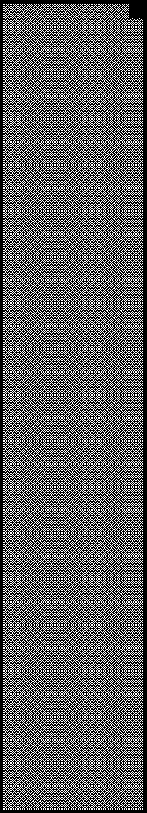

2021 DUTCH GRAND PRIX

2 - 5 September 2021

From The FIA Formula One Race Director Document 25

To All Teams, All Officials Date 04 September 2021

Time 13:23

Title Race Directors Note - Post Qualifying Procedure

Description Post Qualifying Procedure

Enclosed 2021 Dutch F1 Grand Prix Post Qualifying Procedure Doc 25.pdf

Michael Masi

The FIA Formula One Race Director

2021 D G P UTCH RAND RIX

2 – 5 September 2021

From The FIA Formula One Race Director Document 25

To All Teams, All Officials Date 4 September 2021

Time 13:20

The Post-Qualifying interview procedure requires the top three (3) drivers to be interviewed in the Pit Lane

in front of the FIA Garages once they have got out of their cars on the Grid.

Should either of your drivers be among the top three (3) at the end of qualifying we would like to ask for

your co-operation in following the procedure below:

• If they take the chequered flag at the end of Q3, the fastest three (3) drivers should stay on track and

proceed directly to the Grid where the 1, 2, 3 boards will be located in the vicinity of grid position 4.

• Other than the team mechanics (with cooling fans if necessary), officials and FIA pre-approved

television crews and the four (4) FIA approved photographers, no one else will be allowed in this

designated area at this time (no driver physios nor team PR personnel). At the sole discretion of the

FIA Media Delegate, the team-embedded photographer of the pole position driver may also be

permitted on the grid at this time.

• Once out of their cars, the top three (3) Drivers should wave to the crowd in the grandstand and will

then be escorted through the gate in the Pit Wall to the interview area located in front of the podium

where each Driver will be weighed by the FIA. Each Driver must remain fully attired until after they have

been weighed (e.g: Helmet, Gloves, etc).

• After the Drivers have been weighed, the Post-Qualifying interviews will take place in this designated

area. The interviewer will be Giedo van der Garde.

• At the same time each team must bring these cars directly to the Parc Fermé area located at the Pit

Lane Entry under the supervision of the officials.

• If one (1) of the top three (3) drivers is already in the Pit Lane at the end of the session, the team should

ensure that he goes directly to the designated area once the other drivers have arrived there.

• At the end of the live interviews the pole position driver will be led to the backdrop in front of the FIA

Garages for the AfRS and Pirelli Pole Position Award photo opportunity.

• The top three (3) drivers will then be escorted across the track by the FIA Media Delegate to the FIA

Press Conference located on the 1st floor of the Pit Garage Complex.

• At the end of the FIA Press Conference, the top three (3) drivers will go to the TV pen, located at the

Pit Entry end of the Paddock behind the Mercedes and Red Bull Transporters and they may be

accompanied by their press officers, who should wait to collect their drivers at the back of the press

conference room.

• NB: Drivers eliminated in Q1 and Q2, drivers classified from 4th to 10th in Q3 and drivers who did not

participate to Q1 but are eligible to race must also attend the TV pen interview session after they have

been weighed by the FIA at the end of the last part of qualifying in which they participated.

1/3

• Any Driver classified from 4th and beyond who does not have a virtual session for the written media

organised after Qualifying must be available for interviews at the written media zone adjacent to the TV

pen once their TV interviews have concluded.

Please see the attached Qualifying - Parc Fermé Diagram.

Michael Masi

FIA Formula One Race Director

2/3

2021 Dutch Grand Prix Parc Ferme - Qualifying

2 1

AFRS

Fence Podium

F1 Backdrop F Remaining cars parked on e TV RF n right-hand side of pit entry Cameraman c e Fence

Fireman

Pit Wall Pit Wall

2nd

1st

3rd

Grid position 4

Version 2 – 4 September 2021
