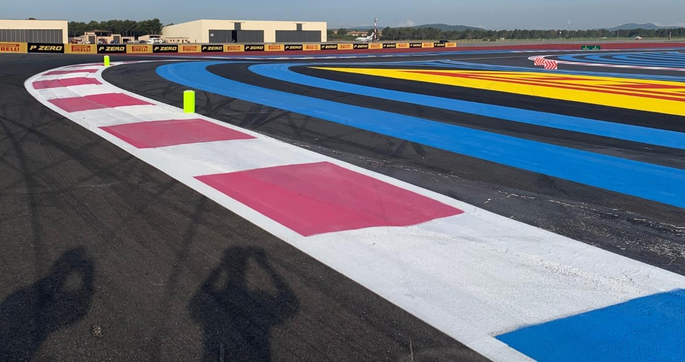
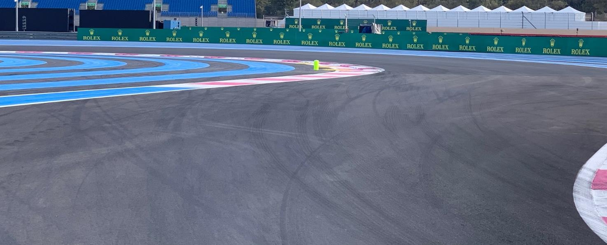
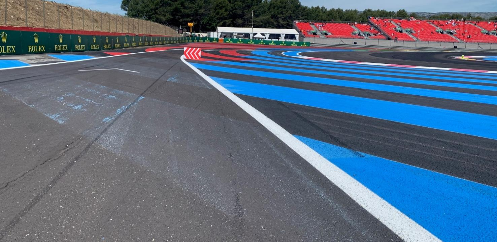
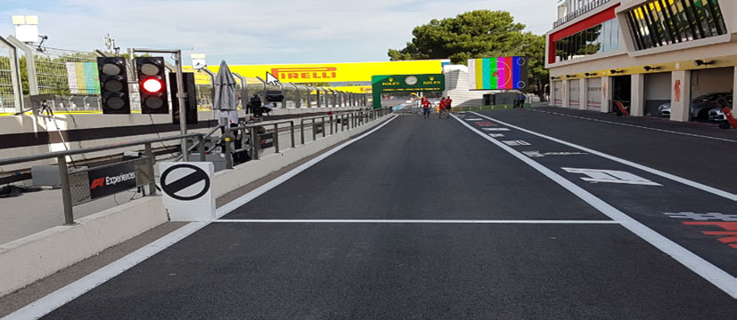
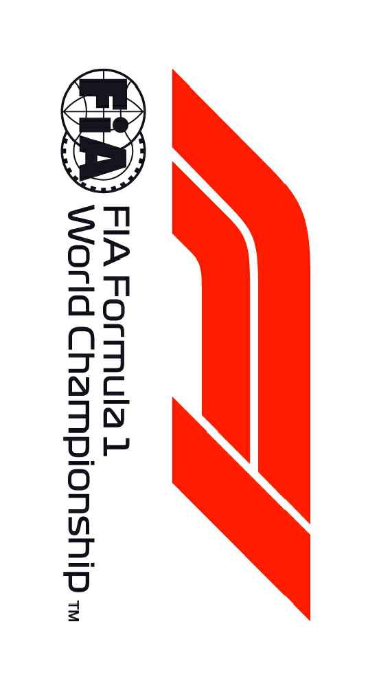
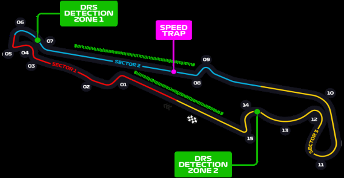

2021 FRENCH GRAND PRIX

17 -20 June 2021

From The FIA Formula One Race Director Document 16

To All Teams, All Officials Date 19 June 2021

Time 09:13

Title Race Directors' Event Notes Version 3

Description Event Notes Version 3

Enclosed 2021 French F1 Grand Prix Event Notes V3 Doc 16.pdf

Michael Masi

The FIA Formula One Race Director

2021 F G P RENCH RAND RIX

17 – 20 June 2021

From The FIA Formula One Race Director Document 16

To All Teams, All Officials Date 19 June 2021

Time 09:15

EVENT NOTES VERSION 3 General Instructions

1) Pit lane map

1.1 Safety Car lines.

1.2 The location of the pit entry and the pit exit.

1.3 Designated garage areas.

1.4 Safety Car position for first lap and rest of race.

1.5 Blue flag marshal at the pit exit.

1.6 Track light panels displaying pit entry status.

2) Pirelli Event Preview

2.1 With reference to Article 24.4(a) of the Sporting Regulations see the attached document provided by the official tyre supplier.

3) Red zones for photographers in the pit lane during practice sessions

3.1 See the attached drawing.

4) Track light panels

4.1 The FIA track light panels have been installed in the positions shown on the circuit map. In accordance with Appendix H to the ISC the light signals have the same meaning as flag signals.

5) Track light panel displaying pit entry status

5.1 The light panel indicated on the pit lane map will display a flashing yellow arrow if cars are required to use the pit lane once the Safety Car has been deployed during the race.

5.2 The light panel indicated on the pit lane map will display a flashing red cross if the pit lane is closed at any point during the race.

6) Drivers leaving their pit stop position in the pit lane

6.1 For safety reasons, no car should be driven from its pit stop position at any time unless:

a) It has first been driven into the pit stop position having just entered the pit lane from the track,

and;

b) It is then driven immediately back onto the track from the pit stop position.

1/6

7) Observing yellow flags during free practice and qualifying

7.1 Double waved: Any driver passing through a double waved yellow marshalling sector must reduce speed significantly and be prepared to change direction or stop. In order for the stewards to be

satisfied that any such driver has complied with these requirements it must be clear that he has not

attempted to set a meaningful lap time, for practical purposes this means the driver should abandon

the lap (this does not necessarily mean he has to pit as the track could well be clear the following

lap).

7.2 Single waved: Drivers should reduce their speed and be prepared to change direction. It must be clear that a driver has reduced speed and, in order for this to be clear, a driver would be expected

to have braked earlier and/or discernibly reduced speed in the relevant marshalling sector.

Drivers should not overtake any car in a single waved yellow marshalling sector unless it is clear that

a car is slowing with a completely obvious problem, e.g. obvious accident damage or a deflated tyre.

8) In laps during qualifying and reconnaissance laps

8.1 In order to ensure that cars are not driven unnecessarily slowly on in laps during and after the end of qualifying or during reconnaissance laps when the pit exit is opened for the race, drivers must stay

below the maximum time set by the FIA between the Safety Car lines shown on the pit lane map.

You will be informed of the maximum time after the first day of practice.

9) Parc Fermé Cameras

9.1 To assist with the revised FIA Event procedures, the Parc Fermé cameras must be uncovered and operational at all times during the Event.

10) Operational personnel curfew

10.1 Boards warning anyone attempting to enter the paddock that the curfew is in operation will be placed immediately before the turnstiles at the appropriate times.

10.2 At this Event, Personnel will be permitted to enter the Paddock 30 minutes prior to the curfew to assist social distancing. No work is permitted to be undertaken until the curfew has ended.

11) Tyre Blanket Usage during Pit Stops in the Race

11.1 For reasons of safety, tyre blankets are not permitted in the Pit Lane at any time during the race.

12) Lapping during the race

12.1 The ISC requires drivers who are caught by another car about to lap him to allow the faster driver past at the first available opportunity. The F1 Marshalling System has been developed in order to

ensure that the point at which a driver is shown blue flags is consistent, rather than trusting the ability

of marshals to identify situations that require blue flags.

As it was at the end of last season the system will be set to give a pre-warning when the faster car

is within 3.0s of the car about to be lapped, this should be used by the team of the slower car to warn

their driver he is soon going to be lapped and that allowing the faster car through should be

considered a priority. When the faster car is within 1.2s of the car about to be lapped blue flags will

be shown to the slower car (in addition to blue light panels, blue cockpit lights and a message on the

timing monitors) and the driver must allow the following driver to overtake at the first available

opportunity.

It should be noted that the aim of using F1MS is to ensure consistent application of the rules,

additional instructions may also be given by race control when necessary.

2/6

Event Specific Instructions

13) Formula 1 Sporting Regulations Article 21.6

13.1 In accordance with the provisions of Article 21.6a)i), this Event is a Closed Event.

14) Changes to the circuit

14.1 Resurfacing has taken place in the following locations: a) Entry to Turn 1 through to the Exit of Turn 2

b) Point 2.5 through to the Exit of Turn 7

c) Point 7.5 through to Point 9.5

d) Point 10.5 thought to Turn 13

e) Turn 14 through to the Exit of Turn 15

f) The Pit Entry Road from the where it leaves the track until the first Garage.

14.2 The barrier separating the Pit Straight and the Pit Lane Entry has been extended approximately 15m.

15) Specific Technical Procedures for Closed Events

15.1 The provisions of Technical Directive Ref: TD012 Issue A and TD003 Issue C must be complied with at all times during the Event.

15.2 Any tyres that are removed from a car and could be re-used during a session should be presented for scanning before being rewrapped and reheated. If time constraints do not permit this then all

tyres used during a session must be presented to the tyre checker at the front of the garage at the

end of any session. This applies to dry, wet and intermediate tyres.

15.3 Both TD012 Issue: A and TD003 Issue C will be amended after the Event to reflect any additional operational requirements as required.

16) Weighing and weighing platform

16.1 The FIA weighing platform will be available for teams to use at the following times, however, no more than 8 team personnel may be present during any visit. Each visit should last no more than 10

minutes unless no other team is waiting in the pit lane:

a) From 11:30 on Thursday until 10:30 on Friday.

b) From 12:30 on Friday until 14:30 on Saturday (between 13:00 and 14:30 on Saturday each

visit will be restricted to five (5) minutes).

c) From when the cars are returned to the teams after qualifying until 19:30 on Saturday.

d) From 10:00 until 11:00 and 13:00 until 14:20 on Sunday.

Any team found to be abusing the time limits set out above, which we will be enforced by FIA security

personnel and our own CCTV, will not be permitted to use the weighbridge again during the Event.

16.2 Whilst waiting in the pit lane, the use of tyre blankets is not permitted.

17) Support Races

17.1 Team Barrier placement

a) Team barrier placement prior to and during all support category practice sessions and races:

On the white line approximately two (2) metres from the garages.

b) It is not permitted to push cars to the weighing area at any time a support category is in pit

lane.

17.2 Support Category Movements

a) Support Crews and Trolleys will be released into Pit Lane no earlier than 20 minutes prior to

the opening of Pit Exit for their respective sessions.

b) Support Category competition vehicles will be released from the marshalling area no earlier

than 15 minutes prior to the opening of Pit Exit for their respective sessions.

3/6

18) Pit Lane

18.1 Speed Limit

a) The Pit Lane Speed limit detailed in Article 22.10 of the Sporting Regulations is hereby

amended to 60km/h for the duration of the Event.

19) Practice starts

19.1 Practice starts may only be carried out after the pit exit on the right-hand side (in the slow lane of the second part of the pit lane) and, for the avoidance of doubt, this includes any time the pit exit is open

for the race.

19.2 For reasons of safety and sporting equity, cars may not stop in the fast lane at any time the pit exit is open without a justifiable reason (a practice start is not considered a justifiable reason).

20) Lines or bollards at the Pit Entry and Pit Exit

20.1 In accordance with Chapter 4 (Section 5) of Appendix L to the ISC drivers must keep to the right of the solid white line at the pit exit when leaving the pits.

20.2 For safety reasons, drivers must keep to the right of the bollard at the pit entry when they are entering the pits.

20.3 Except in the cases of force majeure (accepted as such by the Stewards), the crossing by any part of the car, in any direction, of the painted area, between the pit entry and the track, by a driver who,

in the opinion of the Stewards, had committed to entering the pit lane is prohibited.

21) DRS

21.1 DRS Detection will be automatically disabled in each individual zone if any of the light panels in that particular zone are displaying yellow. The zone and corresponding light panels are as follows:

a) Zone 1: Panels 7, 8, 9

b) Zone 2: Panels 18, 19, 1, 2

22) Track Limits

22.1 Turns 1 and 2

a) Any driver who fails to negotiate Turn 2 by using the track, and who passes completely to the

right of the first fluorescent yellow bollard on the apex of the corner, must keep completely to

the right of the fluorescent yellow bollard and re-join the track by driving through the two arrays

of blocks in the run off by passing to the right of the first and to the left of the second. See

Image 1.

22.2 Turns 3-5

a) Any driver who fails to negotiate Turn 4 by using the track, and who passes completely to the

left of the fluorescent yellow bollard on the apex of the corner, must keep completely to the left

of the fluorescent yellow bollard and re-join the track by driving to the left of the block in the

run off prior to Turn 5. See Images 2 and 3

22.3 Turn 6 Exit

a) A lap time achieved during any practice session or the race by leaving the track on the exit of Turn 6, will result in that lap time being invalidated by the stewards. A driver will be judged to have left the track if no part of the car remains in contact with the track.

22.4 Turns 8 and 9

a) Any driver going straight on at turn 8 must re-join the track by driving through the four arrays

of blocks in the escape road, to the left of the first, to the right of the second, to the left of the

third and to the right of the fourth.

4/6

22.5 General - Turns 1-2, Turns 3-5, Turn 6 Exit, Turns 8-9

a) Each time any car fails to negotiate Turns 1-2 and/or Turns 3-5 and/or Turn 6 Exit and/or Turns

8-9 by using the track as described above, teams will be informed via the official messaging

system.

b) On the third occasion of a driver failing to negotiate Turns 1-2 and/or Turns 3-5 and/or Turn 6

Exit and/or Turns 8-9 by using the track during the race, he will be shown a black and white

flag, any further cutting will then be reported to the stewards.

c) In all cases detailed above, the driver must only re-join the track when it is safe to do so and

without gaining a lasting advantage.

d) The above requirements will not automatically apply to any driver who is judged to have been

forced off the track, each such case will be judged individually.

23) Fire extinguishers around the circuit

23.1 Indicated by red boards with a white letter “F” attached to the debris fences and barriers.

24) Places to remove cars from the track

24.1 Indicated by fluorescent orange panels on the barriers.

24.2 Should a car stop on the track during a session, the driver must keep all of their protective clothing (Helmet, Gloves, etc) on until they have returned to their garage

25) Sporting Regulations Article 36.4

25.1 In addition to the provisions of Article 36.4, and for reasons of safety, tyre blankets must be disconnected from any power supply at the five-minute signal and must not be reconnected during

the start procedure, unless the delayed start signal is shown.

26) Access to the grid prior to the Start Procedure

26.1 To assist social distancing in accessing the grid prior to the commencement of the start procedure, Team personnel and equipment will be granted access to the grid from 1400hrs on Sunday 20th

June.

27) Removing cars from the grid

27.1 Through the two gates in the pit wall, the first located adjacent to grid position 1 and the second located adjacent to grid position 16.

28) Car number light panels for the start

28.1 On the right-hand side of the grid.

29) Post-race parc fermé

29.1 All cars must enter the pit lane and, with the exception of the first three (3), should be driven directly to the weighing area at the pit entry. The first three (3) cars must follow the post-race procedure

which will be distributed prior to the start of the race.

30) Any other business

Michael Masi

FIA Formula One Race Director

5/6

Image 1: Turns 1-2

Images 2 and 3: Turns 3-5

6/6

FORMULA 1 EMIRATES GRAND PRIX DE FRANCE 2021 - Le Castellet

Circuit Map

6 DRS DETECTION 1 6

DRS ACTIVATION 1 S1 M05 5 5 4 7 M07 3 4 M02 7 8 M04 M09

M03 1 3 M06 M06 9 2 M08 M11 T M01 9 M01 2 8 M10 M15 10 11 S2 DRS DETECTION 2 10 1 14 17 M12 M17 12 M18 16 12 M12 19 M16 M27 13 15 18 M23 15 M25

DRS ACTIVATION 2 Start Line M14 11 M19 Control Line M21 14 S1 Sector 1 (50m After Turn 5) 13 S2 Sector 2 (370m before Turn 10)

T Speed Trap (165m Before Turn 8)

DRS Detection1 (75m Before Turn 7)

DRS Detection2 (On Turn 14)

DRS Activation1 (170m After Turn 7)

DRS Activation2 (115m After Turn 15)

15 Corner Numbers

M22 Marshal Post 22 FIA Marshal Light No.

Circuit Centreline Length = 5.842km

© 2021 Formula One World Championship Limited The F1 FORMULA 1 logo, F1 logo, FORMULA 1, FORMULA ONE, F1, FIA FORMULA ONE WORLD CHAMPIONSHIP, GRAND PRIX and related marks are trade marks of Formula One Licensing BV, a                                                                                                                        VERSION 1 - ISSUED 01.06.21

2021 French Grand Prix Pit Lane

SAFETY CAR Line 1

PIT LANE Starts Pit Entry PIT LANE Ends Status panels

SAFETY CAR Line 2

X

PIT ENTRY

SAFETY CAR SAFETY CAR Race First Lap

PIT EXIT Garages F1 Bollard Medical Centre

CARS RECOVERED FROM TRACK PLACED HERE

12 11 10 9 8 7 6 5 4 3 2 1 TC

|  |  | 1F |  | smailliW |  | saaH |  | oemoR aflA | ahplA iruaT |  | irarreF |  | Race Control |  | eniplA |  | notsA nitraM |  | neraLcM | lluB deR |  | sedecreM |  | AIF |  | AIF |
| --- | --- | --- | --- | --- | --- | --- | --- | --- | --- | --- | --- | --- | --- | --- | --- | --- | --- | --- | --- | --- | --- | --- | --- | --- | --- | --- |
|  | Pit Stop Position |  | Williams |  | Haas |  | Alfa Romeo |  |  | AlphaTauri |  | Ferrari |  | Alpine |  | Aston Martin |  | McLaren |  |  | Red Bull |  | Mercedes |  | Designated Garage Areas |  |
| FAST LANE FAST LANE |  |  |  |  |  |  |  |  |  |  |  |  |  |  |  |  |  |  |  |  |  |  |  |  |  |  |

Team Personnel Pole Position (Race Start ONLY)

Version 1 – 16 June 2021

TOILET LIFT gnicaR gnicaR gnicaR gnicaR gnicaR gnicaR gnicaR gnicaR irarreF iruaTahplA iruaTahplA iruaTahplA iruaTahplA irarreF irarreF irarreF TOILET n itraM n itraM n itraM n itraM n itraM gnicaR gnicaR gnicaR GM GM GM GM gnicaR TOILET SHOWER A A A A

sm ailliW sm ailliW sm ailliW sm ailliW saaH saaH saaH saaH oemoR aflA oemoR aflA oemoR aflA oemoR aflA aireducS aireducS aireducS aireducS aireducS aireducS aireducS aireducS eniplA eniplA eniplA eniplA n o tsA n o tsA n o tsA e n ip lA n o tsA n o tsA neraLcM neraLcM neraLcM neraLcM lluB deR lluB deR lluB deR sedecreM sedecreM sedecreM sedecreM lluB deR g ir

RM RM O O E E OD OD I I M M C C A A L L CORRIDOR RMOEODIMCAL OFF RM I O C E E ODIMCAL CLOA M K E R D O IC O A M L TOILET TOILET M O F 12 11 n ic a R s m a illiW TOILET TOILET Garge siz s a a H e = 1 27 0 9m sq Garge 9 siz g n ic a R o e m o R a flA e = 279m sq TOILET TOILET iru a T a h p lA a ire d u c S 8 7 a r r e F a ir e d u c S TOILET TOILET TOILET e n ip lA 6 5 n it r a M n o t s A TOILET TOILET n e r a L c M 4 TOILET g n ic a R llu B d e R 3 2 G M A s e d e c r e M TOILET TOILET A IF 1 TC OF A IF FICE TOILET

RED ZONE RED ZONE RED ZONE

T T S R H 2 LI G A 4 T 6 8 S 1 0 1 3 2 1 5 4 1 7 6 1 9 8 1 1 1 0 3 2 1 5 1 7 1 9 1

PHOTOGRAPHERS EXCLUSION RED ZONE

FORMULA 1 EMIRATES GRAND PRIX DE FRANCE 2021

© 2021 Formula One World Championship Limited The F1 FORMULA 1 logo, F1 logo, FORMULA 1, FORMULA ONE, F1, FIA FORMULA ONE WORLD CHAMPIONSHIP, GRAND PRIX and related marks are trade marks of Formula One Licensing BV, a Formula 1 company. The FIA logo is a trade mark of the Fédération Internationale de l'Automobile. All rights reserved.

In agreement with the FIA and in accordance with Article 24.4 a) of the F1 Sporting Regulations, this document contains the prescriptions for the operation of tyres during the following event.

| Grand Prix of France 18/06-20/06/2021 (21R07PRC) |  |  |  |  |  |  |
| --- | --- | --- | --- | --- | --- | --- |
| Compounds selection | pound |  |  |  |  |  |
| C2 |  | FL 2W1 | FR 2W2 | RL 2W3 | RR 2W4 | Mandatory race tyres C2 C3 Q3 tyre |
| C3 |  | 3Y1 | 3Y2 | 3Y3 | 3Y4 |  |
| C4 Intermediate |  | 4R1 | 4R2 | 4R3 | 4R4 |  |
| Wet |  | 33X 34Y | 35X 36Y | 37X 37Y | 39X 39Y |  |

| Prescriptions |  |  |  |  |  |  |  |  |
| --- | --- | --- | --- | --- | --- | --- | --- | --- |
|  | Mimimum Starting P |  |  | Minimum re-heat pressure for slicks 20.5 psi |  | Expected stabilized running pressure ≥22.0 psi | Camber limit -3.50 ° | Blistering sensitivity Medium |
|  | Slicks 21.0 psi | Inter 22.0 psi | Wet 21.0 psi |  | 0 60 80 100 (°C) max. 3h max. 3h max. 2h max max. 2h |  | . 30' |  |

| Fro | nt p | res | sur | e | st | arti | ng | P |  |  |  |  |  |
| --- | --- | --- | --- | --- | --- | --- | --- | --- | --- | --- | --- | --- | --- |
| Rea | r pr | ess | ur | e |  |  |  |  |  |  |  |  |  |
|  |  |  |  |  |  |  |  |  | Min | imu | m f | ron | t |
|  |  |  |  |  |  |  |  |  | s | tart | ing | P |  |

• The temperatures apply at all times during the event.

| Tyres notes |  |
| --- | --- |
| • Not permitted to switch tyres from their originally allocated position. • Do not subject tyres to large deformation or heavy impact. • Do not leave fitted tyres exposed at an air temperature lower than 15°C and/or any UV emission. • Revised prescriptions could be issued during the race weekend in accordance with TD003. | • All temperature limits apply to the actual tyre surface temperature, measured with the IR gun detailed in the TD003. • STORAGE temperature is the recommended temperature the tyre can stay in blankets without time limit. • BLANKET HEATING TIME for each temperature range to be counted from the moment the blanket control unit is set to reach its targeted temperature within its correspondent interval. |

General notes

Teams are kindly reminded that the following will be subject to FIA checks during the event: • Starting pressures • Cold pressures (according to the cold pressure cooling curves) • Re-heat pressures • Camber at maximum speed • Maximum tyre temperatures in blankets • Tyre swapping
