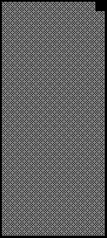

2021 FRENCH GRAND PRIX

17 -20 June 2021

From The FIA Formula One Race Director Document 20

To All Teams, All Officials Date 19 June 2021

Time 14:06

Title Race Directors Note - Post Qualifying Procedure

Description Post Qualifying Procedure

Enclosed 2021 French F1 Grand Prix Post Qualifying Procedure Doc 20.pdf

Michael Masi

The FIA Formula One Race Director

2021 F G P RENCH RAND RIX

17 – 20 June 2021

From The FIA Formula One Race Director Document 20

To All Teams, All Officials Date 19 June 2021

Time 14:05

NOTE TO TEAMS: POST QUALIFYING PROCEDURE

The Post-Qualifying interview procedure requires the top three (3) drivers to be interviewed in the Pit Lane underneath the Podium once they have got out of their cars on the Grid.

Should either of your drivers be among the top three (3) at the end of qualifying we would like to ask for your co-operation in following the procedure below:

• If they take the chequered flag at the end of Q3, the fastest three (3) drivers should stay on track and proceed directly to the Grid where the 1, 2, 3 boards will be located in the vicinity of grid position 13.

• Other than the team mechanics (with cooling fans if necessary), officials and FIA pre-approved television crews and the four (4) FIA approved photographers, no one else will be allowed in this designated area at this time (no driver physios nor team PR personnel).

• Once out of their cars, the top three (3) Drivers will be escorted through the gate in the Pit Wall to the interview area located under the Podium where each Driver will be weighed by the FIA. Each Driver must remain fully attired until after they have been weighed (e.g: Helmet, Gloves, etc).

• After the Drivers have been weighed, the Post-Qualifying interviews will take place in this designated area. The interviewer will be Paul di Resta.

• At the same time each team must bring these cars directly to the Parc Fermé area located at the Pit Lane Entry under the supervision of the officials.

• If one (1) of the top three (3) drivers is already in the Pit Lane at the end of the session, the team should ensure that he goes directly to the designated area once the other drivers have arrived there.

• At the end of the live interviews the pole position driver will be led to the backdrop located underneath the podium for the AfRS and Pirelli Pole Position Award photo opportunity.

• The top three (3) drivers will then be escorted by the FIA Media Delegate to the FIA Press Conference located on the 2nd floor of the Pit Lane Garage Complex.

• At the end of the FIA Press Conference, the top three (3) drivers will go to the TV pen, located at the Pit Entry end of the Paddock in front of the FIA Hospitality and they may be accompanied by their press officers, who should wait to collect their drivers at the back of the press conference room.

• NB: Drivers eliminated in Q1 and Q2, drivers classified from 4th to 10th in Q3 and drivers who did not participate to Q1 but are eligible to race must also attend the TV pen interview session after they have been weighed by the FIA at the end of the last part of qualifying in which they participated.

Please see the attached Qualifying - Parc Fermé Diagram.

Michael Masi

FIA Formula One Race Director

1/2

2021 French Grand Prix Parc Ferme - Qualifying

12 11 10 9 8 7 6 5 4 3 2 1 TC

iruaTahplA sedecreM smailliW saaH oemoR irarreF eniplA notsA nitraM neraLcM lluB 1F aflA AIF AIF deR

F1 Backdrop AFRS e Remaining cars parked e c n c n e at FIA garage e F F

Pit Wall Pit Wall

2nd

TV RF 1st Cameraman

3rd

Grid Position 13

Version 1 – 18 June 2021
