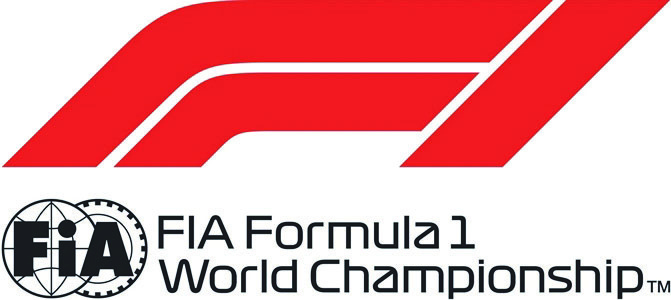

2021 ITALIAN GRAND PRIX

9 - 12 September 2021

From The Stewards Document 30

To All Teams, All Officials Date 10 September 2021

Time 22:05

Title Timing Sheet

Description Provisional Sprint Qualifying Grid

Enclosed ITA DOC 30 - Provisional Sprint Qualifying Starting Grid.pdf

Tim Mayer Garry Connelly

Vitantonio Liuzzi Paolo Longoni

The Stewards

Doc 30 Time 22:05

FORMULA 1 HEINEKEN GRAN PREMIO D’ITALIA 2021 - Monza

Sprint Qualifying Provisional Starting Grid

1 77 Valtteri BOTTAS 1:19.555 Mercedes-AMG Petronas F1 Team 2 44 Lewis HAMILTON 1:19.651 Mercedes-AMG Petronas F1 Team 3 33 Max VERSTAPPEN 1:19.966 Red Bull Racing Honda 4 4 Lando NORRIS 1:19.989 McLaren F1 Team 5 3 Daniel RICCIARDO 1:19.995 McLaren F1 Team 6 10 Pierre GASLY 1:20.260 Scuderia AlphaTauri Honda 7 55 Carlos SAINZ 1:20.462 Scuderia Ferrari 8 16 Charles LECLERC 1:20.510 Scuderia Ferrari 9 11 Sergio PEREZ 1:20.611 Red Bull Racing Honda 10 99 Antonio GIOVINAZZI 1:20.808 Alfa Romeo Racing ORLEN 11 5 Sebastian VETTEL 1:20.913 Aston Martin Cognizant F1 Team 12 18 Lance STROLL 1:21.020 Aston Martin Cognizant F1 Team 13 14 Fernando ALONSO 1:21.069 Alpine F1 Team 14 31 Esteban OCON 1:21.103 Alpine F1 Team 15 63 George RUSSELL 1:21.392 Williams Racing 16 6 Nicholas LATIFI 1:21.925 Williams Racing 17 22 Yuki TSUNODA 1:21.973 Scuderia AlphaTauri Honda 18 47 Mick SCHUMACHER 1:22.248 Uralkali Haas F1 Team 19 88 Robert KUBICA 1:22.530 Alfa Romeo Racing ORLEN 20 9 Nikita MAZEPIN 1:22.716 Uralkali Haas F1 Team

© 2021 Formula One World Championship Limited The F1 FORMULA 1 logo, F1 logo, FORMULA 1, FORMULA ONE, F1, FIA FORMULA ONE WORLD CHAMPIONSHIP, GRAND PRIX and related marks are trade marks of Formula One Licensing BV, a Formula 1 company. The FIA logo is a trade mark of the Fédération Internationale de l’Automobile. All rights reserved. No part of these results/data may be reproduced, stored in a retrieval system or transmitted in any form or by any means electronic, mechanical, photocopying, recording, broadcasting or otherwise without prior permission of the copyright holder except for reproduction in local/national/international daily press and regular printed publications on sale to the public within 90 days of the event to which the results/data relate and provided that the copyright symbol and name of copyright owner appears.
