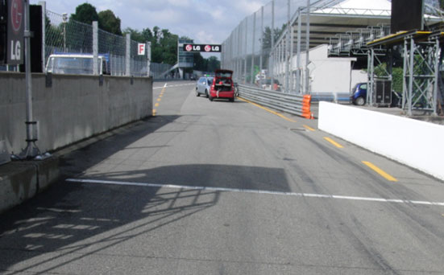
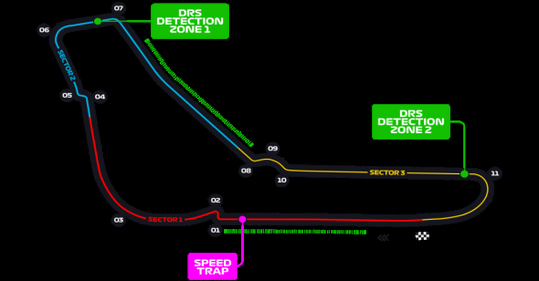

2021 ITALIAN GRAND PRIX

9 - 12 September 2021

From The FIA Formula One Race Director Document 3

To All Teams, All Officials Date 09 September 2021

Time 13:17

Title Race Directors' Event Notes

Description Event Notes

Enclosed 2021 Italian F1 Grand Prix Event Notes Doc 3.pdf

Michael Masi

The FIA Formula One Race Director

2021 I G P TALIAN RAND RIX

9 – 12 September 2021

From The FIA Formula One Race Director Document 3

To All Teams, All Officials Date 9 September 2021

Time 13:15

EVENT NOTES General Instructions

1) Pit lane map

1.1 Safety Car lines.

1.2 The location of the pit entry and the pit exit.

1.3 Designated garage areas.

1.4 Safety Car position for first lap and rest of race.

1.5 Blue flag marshal at the pit exit.

1.6 Track light panels displaying pit entry status.

2) Pirelli Event Preview

2.1 With reference to Article 24.4(a) of the Sporting Regulations see the attached document provided by the official tyre supplier.

3) Red zones for photographers in the pit lane during practice sessions

3.1 See the attached drawing.

4) Track light panels

4.1 The FIA track light panels have been installed in the positions shown on the circuit map. In accordance with Appendix H to the ISC the light signals have the same meaning as flag signals.

5) Track light panel displaying pit entry status

5.1 The light panel indicated on the pit lane map will display a flashing yellow arrow if cars are required to use the pit lane once the Safety Car has been deployed during the race.

5.2 The light panel indicated on the pit lane map will display a flashing red cross if the pit lane is closed at any point during the sprint qualifying session or race.

6) Drivers leaving their pit stop position in the pit lane

6.1 For safety reasons, no car should be driven from its pit stop position at any time unless:

a) It has first been driven into the pit stop position having just entered the pit lane from the track,

and;

b) It is then driven immediately back onto the track from the pit stop position.

1/6

7) Observing yellow flags during free practice and qualifying

7.1 Double waved: Any driver passing through a double waved yellow marshalling sector must reduce speed significantly and be prepared to change direction or stop. In order for the stewards to be

satisfied that any such driver has complied with these requirements it must be clear that he has not

attempted to set a meaningful lap time, for practical purposes this means the driver should abandon

the lap (this does not necessarily mean he has to pit as the track could well be clear the following

lap).

7.2 Single waved: Drivers should reduce their speed and be prepared to change direction. It must be clear that a driver has reduced speed and, in order for this to be clear, a driver would be expected

to have braked earlier and/or discernibly reduced speed in the relevant marshalling sector.

Drivers should not overtake any car in a single waved yellow marshalling sector unless it is clear that

a car is slowing with a completely obvious problem, e.g. obvious accident damage or a deflated tyre.

8) In laps during qualifying and reconnaissance laps

8.1 In order to ensure that cars are not driven unnecessarily slowly on in laps during and after the end of qualifying or during reconnaissance laps when the pit exit is opened for the sprint qualifying

session or the race, drivers must stay below the maximum time set by the FIA between the Safety

Car lines shown on the pit lane map.

You will be informed of the maximum time after the first free practice session.

9) Parc Fermé Cameras

9.1 To assist with the revised FIA Event procedures, the Parc Fermé cameras must be uncovered and operational at all times during the Event.

10) Operational personnel curfew

10.1 Boards warning anyone attempting to enter the paddock that the curfew is in operation will be placed immediately before the turnstiles at the appropriate times.

10.2 At this Event, Personnel will be permitted to enter the Paddock 30 minutes prior to the curfew to assist social distancing. No work is permitted to be undertaken until the curfew has ended.

11) Tyre Blanket Usage during Pit Stops in the Race

11.1 For reasons of safety, tyre blankets are not permitted in the Pit Lane at any time during the sprint qualifying session or the race.

12) Lapping during the sprint qualifying session or the race

12.1 The ISC requires drivers who are caught by another car about to lap him to allow the faster driver past at the first available opportunity. The F1 Marshalling System has been developed in order to

ensure that the point at which a driver is shown blue flags is consistent, rather than trusting the ability

of marshals to identify situations that require blue flags.

The system will be set to give a pre-warning when the faster car is within 3.0s of the car about to be

lapped, this should be used by the team of the slower car to warn their driver he is soon going to be

lapped and that allowing the faster car through should be considered a priority. When the faster car

is within 1.2s of the car about to be lapped blue flags will be shown to the slower car (in addition to

blue light panels, blue cockpit lights and a message on the timing monitors) and the driver must allow

the following driver to overtake at the first available opportunity.

It should be noted that the aim of using F1MS is to ensure consistent application of the regulations,

additional instructions may also be given by race control when necessary.

2/6

Event Specific Instructions

13) Formula 1 Sporting Regulations Article 21.6

13.1 In accordance with the provisions of Article 21.6a)i), this Event is a Closed Event.

14) Changes to the circuit

14.1 Other than routine maintenance no changes of significance.

15) Specific Technical Procedures for Closed Events

15.1 The provisions of Technical Directive Ref: TD012 Issue A and TD003 Issue E must be complied with at all times during the Event.

15.2 Any tyres that are removed from a car and could be re-used during a session should be presented for scanning before being rewrapped and reheated. If time constraints do not permit this then all

tyres used during a session must be presented to the tyre checker at the front of the garage at the

end of any session. This applies to dry, wet and intermediate tyres.

15.3 Both TD012 Issue: A and TD003 Issue E will be amended after the Event to reflect any additional operational requirements as required.

16) Weighing and weighing platform

16.1 The FIA weighing platform will be available for teams to use at the following times, however, no more than 8 team personnel may be present during any visit. Each visit should last no more than 10

minutes unless no other team is waiting in the pit lane:

a) From 14:30 on Thursday until 13:30 on Friday.

b) From 15:30 until 17:30 on Friday (each visit will be restricted to five (5) minutes).

c) From when the cars are returned to the teams after the qualifying practice session until 22:30

on Friday.

d) From 09:00 until 15:30 on Saturday (between 13:00 and 15:30 on Saturday each visit will be

restricted to five (5) minutes).

e) From when the cars are returned to the teams after the sprint qualifying session until 20:30 on

Saturday.

f) From 10:00 until 11:00 and 13:00 until 14:20 on Sunday.

Any team found to be abusing the time limits set out above, which we will be enforced by FIA security

personnel and our own CCTV, will not be permitted to use the weighbridge again during the Event.

16.2 Whilst waiting in the pit lane, the use of tyre blankets is not permitted.

17) Support Races

17.1 Team Barrier placement

a) Team barrier placement prior to and during all support category practice sessions and races:

No more than three (3) metres from the garages.

b) Please ensure that your Pit Stop gantry arms are moved back towards the Garage during all

Support Race Activity.

c) It is not permitted to push cars to the weighing area at any time a support category is in pit

lane.

17.2 Support Category Movements

a) Support Crews and Trolleys will be released into Pit Lane no earlier than 20 minutes prior to

the opening of Pit Exit for their respective sessions.

b) Support Category competition vehicles will be released from the marshalling area no earlier

than 15 minutes prior to the opening of Pit Exit for their respective sessions.

3/6

18) Practice starts

18.1 During each free practice session, practice starts may only be carried out on the right-hand side after the end of the Pit Wall but before the first dotted white line across the pit exit. Drivers wishing to carry

out a practice start should stop on the right in order to allow other cars to pass on their left.

18.2 During the time the pit exit is open for the race, practice starts may be carried out after the end of the pit wall but before the second dotted white line across the pit exit. Drivers wishing to carry out a

practice start should stop on the right in order to allow other cars to pass on their left.

18.3 During these times any driver passing a car which has stopped to carry out a practice start may cross the white line that is referred to in 19.1 below. Any driver crossing this line must move back to

the right of it as quickly as possible.

18.4 For reasons of safety and sporting equity, cars may not stop in the fast lane at any time the pit exit is open without a justifiable reason (a practice start is not considered a justifiable reason).

18.5 For reasons of safety and sporting equity, at any time the pit exit is open and when practice starts are permitted to be carried out, any car who wishes to perform a practice start must form up in a line

and leave in the order they got there unless another car is unduly delayed.

19) Lines or bollards at the Pit Entry and Pit Exit

19.1 In accordance with Chapter 4 (Section 5) of Appendix L to the ISC drivers must keep to the right of the solid white line at the pit exit when leaving the pits. No part of any car leaving the pits may cross

this line other than in the cases detailed in 18.1, 18.2 and 18.3 above.

19.2 For safety reasons drivers must keep to the right of the bollard at the pit entry when they are entering the pits.

19.3 Except in the cases of force majeure (accepted as such by the Stewards), the crossing by any part of the car, in any direction, of the painted area between the pit entry and the track, by a driver who,

in the opinion of the Stewards, had committed to entering the pit lane is prohibited.

19.4 The dotted white line across the pit exit is the track edge line.

20) DRS

20.1 DRS Detection will be automatically disabled in each individual zone if any of the light panels in that particular zone are displaying yellow. The zone and corresponding light panels are as follows:

a) Zone 1: Panels 9, 10, 11, 12, 13

b) Zone 2: Panels 1, 2, 3

21) Track Limits

21.1 Turns 1-2

a) Four rows of polystyrene blocks have been placed in the escape road at Turn 1 / Turn 2 (first

chicane). In order to ensure that cars are able to re-join the track safely any driver using the

escape road must go around the end of each of these rows and re-join the track at the end of

the escape road. Drivers may only use the grass if it is clearly unavoidable.

21.2 Turn 5

a) Any driver going straight and who misses the black and yellow bumps placed before the apex

kerb of Turn 5 (second chicane) must stay to the right of the yellow line and the bollard, he

may then re-join the track at the far end of the asphalt run-off area after the exit of Turn 5. A

lap time achieved during any practice session, sprint qualifying session or the race in this

manner will result in that lap time will being invalidated by the stewards.

21.3 Turn 11

a) A lap time achieved during any practice session, sprint qualifying session or the race by leaving

the track on the outside of Turn 11, will result in that lap time and the immediately following lap

4/6

time being invalidated by the stewards. A driver will be judged to have left the track if no part

of the car remains in contact with the track.

21.4 General – Turn 1-2, Turn 5 and Turn 11

a) Each time any car passes behind the apex at Turn 5 or crosses the white line at Turn 11,

Competitors will be informed via the official messaging system.

b) On the third occasion of a driver cutting behind the apex of Turn 5, and/or crossing the white

line on the outside of Turn 11 during the sprint qualifying session or the race, he will be shown

a black and white flag, any further cutting will then be reported to the stewards. For the

avoidance of doubt this means a total of three occasions combined, not three at each corner.

c) The above requirements will not automatically apply to any driver who is judged to have been

forced off the track, each such case will be judged individually.

d) In all cases detailed in item 21 above, the driver must only re-join the track when it is safe to

do so and without gaining a lasting advantage.

22) Article 27.4

22.1 Each Competitor and Driver is reminded of the provisions of Article 27.4 of the Formula 1 Sporting Regulations.

22.2 For reasons of safety, during each practice session, acts such as weaving across the track to hinder another car may be referred to the stewards.

22.3 During Free Practice session 1 and the Qualifying Practice, the time published in accordance with Item 8 of the Race Directors Event Notes will be used as a guide by the stewards to determine if a

Driver is considered to be driving unnecessarily slowly on an out lap or any other lap that is not a

fast lap or in lap.

22.4 For the avoidance of doubt, the pit exit, as defined in Article 28.2 of the F1 Sporting Regulations is considered a part of the track and the provisions of Article 27.4 apply in this area.

23) Fire extinguishers around the circuit

23.1 Indicated by white boards with a red fire extinguisher image attached to the debris fences and barriers.

24) Places to remove cars from the track

24.1 Indicated by fluorescent orange panels on the barriers.

24.2 Should a car stop on the track during a session, the driver must keep all of their protective clothing (Helmet, Gloves, etc) on until they have returned to their garage.

25) Access to the grid prior to the Start Procedure

25.1 To assist social distancing in accessing the grid prior to the commencement of the start procedure, Team personnel and equipment will be granted access to the grid from:

a) 1545hrs on Saturday 11th September

b) 1400hrs on Sunday 12th September.

26) Removing cars from the grid

26.1 Through the gate in the pit wall located adjacent to grid position 6 and through the Pit Lane Exit.

27) Car number light panels for the start

27.1 On the right-hand side of the grid.

5/6

28) Post-race parc fermé

28.1 All cars must enter the pit lane and, with the exception of the first three (3), should be driven directly to the weighing area at the pit entry.

28.2 The first three (3) cars must follow the post-race procedure which will be distributed prior to the start of the race.

29) Any other business

Michael Masi

FIA Formula One Race Director

6/6

2021 Italian Grand Prix Pit Lane

SAFETY CAR Line 2 PIT LANE Starts PIT LANE Ends SAFETY CAR Line 1

X BLUE FLAG PIT EXIT SAFETY CAR PIT ENTRY Marshal Race F1 Garages

X

CARS RECOVERED FROM Pit Entry SAFETY CAR Pit Entry Pole Position TRACK PLACED HERE Bollard First Lap Status panels

| 60 | 59 | 58 | 57 | 56 | 55 | 54 | 53 | 52 | 51 | 50 | 49 | 48 | 47 | 46 | 45 |  | 44 | 43 | 42 | 41 | 40 |  | 39 | 38 | 37 | 36 | 35 | 34 | 33 | 32 | 31 | 30 | 29 | 28 | 27 | 26 | 25 | 24 | 23 2 | 2 21 | 20 | 19 |  | 18 | 17 | 16 | 15 | 14 | 13 | 12 | 11 | 10 | 9 | 8 | 7 | 6 | 5 | 4 | 3 |
| --- | --- | --- | --- | --- | --- | --- | --- | --- | --- | --- | --- | --- | --- | --- | --- | --- | --- | --- | --- | --- | --- | --- | --- | --- | --- | --- | --- | --- | --- | --- | --- | --- | --- | --- | --- | --- | --- | --- | --- | --- | --- | --- | --- | --- | --- | --- | --- | --- | --- | --- | --- | --- | --- | --- | --- | --- | --- | --- | --- |
| 1 alumroF | smailliW | smailliW | smailliW | smailliW | saaH / smailliW | saaH | saaH | saaH | saaH | oemoR aflA | oemoR aflA | oemoR aflA | oemoR aflA | oemoR aflA | R aflA / TahplA |  | iruaTahplA | iruaTahplA | iruaTahplA | iruaTahplA | irarreF |  | irarreF | irarreF | irarreF | irarreF | eniplA / irarreF | eniplA | eniplA | eniplA | eniplA | yawklaW | nitraM notsA | nitraM notsA | nitraM notsA | nitraM notsA | nitraM notsA | neraLcM | neraLcM | neraLcM neraLcM | neraLcM | lluB deR |  | lluB deR | lluB deR | lluB deR | lluB deR | sedecreM | sedecreM | sedecreM | sedecreM | sedecreM | sedecreM | 1 alumroF | 1 alumroF | AIF | AIF | AIF | AIF |
|  |  |  |  |  | Haas |  |  |  |  | Alfa Romeo |  |  |  |  |  | AlphaTauri |  |  |  |  |  | Ferrari |  |  |  |  |  | Alpine |  |  |  |  | Aston Martin |  |  |  |  | McLaren |  |  |  |  | Red Bull |  |  |  |  |  | Mercedes |  |  |  |  | Designated Garage Areas |  |  |  |  |  |

Pit Stop Position

FAST LANE FAST LANE

Control Line

Version 1 – 9 September 2021

In agreement with the FIA and in accordance with Article 24.4 a) of the F1 Sporting Regulations, this document contains the prescriptions for the operation of tyres during the following event. Document version: 1 issue: A

| Grand Prix of Italy 10/09-12/09/2021 (21R14MZA) |  |  |  |  |  |  |
| --- | --- | --- | --- | --- | --- | --- |
| Compounds selection | pound |  |  |  |  |  |
| C2 |  | FL 2W1 | FR 2W2 | RL 6W3 | RR 6W4 | Mandatory race tyres C2 C3 Q3 tyre |
| C3 |  | 3Y1 | 3Y2 | 7Y3 | 7Y4 |  |
| C4 Intermediate |  | 4R1 | 4R2 | 8R7 | 8R8 |  |
| Wet |  | 33X 34Y | 35X 36Y | 37X 37Y | 39X 39Y |  |

| Prescriptions |  |  |  |  |  |  |  |  |
| --- | --- | --- | --- | --- | --- | --- | --- | --- |
|  | Mimimum Starting P |  |  | Minimum re-heat pressure for slicks 23.5 psi |  | Expected stabilized running pressure ≥25.0 psi | Camber limit -3.00 ° | Blistering sensitivity Low |
|  | Slicks 24.0 psi | Inter 23.5 psi | Wet 22.5 psi |  | 60 80 100 (°C) max. 3h max. 3h max. 2h max max. 2h |  | . 30' |  |

| Fro | nt p | res | sur | e |
| --- | --- | --- | --- | --- |
| Rea | r pr | ess | ure |  |

• The temperatures apply at all times during the event.

| Tyres notes |  |
| --- | --- |
| • Not permitted to switch tyres from their originally allocated position. • Do not subject tyres to large deformation or heavy impact. • Do not leave fitted tyres exposed at an air temperature lower than 15°C and/or any UV emission. • Revised prescriptions could be issued during the race weekend in accordance with TD003. | • All temperature limits apply to the actual tyre surface temperature, measured with the IR gun detailed in the TD003. • BLANKET HEATING TIME for each temperature range to be counted from the moment the blanket control unit is set to reach its targeted temperature within its correspondent interval. |

General notes

Teams are kindly reminded that the following will be subject to FIA checks during the event: • Starting pressures • Cold pressures (according to the cold pressure cooling curves) • Re-heat pressures • EOS Camber • Maximum tyre temperatures in blankets • Tyre swapping
