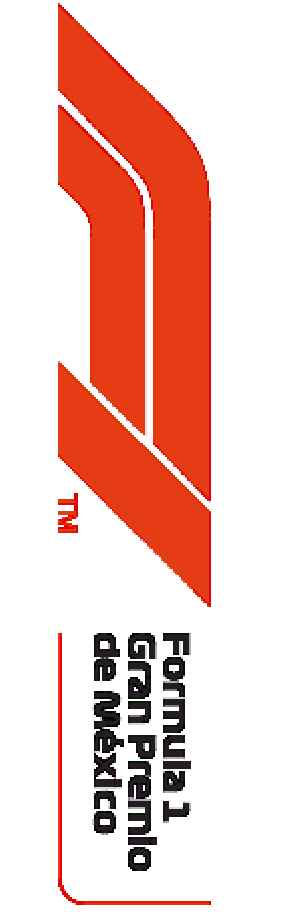

2021 MEXICAN GRAND PRIX

4 - 7 November 2021

From The FIA Formula One Race Director Document 52

To All Teams, All Officials Date 07 November 2021

Time 10:09

Title Race Directors' Note - Pre-Race Procedure

Description Pre-Race Procedure

Enclosed 2021 Mexican F1 Grand Prix Pre Race Procedure Doc 52.pdf

Michael Masi

The FIA Formula One Race Director

2021 M G P EXICAN RAND RIX

4 – 7 November 2021

From The FIA Formula One Race Director Document 52

To All Teams, All Officials Date 7 November 2021

Time 10:10

NOTE TO TEAMS: WE RACE AS ONE RECOGNITION AND NATIONAL ANTHEM

Please find below a summary of the requirements for the Pre-Race activity to support the values of

WeRaceAsOne and the National Anthem, which must be followed in order to ensure the orderly running

of these procedures.

The FIA, Formula 1, Teams and Drivers stand united as a sport in support of the principles of

WeRaceAsOne, the initiative created by Formula 1 under the FIA’s #PurposeDriven movement. Each

driver may choose to mark this moment with their own gesture, while complying with the fundamental

principles of the FIA Statutes.

The procedure outlined for the pre-race activities are detailed below together with the associated timings:

12.41:00 At F1 personnel visual cue and an announcement over the PA system each Driver will walk in

their race suits to the WeRaceAsOne banner placed across the width of the track and stand

by their name card. In support of the FIA’s Safe and Affordable Helmet Programme launch in

Mexico, each driver will have their custom-designed example of the affordable helmet placed

in front of them on the banner.

Drivers may, if they choose to do so, wear the GPDA issued WRAO t-shirt or any attire

conveying a message in support of the WeRaceAsOne values. This attire must be approved

by the Drivers’ respective teams.

At this stage the VT of driver pledges will be playing on the International feed whilst Drivers

get organised and into position.

12.42:00 International Feed goes live to drivers organised in position on the carpet runner.

12:43:00 On the Audio Beep, drivers can choose a gesture of support. As suggestions these gestures

could include;

• taking the knee

• standing on banner with arms crossed in front or behind them

• standing on banner and bow head

• standing on banner

• standing on banner and place their hand on the heart

1/3

12.43:10 On the Audio Beep, this moment will be concluded with the audio “Thank you for this statement

of support for the values of sustainability, diversity and inclusion, community and ending racism

in the world. Under We Race As One’s Community pillar, Formula 1, the FIA and all teams and

drivers took this moment to highlight the FIA’s Safe and Affordable Helmet Programme, which

aims to save the lives of the most vulnerable road users around the world – always remember

to wear a helmet when you ride” and drivers remove their t-shirts and move to their name

card position for the National Anthem, wearing their race suits.

12.44:00 The National Anthem.

The FIA, F1 and F1 Teams Communication Directors will continue to manage the media expectations on

how this gesture will be marked. Failure to comply with these procedures will be reported to the Stewards.

Please see the attached National Anthem Diagram.

Michael Masi

FIA Formula One Race Director

2/3

A4 Copyright Formula One World Championship Ltd. This drawing and the information contained therein is the property of Formula One World Championship Ltd. Reproduction in any form without prior written consent is strictly prohibited.

F1 DRIVERS 17X BAND DANCERS COLOR GUARDS

F1 SAFETY CAR

SINGERS

RAC SAFETY

TROPHY

DIGNITARIES

FIA MEX F1 6X FLAG FLAG FLAG FLAG GUARDS

| FORMULA 1 GRAN PREMIO DE LA CIUDAD DE MÉXICO 2021 R 1 8 Autódromo Hermanos Rodríguez - Mexico City - Mexico NOV 05 - NOV 07 | Drawing Title NATIONAL ANTHEM Drawing NumberU:\...DRAWING\2021\MEXICO |  |  |  |
| --- | --- | --- | --- | --- |
|  | Drawn NMS | Date S 07/11/2021 | cale N.T.S | Rev A4 A |
