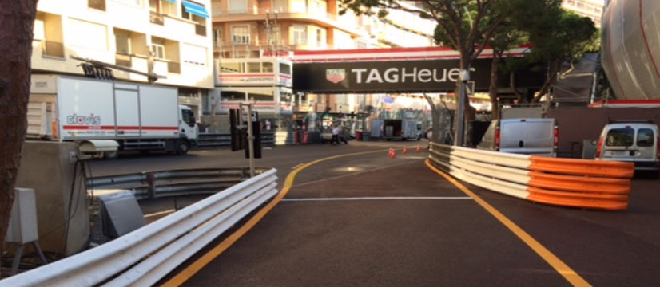
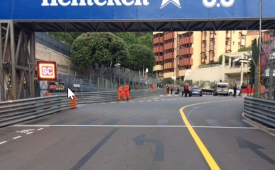
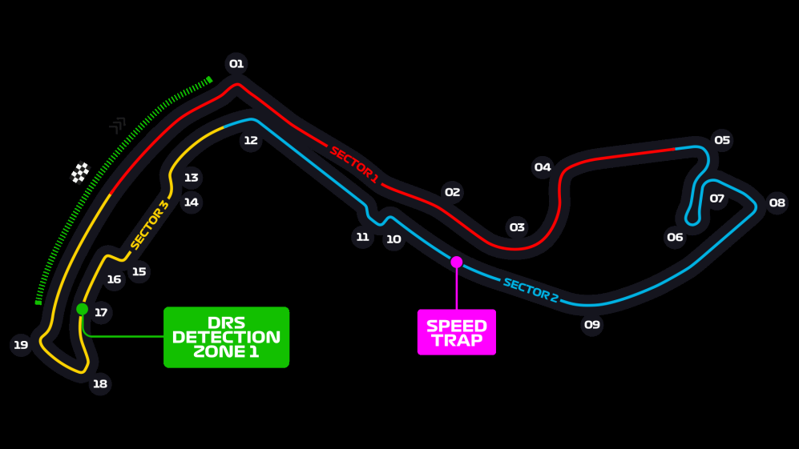

2021 MONACO GRAND PRIX

19 - 23 May 2021

From The FIA Formula One Race Director Document 5

To All Teams, All Officials Date 19 May 2021

Time 16:12

Title Race Directors' Event Notes Version 2

Description Event Notes Version 2

Enclosed 2021 Monaco F1 Grand Prix Event Notes V2 Doc 5.pdf

Michael Masi

The FIA Formula One Race Director

2021 M G P ONACO RAND RIX

19 – 23 May 2021

From The FIA Formula One Race Director Document 5

To All Teams, All Officials Date 19 May 2021

Time 16:10

EVENT NOTES VERSION 2 General Instructions

1) Pit lane map

1.1 Safety Car lines.

1.2 The location of the pit entry and the pit exit.

1.3 Designated garage areas.

1.4 Safety Car position for first lap and rest of race.

1.5 Blue flag marshal at the pit exit.

1.6 Track light panels displaying pit entry status.

2) Pirelli Event Preview

2.1 With reference to Article 24.4(a) of the Sporting Regulations see the attached document provided by the official tyre supplier.

3) Red zones for photographers in the pit lane during practice sessions

3.1 See the attached drawing.

4) Track light panels

4.1 The FIA track light panels have been installed in the positions shown on the circuit map. In accordance with Appendix H to the ISC the light signals have the same meaning as flag signals.

5) Track light panel displaying pit entry status

5.1 The light panel indicated on the pit lane map will display a flashing yellow arrow if cars are required to use the pit lane once the Safety Car has been deployed during the race.

5.2 The light panel indicated on the pit lane map will display a flashing red cross if the pit lane is closed at any point during the race.

6) Drivers leaving their pit stop position in the pit lane

6.1 For safety reasons, no car should be driven from its pit stop position at any time unless:

a) It has first been driven into the pit stop position having just entered the pit lane from the track,

and;

b) It is then driven immediately back onto the track from the pit stop position.

1/5

7) Observing yellow flags during free practice and qualifying

7.1 Double waved: Any driver passing through a double waved yellow marshalling sector must reduce speed significantly and be prepared to change direction or stop. In order for the stewards to be

satisfied that any such driver has complied with these requirements it must be clear that he has not

attempted to set a meaningful lap time, for practical purposes this means the driver should abandon

the lap (this does not necessarily mean he has to pit as the track could well be clear the following

lap).

7.2 Single waved: Drivers should reduce their speed and be prepared to change direction. It must be clear that a driver has reduced speed and, in order for this to be clear, a driver would be expected

to have braked earlier and/or discernibly reduced speed in the relevant marshalling sector.

Drivers should not overtake any car in a single waved yellow marshalling sector unless it is clear that

a car is slowing with a completely obvious problem, e.g. obvious accident damage or a deflated tyre.

8) In laps during qualifying and reconnaissance laps

8.1 In order to ensure that cars are not driven unnecessarily slowly on in laps during and after the end of qualifying or during reconnaissance laps when the pit exit is opened for the race, drivers must stay

below the maximum time set by the FIA between the Safety Car lines shown on the pit lane map.

You will be informed of the maximum time after the first day of practice.

9) Parc Fermé Cameras

9.1 To assist with the revised FIA Event procedures, the Parc Fermé cameras must be uncovered and operational at all times during the Event.

10) Operational personnel curfew

10.1 Boards warning anyone attempting to enter the paddock that the curfew is in operation will be placed immediately before the turnstiles at the appropriate times.

10.2 At this Event, Personnel will be permitted to enter the Paddock 30 minutes prior to the curfew to assist social distancing. No work is permitted to be undertaken until the curfew has ended.

11) Tyre Blanket Usage during Pit Stops in the Race

11.1 For reasons of safety, tyre blankets are not permitted in the Pit Lane at any time during the race.

12) Lapping during the race

12.1 The ISC requires drivers who are caught by another car about to lap him to allow the faster driver past at the first available opportunity. The F1 Marshalling System has been developed in order to

ensure that the point at which a driver is shown blue flags is consistent, rather than trusting the ability

of marshals to identify situations that require blue flags.

As it was at the end of last season the system will be set to give a pre-warning when the faster car

is within 3.0s of the car about to be lapped, this should be used by the team of the slower car to warn

their driver he is soon going to be lapped and that allowing the faster car through should be

considered a priority. When the faster car is within 1.2s of the car about to be lapped blue flags will

be shown to the slower car (in addition to blue light panels, blue cockpit lights and a message on the

timing monitors) and the driver must allow the following driver to overtake at the first available

opportunity.

It should be noted that the aim of using F1MS is to ensure consistent application of the rules,

additional instructions may also be given by race control when necessary.

2/5

Event Specific Instructions

13) Formula 1 Sporting Regulations Article 21.6

13.1 In accordance with the provisions of Article 21.6a) i), this Event is a Closed Event.

14) Changes to the circuit

14.1 Resurfacing has taken place in the following locations: a) The Pit Lane fast lane

b) Exit of Turn 19 through to the exit of Turn 1

c) Exit of Turn 4 through to the exit of the tunnel prior to Turn 10

d) Exit of Turn 11 through to the Entry to Turn 15

14.2 The apex kerb at Turn 4 has been removed and replaced with a painted flat kerb.

14.3 The apex kerb at Turn 14 has been placed in the 2018 location.

14.4 Debris fence has been added in a number of locations around the circuit.

15) Specific Technical Procedures for Closed Events

15.1 The provisions of Technical Directive Ref: TD012 Issue: A and the “Pirelli HSE procedures” must be complied with at all times during the Event.

15.2 Any tyres that are removed from a car and could be re-used during a session should be presented for scanning before being rewrapped and reheated. If time constraints do not permit this then all

tyres used during a session must be presented to the FIA representative at the front of the garage

at the end of any session. This applies to dry, wet and intermediate tyres.

15.3 Both TD012 Issue: A and the “Pirelli HSE procedures” will be amended after the Event to reflect any additional operational requirements as required.

16) Weighing and weighing platform

16.1 The FIA weighing platform will be available for teams to use at the following times, however, no more than 8 team personnel may be present during any visit. Each visit should last no more than 10

minutes unless no other team is waiting in the pit lane:

a) From 11:30 on Wednesday until 10:30 on Thursday.

b) From 12:30 until 23:30 on Thursday

c) From 14:00 on Friday until 14:30 on Saturday (between 13:00 and 14:30 on Saturday each

visit will be restricted to five (5) minutes).

d) From when the cars are returned to the teams after qualifying until 19:30 on Saturday.

e) From 10:00 until 11:00 and 13:00 until 14:20 on Sunday.

Any team found to be abusing the time limits set out above, which we will be enforced by FIA security

personnel and our own CCTV, will not be permitted to use the weighbridge again during the Event.

17) Support Races

17.1 Team Barrier placement

a) Team barrier placement prior to and during all support category practice sessions and races:

No more than one (1) metre from the garages.

b) It is not permitted to push cars to the weighing area at any time a support category is in pit

lane.

17.2 Support Category Movements

a) Support Crews and Trolleys will be released into Pit Lane no earlier than 20 minutes prior to

the opening of Pit Exit for their respective sessions.

b) Support Category competition vehicles will be released from the marshalling area no earlier

than 15 minutes prior to the opening of Pit Exit for their respective sessions. 3/5

18) Pit Lane

18.1 Speed Limit

a) The Pit lane Speed limit detailed in Article 22.10 of the Sporting Regulations is hereby

amended to 60km/h for the duration of the Event.

18.2 Pit Exit Derestriction Line a) Please be aware that the derestriction line at the Pit Exit is located after the Control Line in Pit

Lane. The Pit Exit derestriction line is identified as the solid white line and the Control Line is

displayed as a chequered flag.

19) Practice starts

19.1 Practice starts may be carried out on the track at the end of each free practice session, none may be carried out in the pit lane. Any car on the track when the chequered flag is shown may then

complete another lap and, instead of entering the pits, proceed to the grid and carry out a practice

start.

All drivers carrying out a practice must do so by pulling as far forward on the grid as possible and, if

necessary, should wait for others to carry out a start before getting to a grid position further forward.

Under no circumstances should a driver make a practice start if another car is still stationary in front

of him on the same side of the grid.

If any driver appears to be disregarding any of the above a red flag will be displayed and the

possibility to carry out any further starts will be immediately terminated.

19.2 For reasons of safety and sporting equity, cars may not stop in the fast lane at any time the pit exit is open without a justifiable reason (a practice start is not considered a justifiable reason).

20) Lines or bollards at the Pit Entry and Pit Exit

20.1 In accordance with Chapter 4 (Section 5) of Appendix L to the ISC drivers must keep to the right of the solid yellow line at the pit exit when leaving the pits and stay to the right of this line until it finishes

after Turn 1.

20.2 In order to warn drivers leaving the pits that the pit exit is obstructed, two (2) yellow arrows will be illuminated, one at the pit exit and one just before Turn 1. If either of these are illuminated, drivers

leaving the pits are permitted to cross the yellow line.

21) Lights before Pit Exit

21.1 There are two (2) yellow arrows above the track just before the Pit Exit, these will be flashed to warn drivers on the track that a car is leaving the pit lane.

22) DRS

22.1 DRS Detection will be automatically disabled in each individual zone if any of the light panels in that particular zone are displaying yellow. The zone and corresponding light panels are as follows:

a) Zone 1: Panels 18, 19, 1, 2

23) Track Limits

23.1 Turn 10

a) A lap time achieved during any practice session or the race by leaving the track and failing to

negotiate Turn 10 by using the track, will result in that lap time being invalidated by the

stewards.

23.2 General - Turn 10

a) Each time any car fails to negotiate Turn 10 by using the track as described above, teams will

be informed via the official messaging system.

4/5

b) On the second occasion of a driver failing to negotiate Turn 10 by using the track during the

race, he will be shown a black and white flag, any further cutting will then be reported to the

stewards.

c) The above requirements will not automatically apply to any driver who is judged to have been

forced off the track, each such case will be judged individually.

d) In all cases detailed above, the driver must only re-join the track when it is safe to do so and

without gaining a lasting advantage.

23.3 Turn 10-11 Escape Road

a) If a car uses the escape road at Turn 10-11 (Chicane) the driver may re-join the track only

when the lights, operated by the marshal on the spot, are turned green.

24) Fire extinguishers around the circuit

24.1 Indicated by florescent orange boards attached to the debris fences and barriers.

25) Places to remove cars from the track

25.1 Indicated by fluorescent orange panels on the barriers.

25.2 Should a car stop on the track during a session, the driver must keep all of their protective clothing (Helmet, Gloves, etc) on until they have returned to their garage.

26) Sporting Regulations Article 36.4

26.1 In addition to the provisions of Article 36.4, and for reasons of safety, tyre blankets must be disconnected from any power supply at the five-minute signal and must not be reconnected during

the start procedure, unless the delayed start signal is shown.

27) Access to the grid prior to the Start Procedure

27.1 To assist social distancing in accessing the grid prior to the commencement of the start procedure, Team personnel and equipment will be granted access to the grid from 1400hrs on Sunday 9th May.

28) Removing cars from the grid

28.1 Through the Pit Lane Exit.

29) Car number light panels for the start

29.1 On the right-hand side of the grid.

30) Suspending a Race

30.1 If the race is suspended, we would like the first car entering the pit lane to stop at the end of the last garage, rather than going to the pit exit lights. This will provide more room for the teams and allow

any cars permitted to un-lap to be pushed to the front of the line of cars in the fast lane.

31) Post-race parc fermé

31.1 All cars must enter the pit lane and, with the exception of the first three, should be driven directly to the weighing area at the pit entry. The first three must follow the post-race procedure which will be

distributed prior to the start of the race.

32) Any other business

Michael Masi

FIA Formula One Race Director

5/5

enaL

potS noitisoP 1202

tiP yaM 91– 31 1 noisreV

| 1F |  |
| --- | --- |
| 1F 1F | smailliW |
| smailliW |  |
| smailliW |  |
| saaH | saaH |
| saaH |  |
| saaH |  |
| oemoR aflA | oemoR aflA |
| oemoR aflA |  |
| oemoR aflA | iruaTahplA |
| iruaTahplA |  |
| iruaTahplA |  |
| iruaTahplA |  |
| irarreF | irarreF |
| irarreF |  |
| irarreF |  |
| eniplA | eniplA |
| eniplA |  |
| eniplA |  |
| nitraM notsA | notsA nitraM |
| nitraM notsA |  |
| nitraM notsA |  |
| neraLcM | neraLcM |
| neraLcM |  |
| neraLcM |  |
| lluB deR | lluB deR |
| lluB deR |  |
| lluB deR |  |
| sedecreM | sedecreM |
| sedecreM |  |
| sedecreM |  |
| AIF |  |
| AIF |  |

galF lahsraM 21 2 eulB eniL

RAC

YTEFAS 11

ENAL TIXE

TIP 01 TSAF

xirP

dnarG 9

RAC rewoT sdnE CR ecaR YTEFAS ENAL ocanoM 8 TIP

7

1202

6

stratS 5 ENAL

TIP

4

ENAL 3 slenap yrtnE X TSAF RAC tiP sutatS paL YTEFAS tsriF 2 AIF

saerA detangiseD X

egaraG YRTNE 1 1F / AIF 1 eniL TIP RAC

YTEFAS

| Grand Prix of Monaco 20/05-23/05/2021 (21R05MNC) |  |  |  |  |  |  |  |
| --- | --- | --- | --- | --- | --- | --- | --- |
| Compounds selection | pound |  |  |  |  |  |  |
| C3 |  | FL 3W1 | FR 3W2 | RL 3W3 | RR 3W4 | Mandatory race tyres C3 C4 Q3 tyre | Mandatory race tyres C3 |
| C4 |  | 4Y1 | 4Y2 | 4Y3 | 4Y4 |  | C4 |
| C5 Intermediate |  | 5R1 | 5R2 | 5R3 | 5R4 |  |  |
| Wet |  | 33X 34Y | 35X 36Y | 37X 37Y | 39X 39Y |  | Q3 tyre C5 |

Running prescriptions

| Minimum Starting P |  |  | Camber limit -4.00 ° | Blistering sensitivity Low |
| --- | --- | --- | --- | --- |
| Slicks 17.5 psi | Inter 18.0 psi | Wet 17.0 psi |  |  |

Front Rear 17.0 psi 18.0 psi 17.0 psi -2.75 ° Low

Tyre heating strategy (tread & sidewall)

| Tyres notes |  |
| --- | --- |
| • Not permitted to switch tyres from their originally allocated position. • Do not subject tyres to large deformation or heavy impact. • Do not leave fitted tyres exposed at an air temperature lower than 15°C and/or any UV emission. • Revised prescriptions could be issued during the race weekend in accordance with TD/036-18. | • All temperature limits apply to the actual tyre surface temperature, measured with the IR gun detailed in the Appendix to the Technical and Sporting regulations. • STORAGE temperature is the recommended temperature the tyre can stay in blankets without time limit. • BLANKET HEATING TIME for each temperature range to be counted from the moment the blanket control unit is set to reach its targeted temperature within its correspondent interval. |

General notes

Teams are kindly reminded that the following parameters will be subjected to FIA checks during the event: - Starting pressure. - Camber at maximum speed. - Maximum blanket temperature. - Tyre swapping.
