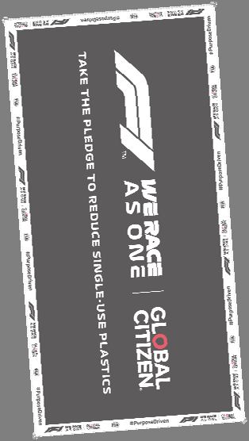
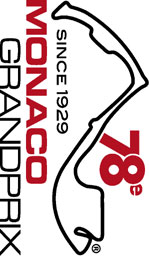

2021 MONACO GRAND PRIX

19 - 23 May 2021

From The FIA Formula One Race Director Document 31

To All Teams, All Officials Date 23 May 2021

Time 11:33

Title Race Directors Note - Pre-Race Procedure

Description Pre-Race Procedure

Enclosed 2021 Monaco F1 Grand Prix Pre Race Procedure Doc 31.pdf

Michael Masi

The FIA Formula One Race Director

2021 M G P ONACO RAND RIX

19 – 23 May 2021

From The FIA Formula One Race Director Document 31

To All Teams, All Officials Date 23 May 2021

Time 11:30

NOTE TO TEAMS: WE RACE AS ONE RECOGNITION AND NATIONAL ANTHEM

Please find below a summary of the requirements for the Pre-Race activity to support the values of

WeRaceAsOne and the Anthems, which must be followed in order to ensure the orderly running of these

procedures.

The FIA, Formula 1, Teams and Drivers stand united as a sport in support of the principles of

WeRaceAsOne, the initiative created by Formula 1 under the FIA’s #PurposeDriven movement. Each

driver may choose to mark this moment with their own gesture, while complying with the fundamental

principles of the FIA Statutes.

The procedure outlined for the pre-race activities are detailed below together with the associated timings:

14.42.00 At F1 personnel visual cue and an announcement over the PA system each Driver will walk in

their race suits to the WeRaceAsOne banner placed across the width of the track and stand

by their name card.

Drivers may, if they choose to do so, wear the GPDA issued WRAO t-shirt or any attire

conveying a message in support of the WeRaceAsOne values. This attire must be approved

by the Drivers’ respective teams.

At this stage the VT of driver pledges will be playing on the International feed whilst Drivers

get organised and into position.

14.43:00 International Feed goes live to drivers organised in position on the carpet runner.

14:43:00 On the Audio Beep, drivers can choose a gesture of support. As suggestions these gestures

could include;

• taking the knee

• standing on banner with arms crossed in front or behind them

• standing on banner and bow head

• standing on banner

• standing on banner and place their hand on the heart

14.43: 20 On the Audio Beep, this moment will be concluded with the audio “Thank you for this statement

of support in pledging to reduce the use of single-use plastics. Formula 1 and the FIA took this

moment, in recognition of the importance of We Race As One” and drivers remove their t-

shirts and move to their name card position for the National Anthem, wearing their race suits.

1/3

14.44:00 The National Anthem of Monaco

The FIA, F1 and F1 Teams Communication Directors will continue to manage the media expectations on

how this gesture will be marked. Failure to comply with these procedures will be reported to the Stewards.

Please see the attached Anthems Diagram.

Michael Masi

FIA Formula One Race Director

2/3

