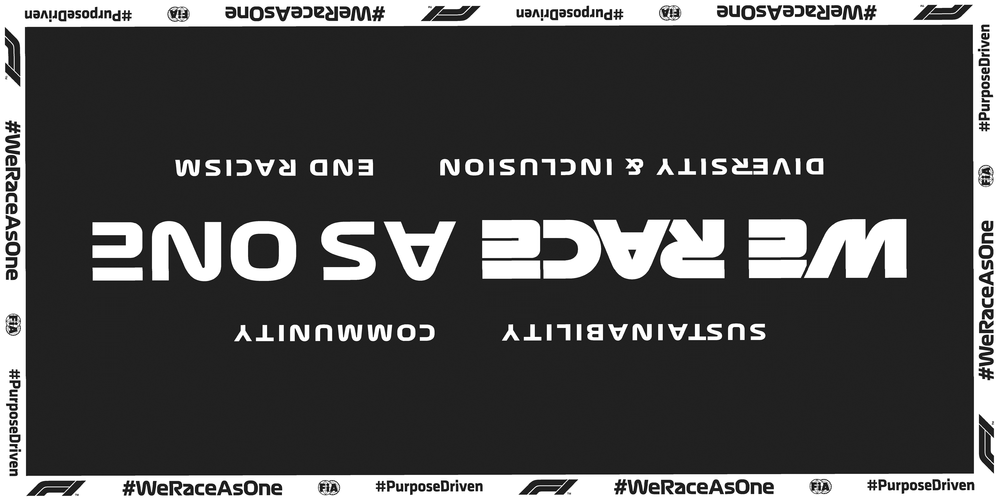
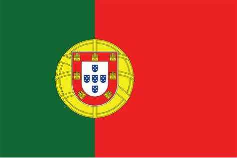

2021 PORTUGUESE GRAND PRIX

29 April - 2 May 2021

From The FIA Formula One Race Director Document 32

To All Teams, All Officials Date 02 May 2021

Time 11:31

Title Race Directors Note - Pre-Race Procedure

Description Pre-Race Procedure

Enclosed 2021 Portuguese F1 Grand Prix Pre Race Procedure Doc 32.pdf

Michael Masi

The FIA Formula One Race Director

2021 P G P ORTUGUESE RAND RIX

29 April - 2 May 2021

From The FIA Formula One Race Director Document 32

To All Teams, All Officials Date 2 May 2021

Time 11:30

NOTE TO TEAMS: WE RACE AS ONE RECOGNITION AND NATIONAL ANTHEM

Please find below a summary of the requirements for the Pre-Race activity to support the values of

WeRaceAsOne and the National Anthem, which must be followed in order to ensure the orderly running

of these procedures.

The FIA, Formula 1, Teams and Drivers stand united as a sport in support of the principles of

WeRaceAsOne, the initiative created by Formula 1 under the FIA’s #PurposeDriven movement. Each

driver may choose to mark this moment with their own gesture, while complying with the fundamental

principles of the FIA Statutes.

The procedure outlined for the pre-race activities are detailed below together with the associated timings:

14.42.00 At F1 personnel visual cue and an announcement over the PA system each Driver will walk in

their race suits to the WeRaceAsOne banner placed across the width of the track and stand

by their name card.

Drivers may, if they choose to do so, wear the GPDA issued WRAO t-shirt or any attire

conveying a message in support of the WeRaceAsOne values. This attire must be approved

by the Drivers’ respective teams.

At this stage the VT of driver pledges will be playing on the International feed whilst Drivers

get organised and into position.

14.43:00 International Feed goes live to drivers organised in position on the carpet runner.

14:43:00 On the Audio Beep, drivers can choose a gesture of support. As suggestions these gestures

could include;

• taking the knee

• standing on banner with arms crossed in front or behind them

• standing on banner and bow head

• standing on banner

• standing on banner and place their hand on the heart

14.43: 20 On the Audio Beep, this moment will be concluded with the audio “Thank you for this statement

of support for the values of sustainability, diversity and inclusion, community and end racism

in the world. Formula 1 and the FIA took this moment, in recognition of the importance of We

Race As One” and drivers remove their t-shirts and move to their name card position for

National Anthem, wearing their race suits.

1/3

14.44:00 National Anthem of Portugal.

The FIA, F1 and F1 Teams Communication Directors will continue to manage the media expectations on

how this gesture will be marked. Failure to comply with these procedures will be reported to the Stewards.

Please see the attached National Anthem Diagram.

Michael Masi

FIA Formula One Race Director

2/3

A1

C 124010

.veR

etaD

NOTRUB

.J nwarD 1

L mehtnA A 12_YADECAR_LAGUTROP\1202\:U

G

U K T U R ENIL TRATS O Y

P 3 K S N

E 1 V lanoitaN E L R noitacoL E 6 E G SAFET Y CAR eliF Y 2 + K L S A 12_YADECAR_LAGUTROP 1 N Y A L C 5 A

T I S Y 1 R K S E rebmuN T 1 N S V :eltiT

E R gniwarD gniwarD I N 4 R 1 E F

D N V V

T 0 Z I 1 A S R F D U D V 1 D R N 1 D E .detibihorp A S 3 F N

L A O B yltcirts P V YAM-RPA 20-13 si N 9 T tnesnoc E V nettirw V E T roirp L 2 E H tuohtiw C T mrof A yna M ni X 8 noitcudorpeR I L gpj.lagutroP-fo-galf\SGALF\. F T .dtL E pihsnoipmahC N 1

F B dlroW T 1202 7 R enO lagutroP

alumroF

fo ytreporp

LAGUTROP eht si niereht

deniatnoc - oamitroP noitamrofni

eht dna gniward

sihT

.dtL ED pihsnoipmahC

- evraglA OIMÉRP dlroW

enO

alumroF

thgirypoC

Y

od S R T 1 G T T EDNARG R

F G H N A lanoicanretnI A

& A G L T U F L I A S O L F I C F

ROSNOPS

omordotuA

1

ALUMROF

S S

E E

I I R R

3 O O Y 0R T T H D A B A P N M N N O A

G H G R B I I D T D

LAITNEDIFNOC YLERUCES ESU

RETFA LANRETNI

EB DENRUTER TSUM

SGNIWARD DNA

DEROTS ::eeuussssII LLA

1A
