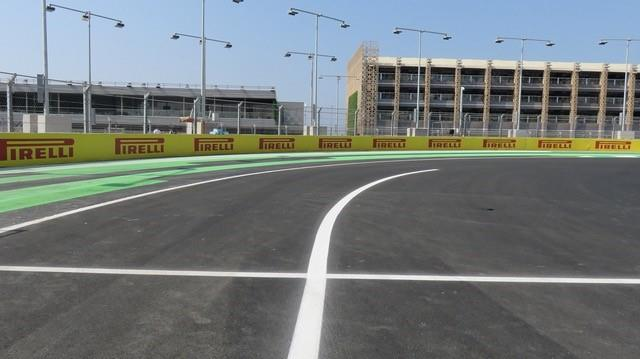
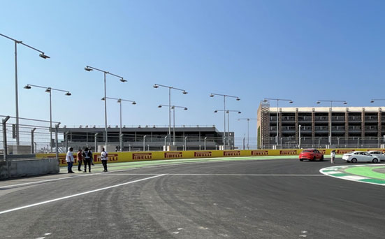
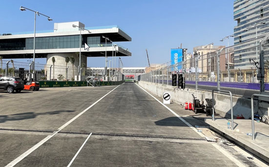
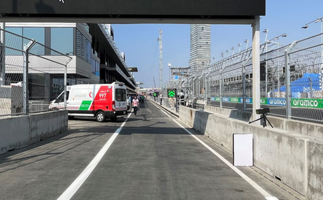
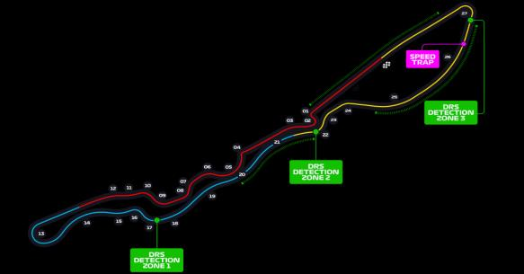
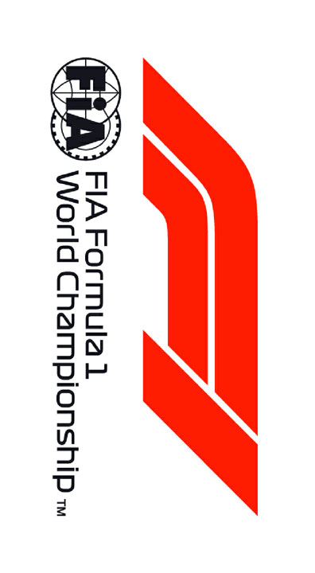

2021 SAUDI ARABIAN GRAND PRIX

2 - 5 December 2021

From The FIA Formula One Race Director Document 14

To All Teams, All Officials Date 04 December 2021

Time 14:54

Title Race Directors' Event Notes Version 3

Description Event Notes Version 3

Enclosed 2021 Saudi Arabian F1 Grand Prix Event Notes V3 Doc 14.pdf

Michael Masi

The FIA Formula One Race Director

2021 S A G P AUDI RABIAN RAND RIX

2 – 5 December 2021

From The FIA Formula One Race Director Document 14

To All Teams, All Officials Date 4 December 2021

Time 14:50

EVENT NOTES VERSION 3 General Instructions

1) Pit lane map

1.1 Safety Car lines.

1.2 The location of the pit entry and the pit exit.

1.3 Designated garage areas.

1.4 Safety Car position for first lap and rest of race.

1.5 Blue flag marshal at the pit exit.

1.6 Track light panels displaying pit entry status.

2) Pirelli Event Preview – UPDATED PREVIEW ATTACHED

2.1 With reference to Article 24.4a) of the Sporting Regulations see the attached document provided by the official tyre supplier.

3) Red zones for photographers in the pit lane during practice sessions

3.1 See the attached drawing.

4) Track light panels

4.1 The FIA track light panels have been installed in the positions shown on the circuit map. In accordance with Appendix H to the ISC the light signals have the same meaning as flag signals.

5) Track light panel displaying pit entry status

5.1 The light panel indicated on the pit lane map will display a flashing yellow arrow if cars are required to use the pit lane once the Safety Car has been deployed during the race.

5.2 The light panel indicated on the pit lane map will display a flashing red cross if the pit lane is closed at any point during the race.

6) Drivers leaving their pit stop position in the pit lane

6.1 For safety reasons, no car should be driven from its pit stop position at any time unless:

a) It has first been driven into the pit stop position having just entered the pit lane from the track,

and;

b) It is then driven immediately back onto the track from the pit stop position.

1/6

7) Observing yellow flags during free practice and qualifying

7.1 Double waved: Any driver passing through a double waved yellow marshalling sector must reduce speed significantly and be prepared to change direction or stop. In order for the stewards to be

satisfied that any such driver has complied with these requirements it must be clear that he has not

attempted to set a meaningful lap time, for practical purposes any driver in a double yellow sector

will have that lap time deleted.

7.2 Single waved: Drivers should reduce their speed and be prepared to change direction. It must be clear that a driver has reduced speed and, in order for this to be clear, a driver would be expected

to have braked earlier and/or discernibly reduced speed in the relevant marshalling sector.

Drivers should not overtake any car in a single waved yellow marshalling sector unless it is clear that

a car is slowing with a completely obvious problem, e.g. obvious accident damage or a deflated tyre.

8) In laps during qualifying and reconnaissance laps

8.1 In order to ensure that cars are not driven unnecessarily slowly on in laps during and after the end of qualifying or during reconnaissance laps when the pit exit is opened for the race, drivers must stay

below the maximum time set by the FIA between the Safety Car lines shown on the pit lane map.

You will be informed of the maximum time after the first day of practice.

9) Parc Fermé Cameras

9.1 To assist with the revised FIA Event procedures, the Parc Fermé cameras must be uncovered and operational at all times during the Event.

10) Operational personnel curfew

10.1 Boards warning anyone attempting to enter the paddock that the curfew is in operation will be placed immediately before the turnstiles at the appropriate times.

10.2 At this Event, Personnel will be permitted to enter the Paddock 30 minutes prior to the curfew to assist social distancing. No work is permitted to be undertaken until the curfew has ended.

11) Tyre Blanket Usage during Pit Stops in the Race

11.1 For reasons of safety, tyre blankets are not permitted in the Pit Lane at any time during the race.

12) Lapping during the race

12.1 The ISC requires drivers who are caught by another car about to lap him to allow the faster driver past at the first available opportunity. The F1 Marshalling System has been developed in order to

ensure that the point at which a driver is shown blue flags is consistent, rather than trusting the ability

of marshals to identify situations that require blue flags.

As it was at the end of last season the system will be set to give a pre-warning when the faster car

is within 3.0s of the car about to be lapped, this should be used by the team of the slower car to warn

their driver he is soon going to be lapped and that allowing the faster car through should be

considered a priority. When the faster car is within 1.2s of the car about to be lapped blue flags will

be shown to the slower car (in addition to blue light panels, blue cockpit lights and a message on the

timing monitors) and the driver must allow the following driver to overtake at the first available

opportunity.

It should be noted that the aim of using F1MS is to ensure consistent application of the rules,

additional instructions may also be given by race control when necessary.

2/6

Event Specific Instructions

13) Formula 1 Sporting Regulations Article 21.6

13.1 In accordance with the provisions of Article 21.6a)ii), this Event is an Open Event.

14) Changes to the circuit

14.1 This is a new Circuit.

14.2 The line at the Pit Exit has been extended. See attached Image on Page 6.

15) Specific Technical Procedures

15.1 The provisions of Technical Directive Ref: TD012 Issue A and TD003 Issue F must be complied with at all times during the Event.

15.2 Any tyres that are removed from a car and could be re-used during a session should be presented for scanning before being rewrapped and reheated. If time constraints do not permit this then all

tyres used during a session must be presented to the tyre checker at the front of the garage at the

end of any session. This applies to dry, wet and intermediate tyres.

15.3 Both TD012 Issue: A and TD003 Issue F will be amended after the Event to reflect any additional operational requirements as required.

15.4 In addition to the provisions at point 3c of the TD003 Issue F, and due to the characteristics of this Circuit, each Competitor must provide telemetry data from FP1, in the agreed format, no later than

two (2) hours after the end of this session. The other requirements detailed in point 3 remain

unchanged.

16) Weighing and weighing platform

16.1 The FIA weighing platform will be available for teams to use at the following times, however, no more than eight (8) team personnel may be present during any visit. Each visit should last no more than

ten (10) minutes unless no other team is waiting in the pit lane:

a) From 16:30 on Thursday until 15:30 on Friday.

b) From 17:30 on Friday until 19:30 on Saturday (between 18:00 and 19:30 on Saturday each

visit will be restricted to five (5) minutes).

c) From when the cars are returned to the teams after qualifying until 00:30 on Saturday.

d) From 15:30 until 16:30 and 18:30 until 19:50 on Sunday.

Any team found to be abusing the time limits set out above, which we will be enforced by FIA security

personnel and our own CCTV, will not be permitted to use the weighbridge again during the Event.

16.2 Whilst waiting in the pit lane, the use of tyre blankets is not permitted.

17) Support Races

17.1 Team Barrier placement

a) Team barrier placement prior to and during all support category practice sessions and races:

No more than two (2) metres from the garages.

b) Please ensure that your Pit Stop gantry arms are moved back towards the Garage during all

Support Race Activity.

c) It is not permitted to push cars to the weighing area at any time a support category is in pit

lane.

17.2 Support Category Movements

a) Support Crews and Trolleys will be released into Pit Lane no earlier than 20 minutes prior to

the opening of Pit Exit for their respective sessions.

3/6

b) Support Category competition vehicles will be released from the marshalling area no earlier

than 15 minutes prior to the opening of Pit Exit for their respective sessions.

18) Practice starts

18.1 Practice starts may be carried out on the asphalt on the left-hand side of the fast lane immediately after the pit exit line and, for the avoidance of doubt, this includes any time the pit exit is open for the

race.

18.2 For reasons of safety and sporting equity, cars may not stop in the fast lane at any time the pit exit is open without a justifiable reason (a practice start is not considered a justifiable reason).

18.3 For reasons of safety and sporting equity, at any time the pit exit is open and when practice starts are permitted to be carried out, any car who wishes to perform a practice start must form up in a line

and leave in the order they got there unless another car is unduly delayed.

18.4 Additionally, Practice starts may be carried out on the track at the end of each free practice session. Any car on the track when the chequered flag is shown may then complete another lap and, instead

of entering the pits, proceed to the grid and carry out a practice start.

18.5 All drivers carrying out a practice start must do so by pulling as far forward on the grid as possible and, if necessary, should wait for others to carry out a start before getting to a grid position further

forward. Under no circumstances should a driver make a practice start if another car is still stationary

in front of him on the same side of the grid.

18.6 If any driver appears to be disregarding any of the above a red flag will be displayed and the possibility to carry out any further starts will be immediately terminated.

19) Lines or bollards at the Pit Entry and Pit Exit

19.1 In accordance with Chapter 4 (Section 5) of Appendix L to the ISC drivers must keep to the left of the solid white line at the and immediately after the Pit Exit when leaving the pits.

19.2 For safety reasons drivers must keep to the left of the of the solid white line immediately prior to the pit entry when they are entering the pits.

19.3 Except in the cases of force majeure (accepted as such by the Stewards), the crossing by any part of the car, in any direction, of the painted area between the pit entry and the track, by a driver who,

in the opinion of the Stewards, had committed to entering the pit lane is prohibited.

19.4 The dotted white line at the Pit Entry and at the Pit Exit identify the track edge line.

20) DRS

20.1 DRS Detection will be automatically disabled in each individual zone if any of the light panels in that particular zone are displaying yellow. The zone and corresponding light panels are as follows:

a) Zone 1: Panels 12, 13, 14

b) Zone 2: Panels 16, 17, 18, 19

c) Zone 3: Panels 20, 21, 1, 2

21) Driving Unnecessarily Slowly

21.1 Due to the nature of this track, drivers are reminded of the provisions of Article 27.4 of the Sporting Regulations.

21.2 Any driver intending to create a gap in front of him in order to get a clear lap should not attempt to do this around Turn 23 through to Turn 25. Any driver seen to have done this will be reported to the

stewards as being in breach of Article 27.4 of the Sporting Regulations.

22) Fire extinguishers around the circuit

22.1 Indicated by white boards with a red letter “F” attached to the debris fences.

4/6

23) Places where drivers may leave the track

23.1 Indicated by white and green panels displaying a man running, attached to the debris fences.

23.2 Additionally, drivers may leave the track at all vehicle openings indicated by fluorescent orange panels on the barriers.

24) Places to remove cars from the track

24.1 Indicated by fluorescent orange panels on the barriers.

24.2 Should a car stop on the track during a session, the driver must keep all of their protective clothing (Helmet, Gloves, etc) on until they have returned to their garage.

25) Access to the grid prior to the Start Procedure

25.1 To assist social distancing in accessing the grid prior to the commencement of the start procedure, Team personnel and equipment will be granted access to the grid from 1930hrs on Sunday 5th

December.

26) Removing cars from the grid

26.1 Through the gates in the pit wall, the first located adjacent to grid position 1, the second adjacent to grid position 13 and the third adjacent to grid position 24.

27) Car number light panels for the start

27.1 On the left-hand side of the grid.

28) Post-race parc fermé

28.1 All cars must enter the pit lane and, with the exception of the first three (3), should be driven directly to the weighing area at the pit entry.

28.2 The first three (3) cars must follow the post-race procedure which will be distributed prior to the start of the race.

29) Any other business

Michael Masi

FIA Formula One Race Director

5/6

ITEM 14.2 - EXTENDED WHITE LINE AT THE PIT EXIT

6/6

2021 Saudi Arabian Grand Prix Pit Lane

Pit Entry SAFETY CAR Status panels PIT ENTRY Race PIT EXIT

F1 Garages X X

SAFETY CAR First Lap SAFETY CAR Line 2 PIT LANE Starts PIT LANE Ends SAFETY CAR Line 1

1 2 3 4 5 6 7 8 9 10 11 12 13 14 15 16 17 18 19 20 21 22 23 24 25 26 27 28 29 30 31 32 33 34 35 36 37 38 39 40 41 42 43 44 45

| Race Control |  | AIF | AIF | AIF | AIF | MOF | sedecreM | sedecreM | sedecreM | sedecreM | lluB deR | lluB deR | lluB deR | lluB deR | neraLcM | neraLcM | neraLcM | neraLcM | nitraM notsA | nitraM notsA | nitraM ntosA | nitraM notsA | eniplA | eniplA | eniplA | eniplA | irarreF | irarreF | irarreF | irarreF | iruaTahplA | iruaTahplA | iruaTahplA | iruaTahplA | oemoRaflA | oemoRaflA | oemoRaflA | oemoR aflA | saaH | saaH | saaH | saaH | smailliW | smailliW | smailliW | smailliW |
| --- | --- | --- | --- | --- | --- | --- | --- | --- | --- | --- | --- | --- | --- | --- | --- | --- | --- | --- | --- | --- | --- | --- | --- | --- | --- | --- | --- | --- | --- | --- | --- | --- | --- | --- | --- | --- | --- | --- | --- | --- | --- | --- | --- | --- | --- | --- |
| Designated Garage Areas | Pit Stop Position |  |  |  |  |  | Mercedes |  |  |  | Red Bull |  |  |  | McLaren |  |  |  | Aston Martin |  |  |  | Alpine |  |  |  | Ferrari |  |  |  | AlphaTauri |  |  |  | Alfa Romeo |  |  |  | Haas |  |  |  | Williams |  |  |  |
| FAST LANE FAST LANE |  |  |  |  |  |  |  |  |  |  |  |  |  |  |  |  |  |  |  |  |  |  |  |  |  |  |  |  |  |  |  |  |  |  |  |  |  |  |  |  |  |  |  |  |  |  |

Pole Position

Version 1 – 2 December 2021

In agreement with the FIA and in accordance with Article 24.4 a) of the F1 Sporting Regulations, this document contains the prescriptions for the operation of tyres during the following event. Document version: 1.1 issue: B

| Grand Prix of Saudi Arabia 03/12-05/12/2021 (21R21JED) |  |  |  |  |  |  |
| --- | --- | --- | --- | --- | --- | --- |
| Compounds selection | pound |  |  |  |  |  |
| C2 |  | FL 2W1 | FR 2W2 | RL 6W3 | RR 6W4 | Mandatory race tyres C2 C3 Q3 tyre |
| C3 |  | 3Y1 | 3Y2 | 7Y3 | 7Y4 |  |
| C4 Intermediate |  | 4R1 | 4R2 | 8R7 | 8R8 |  |
| Wet |  | 33X 34Y | 35X 36Y | 37X 37Y | 39X 39Y |  |

Prescriptions

Pressures, camber & blistering sensitivity

| Mimimum Starting P |  |  | Expected stabilized running pressure ≥25.5 psi | Camber limit -3.25 ° | Blistering sensitivity Medium |
| --- | --- | --- | --- | --- | --- |
| Slicks 24.5 psi | Inter 23.0 psi | Wet 22.0 psi |  |  |  |

Front Rear 21.5 psi 21.5 psi 20.5 psi ≥22.5 psi -2.00 ° Medium

Cold pressure cooling curves

| Fro | nt p | re | ssur | e |
| --- | --- | --- | --- | --- |
| Rea | r p | res | sur | e |

25 23 21 𝑃𝑓𝑟𝑜𝑛𝑡 = 𝑇 − 100 ∙ 0.128+ 𝑃𝑠𝑡𝑎𝑟𝑡𝑓 ]isp [ 19 𝑃𝑟𝑒𝑎𝑟 = 𝑇 − 80 ∙ 0.119+ 𝑃𝑠𝑡𝑎𝑟𝑡𝑟 e ru 17 sse w h e r e rP 15 𝑃𝑠 𝑡 𝑎 𝑟 𝑡𝑓: Minimum starting pressure on 13 the front axle 𝑃𝑠𝑡𝑎𝑟𝑡𝑟: Minimum starting pressure on 11 the rear axle 9 0 10 20 30 40 50 60 70 80 90 100 110 120 Temperature [°C]

Maximum heating times and temperatures (tread & sidewall) Temperature 0 60 80 100 (°C) Slicks (front axle) max. 3h Slicks (rear axle) max. 3h Intermediate max. 2h max. 30' Wet max. 2h • Temperatures refer to tyre tread and side wall temperatures, not blanket or controller set-point temperatures. • Tyres may only be heated prior to the session in which they are intended to be used. • The temperatures apply at all times during the event.

| Tyres notes |  |
| --- | --- |
| • Not permitted to switch tyres from their originally allocated position. • Do not subject tyres to large deformation or heavy impact. • Do not leave fitted tyres exposed at an air temperature lower than 15°C and/or any UV emission. • Revised prescriptions could be issued during the race weekend in accordance with TD003. | • Heating time temperature limits apply to the actual tyre surface temperature measured with the IR gun as detailed in the TD003 • Cold cooling curve temperature limits apply to the tyre side wall temperature measured with the probe as detailed in TD003 • BLANKET HEATING TIME for each temperature range to be counted from the moment the blanket control unit is set to reach its targeted temperature within its correspondent interval. |

General notes

Teams are kindly reminded that the following will be subject to FIA checks during the event: • Starting pressures • Cold pressures (according to the cold pressure cooling curves) • Re-heat pressures • EOS Camber • Maximum tyre temperatures in blankets • Tyre swapping

