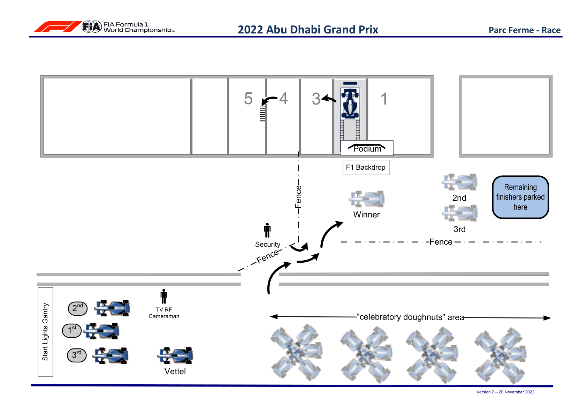

2022 ABU DHABI GRAND PRIX

18 - 20 November 2022

From The FIA Formula One Media Delegate Document 30

To All Teams, All Officials Date 20 November 2022

Time 15:13

Title Post-Race Procedure

Description Post-Race Procedure

Enclosed ABU DOC 30 - Post-Race Procedures.pdf

Tom Wood

The FIA Formula One Media Delegate

2022 A D G P BU HABI RAND RIX

17 – 20 November 2022

From The FIA Formula One Media Delegate Document 30

To All Officials, All Teams Date 20 November 2022

Time 15:12

NOTE TO TEAMS: POST RACE INTERVIEW & PODIUM CEREMONY PROCEDURE

In addition to the provisions of the 2022 Formula 1 Sporting Regulations – Appendix 5 Podium Ceremony, the Podium Ceremony procedure detailed below must be followed.

Post Race Interview and Podium Ceremony Procedure:

 The master of ceremonies will be appointed by the FIA to conduct and take responsibility for the entire podium ceremony.

 Drivers who finish the race in the top three positions (and Car #5 if not in the top 3) will be required to stay on track, drop to the back of the field and then proceed directly to the Grid where there will be the opportunity for post-championship celebrations should they wish to do so. Following these celebrations, they should proceed towards the start light gantry where they will find the boards showing positions from 1, 2, 3.

 Any other drivers wishing to conduct post-championship celebrations must do so in a safe place off- track and before the pit entry, and must then return to the pit lane directly.

 Other than the team mechanics (with cooling fans if necessary), officials and FIA pre-approved television crews and FIA approved photographers, no one else will be allowed in the designated area at this time (no team PR personnel. Driver physios must wait outside the cool down room behind the podium until the podium ceremony has concluded following the instructions given to all teams by the Media Delegate). At the sole discretion of the FIA Media Delegate, the team- embedded photographer of the winning driver may also be permitted in the designated area. All other approved photographers must remain outside of the designated area for the duration of the Parc Fermé and Podium procedure.

 Competitors are reminded of Article 63.2 of the Sporting Regulations – “For the duration of the Post Race Interviews and Podium Ceremony Procedure, the Drivers finishing in race in positions 1, 2, 3 must remain attired only in their Driving Suits, 'done up' to the neck, not opened to the waist.”

 Drivers will be weighed by the FIA. Each Driver must be fully attired while they are weighed (e.g.: Helmet, Gloves, etc.). Water will be available in the parc fermé area after the driver has been weighed.

 Once weighed, the Drivers will be called for their post-race interviews. The post-race interviews will take place in the designated area on the grid, and the interviewer will be selected by the Commercial Rights Holder.

 As soon as the drivers have got out of their cars, team mechanics must push them back into the parc fermé area in the pit lane, with the winning car positioned directly underneath the podium.

 Drivers must not interfere with Parc Fermé protocols in any way.

1

 Once the interviews have been completed, the Drivers will be immediately escorted to the cool down room on the first floor of the Pit Garage Complex.

 Each Driver will be given their Pirelli Caps.  The drivers will then be escorted to the Podium area where the 1, 2, 3 Rostrum and Dias will be located.

 When the Drivers are ready, an announcement for the Podium Ceremony will take place with the 3rd and 2nd placed Drivers introduced to move to their respective Podium Dias steps.

 The Winning Driver will then be announced who will move to his position on the Podium.  The National Anthems will then take place and flags will be displayed.  Dignitaries will present the trophies on the podium as arranged by the Master of Ceremonies.  The Trophy Presentations will take place in the following order:

o Winning Driver (On the Podium) o A representative of the Winning Constructor (On the Podium) o 2nd Place Driver (On the Podium) o 3rd Place Driver (On the Podium)  Following the Podium Ceremony, the top three (3) drivers will be escorted by the FIA Media Delegate to the TV pen located at the Pit Entry end of the paddock, where they may be accompanied by their press officers.

 At the end of the TV pen, the top three (3) drivers will go to the FIA Press Conference, located on the ground floor of the Media Centre Building.

 Drivers from 4th and beyond must proceed directly to the TV pen after they have been weighed in the Parc Fermé, located in the FIA garage. Each Driver must remain fully attired until after they have been weighed (e.g.: Helmet, Gloves, etc.).

 Any Driver from 4th and beyond who does not have a session for the written media organised after the race must be available for interview at the written media zone adjacent to the TV pen once their TV interviews have concluded.

 Drivers who retire during the race are required to go to the TV pen (and written media pen if they do not have a session for the written media organised after the race) as soon as they have come back into the paddock.

Please see the attached Post Race Podium Ceremony and Parc Fermé Diagram.

Tom Wood

The FIA Formula One Media Delegate

2

