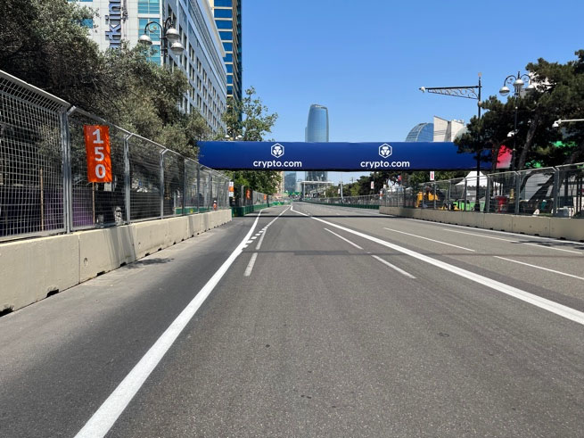
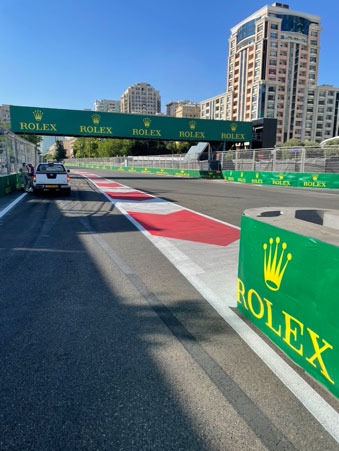
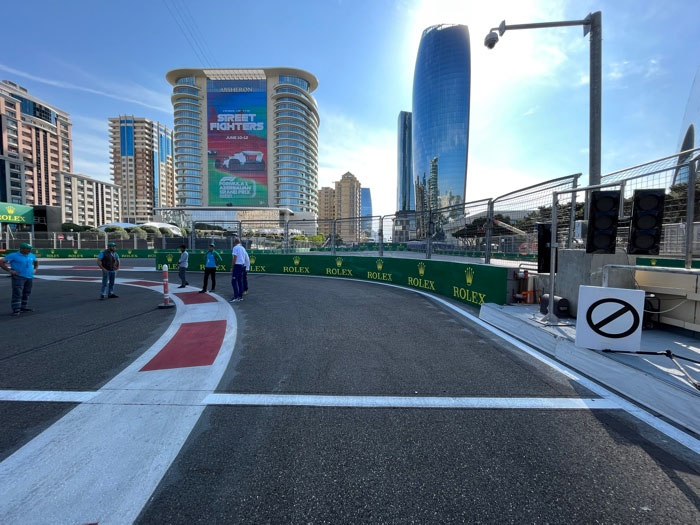

2022 AZERBAIJAN GRAND PRIX

9 - 12 June 2022

From The FIA Formula One Race Director Document 37

To All Teams, All Officials Date 12 June 2022

Time 10:00

Title Race Director's Event Notes V4

Description Race Director's Event Notes V4

Enclosed AZE DOC 37 - Event Notes V4.pdf

Niels Wittich

The FIA Formula One Race Director

2022 A G P ZERBAIJAN RAND RIX

9 – 12 June 2022

From The FIA Formula One Race Director Document 37

To All Teams, All Officials Date 12 June 2022

Time 10:00

EVENT NOTES V4 (changes in light blue) General Instructions

1) Track light panels

The FIA track light panels have been installed in the positions shown on the circuit map. In

accordance with Appendix H to the ISC the light signals have the same meaning as flag signals.

2) Drivers leaving their pit stop position in the pit lane

For safety reasons, no car should be driven from its pit stop position at any time unless:

a) It has first been driven into the pit stop position having just entered the pit lane from the track, and;

b) It is then driven immediately back onto the track from the pit stop position.

3) Observing yellow flags during free practice and qualifying

3.1 Double waved: Any driver passing through a double waved yellow marshalling sector must reduce speed significantly and be prepared to change direction or stop. In order for the stewards to be

satisfied that any such driver has complied with these requirements it must be clear that he has not

attempted to set a meaningful lap time, for practical purposes any driver in a double yellow sector

will have that lap time deleted.

3.2 Single waved: Drivers should reduce their speed and be prepared to change direction. It must be clear that a driver has reduced speed and, in order for this to be clear, a driver would be expected

to have braked earlier and/or discernibly reduced speed in the relevant marshalling sector.

4) Laps during qualifying and reconnaissance laps

In order to ensure that cars are not driven unnecessarily slowly during all laps of the qualifying

sessions or during reconnaissance laps when the pit exit is opened for the race, drivers must stay

below the maximum time set by the FIA between the Safety Car lines shown on the pit lane map.

You will be informed of the maximum time after the second free practice session.

5) Article 55.14

(…) In order to avoid the likelihood of accidents before the safety car returns to the pits, from the

point at which the lights on the car are turned out drivers must proceed at a pace which involves no

erratic acceleration or braking nor any manoeuvre which is likely to endanger other drivers or impede

the restart.(…)

1

6) Parc Fermé Cameras

The Parc Fermé cameras must be uncovered and operational at all times during the Event.

7) Lapping during the race

The ISC requires drivers who are caught by another car about to lap him to allow the faster driver

past at the first available opportunity. The F1 Marshalling System has been developed in order to

ensure that the point at which a driver is shown blue flags is consistent, rather than trusting the ability

of marshals to identify situations that require blue flags.

The system will be set to give a pre-warning when the faster car is within 3.0s of the car about to be

lapped, this should be used by the team of the slower car to warn their driver he is soon going to be

lapped and that allowing the faster car through should be considered a priority. When the faster car

is within 1.2s of the car about to be lapped blue flags will be shown to the slower car (in addition to

blue light panels, blue cockpit lights and a message on the timing monitors) and the driver must allow

the following driver to overtake at the first available opportunity.

It should be noted that the aim of using F1MS is ensure consistent application of the rules, additional

instructions may also be given by race control when necessary.

Event Specific Instructions

8) Formula 1 Sporting Regulations Article 23.1

In accordance with the provisions of Article 23.1b), this Event is an Open Event.

9) Specific Technical Procedures

Please note that from 2022 the FIA have introduced an Appendix Index File which contains all the

relevant and active Appendix documents, Technical and Sporting Directives. The latest version of

this Index file (“2022 Formula 1 Appendix – iss 6 – 2022-05-16.xlsx”) and all relevant documents can

be found on the FIA SFTP site.

10) Support Races team barrier placement and Movements

Team barrier placement prior to and during all support category practice sessions and races: No

more than four metres from the garages.

It is not permitted to push cars to the weighing area at any time a support category is in the pit lane.

Support Crews and Trolleys will be released into Pit Lane no earlier than 20 minutes prior to the

opening of Pit Exit for their respective sessions.

Support Category competition vehicles will be released from the marshalling area no earlier than 15

minutes prior to the opening of Pit Exit for their respective sessions.

2

11) Practice starts

11.1 Practice starts may be carried out in the pit exit on the left-hand side after the corner but before the dashed white line across pit exit. For the avoidance of doubt, this includes any time the pit exit is

open for the race. Drivers must leave adequate room on their right for another driver to pass.

11.2 For reasons of safety and sporting equity, cars may not stop in the fast lane at any time the pit exit is open without a justifiable reason (a practice start is not considered a justifiable reason).

11.3 Additionally, practice starts may be carried out on the track at the end of each free practice session. Any car on the track when the chequered flag is shown may then complete another lap and, instead

of entering the pits, proceed to the grid and carry out a practice start.

11.4 All drivers carrying out a practice start must do so by pulling as far forward on the grid as possible and, if necessary, should wait for others to carry out a start before getting to a grid position further

forward. Under no circumstances should a driver make a practice start if another car is still stationary

in front of him on the same side of the grid.

11.5 If any driver appears to be disregarding any of the above a red flag will be displayed and the possibility to carry out any further starts will be immediately terminated.

12) Lines at the Pit Entry and Pit Exit

12.1 In accordance with Chapter 4, Article 4 and 5 of Appendix L to the ISC drivers must follow the procedures at pit entry and pit exit.

12.2 For safety reasons, the line that is considered to be at pit entry, includes the line painted on the track beginning prior to pit entry and continuing into the pit lane.

12.3 The dashed white line at the pit entry defines the track edge. For safety reasons, no tyre of any car continuing on the track, may cross that line.

12.4 Any car with all four (4) wheels to the left of the solid white must enter the pit lane, if in the opinion of the Stewards, the driver has committed to entering the pit lane, except in cases of force majeure

accepted as such by the Stewards.

3

12.5 Relevant white line at pit exit as per Appendix L, Chapter 4, Article 5.

13) DRS

DRS Detection will be automatically disabled in each individual zone if any of the light panels in that

particular zone are displaying yellow. The zones and corresponding light panels are as follows:

a) DRS Activation 1: Panels 3, 4, 5

b) DRS Activation 2: Panels 21, 1, 2

14) Track Limits

In accordance with the provisions of Article 33.3, the white lines define the track edges.

15) Fire extinguishers around the circuit

Indicated by fluorescent orange boards with a letter “F” attached to the debris fences.

16) Places where drivers may leave the track

Indicated by white boards with a green running man image attached to the debris fences.

Should a car stop on the track during a session, it is recommended that the driver keeps all their

protective clothing (Helmet, Gloves, etc) on until they have returned to their garage.

17) Places to remove cars from the track

Indicated by 2m long fluorescent orange panels on the barriers.

18) Removing cars from the grid

Through the gates in the pit wall adjacent to the race control tower, garage 16 and 32.

19) Race Suspension

In case of a race suspension, cars will be stopped in the fast lane of the pits in front of the pit exit

lights.

20) Car number light panels for the start

On the left-hand side of the grid.

4

21) Changes to the circuit

21.1 Pit entry and TecPro at Pit entry new setup.

21.2 New gate between Turn 1 and Turn 2 on RHS.

21.3 New vehicle opening between Turn 3 and Turn 4 on RHS.

21.4 Pit exit walls extended by 8 meters.

21.5 Track verge line extended up to 4 meters

21.6 The kerb on the RHS before turn 15 has been removed.

21.7 A bollard has been installed at pit exit on the LHS. All drivers must stay to the right of this bollard when leaving the pit lane.

Niels Wittich

The FIA Formula One Race Director

5
