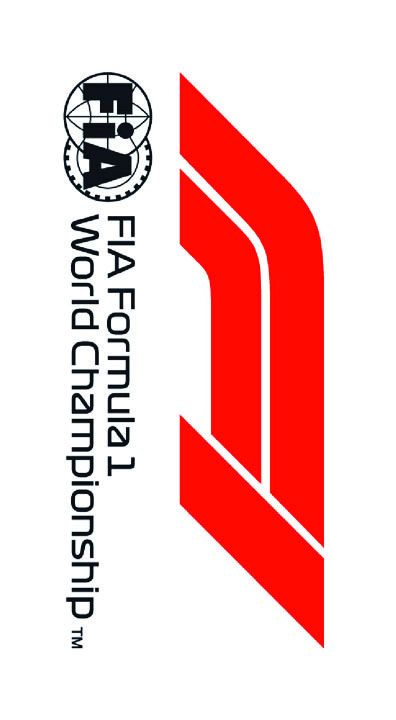

2022 BAHRAIN GRAND PRIX

18 - 20 March 2022

From The FIA Formula One Race Director Document 24

To All Teams, All Officials Date 19 March 2022

Time 14:29

Title Event Notes v2

Description Event Notes v2

Enclosed BRN DOC 24 - Bahrain Grand Prix Event Notes v2 .pdf

Niels Wittich

The FIA Formula One Race Director

2022 B G P AHRAIN RAND RIX

18 – 20 March 2022

From The FIA Formula One Race Director Document 24

To All Teams, All Officials Date 19 March     

Time 14:  

EVENT NOTES V2 (all changes in light blue) General Instructions

1) Pit lane map

1.1 Safety Car lines.

1.2 The location of the pit entry and the pit exit.

1.3 Designated garage areas.

1.4 Safety Car position for first lap and rest of race.

1.5 Blue flag marshal at the pit exit.

1.6 Track light panels displaying pit entry status.

2) Pirelli Event Preview

2.1 With reference to Article 30.5(a) of the Sporting Regulations see the updated document provided by the official tyre supplier.

3) Red zones for photographers in the pit lane during practice sessions

3.1 See the attached drawing.

4) Track light panels

4.1 The FIA track light panels have been installed in the positions shown on the circuit map. In accordance with Appendix H to the ISC the light signals have the same meaning as flag signals.

5) Track light panel displaying pit entry status

5.1 The light panels indicated on the pit lane map will display a flashing yellow arrow if cars are required to use the pit lane once the Safety Car has been deployed during the race.

5.2 The light panels indicated on the pit lane map will display a flashing red cross if the pit lane is closed at any point during the race.

6) Drivers leaving their pit stop position in the pit lane

6.1 For safety reasons, no car should be driven from its pit stop position at any time unless:

a) It has first been driven into the pit stop position having just entered the pit lane from the track,

and;

b) It is then driven immediately back onto the track from the pit stop position.

7) Observing yellow flags during free practice and qualifying

7.1 Double waved: Any driver passing through a double waved yellow marshalling sector must reduce speed significantly and be prepared to change direction or stop. In order for the stewards to be

satisfied that any such driver has complied with these requirements it must be clear that he has not

attempted to set a meaningful lap time, for practical purposes this means any driver in a double

yellow sector will have that lap time deleted.

7.2 Single waved: Drivers should reduce their speed and be prepared to change direction. It must be clear that a driver has reduced speed and, in order for this to be clear, a driver would be expected

to have braked earlier and/or discernibly reduced speed in the relevant marshalling sector.

Drivers should not overtake any car in a single waved yellow marshalling sector unless it is clear that

a car is slowing with a completely obvious problem, e.g. obvious accident damage or a deflated tyre.

8) In laps during qualifying and reconnaissance laps

8.1 In order to ensure that cars are not driven unnecessarily slowly on in laps during and after the end of qualifying or during reconnaissance laps when the pit exit is opened for the race, drivers must stay

below the maximum time set by the FIA between the Safety Car lines shown on the pit lane map.

You will be informed of the maximum time after the first day of practice.

9) Parc Fermé Cameras

9.1 To assist with the revised FIA Event procedures, the Parc Fermé cameras must be uncovered and operational at all times during the Event.

10) Operational personnel curfew

10.1 Boards warning anyone attempting to enter the paddock that the curfew is in operation will be placed immediately before the turnstiles at the appropriate times.

11) Lapping during the race

11.1 The ISC requires drivers who are caught by another car about to lap him to allow the faster driver past at the first available opportunity. The F1 Marshalling System has been developed in order to

ensure that the point at which a driver is shown blue flags is consistent, rather than trusting the ability

of marshals to identify situations that require blue flags.

As it was at the end of last season the system will be set to give a pre-warning when the faster car

is within 3.0s of the car about to be lapped, this should be used by the team of the slower car to warn

their driver he is soon going to be lapped and that allowing the faster car through should be

considered a priority. When the faster car is within 1.2s of the car about to be lapped blue flags will

be shown to the slower car (in addition to blue light panels, blue cockpit lights and a message on the

timing monitors) and the driver must allow the following driver to overtake at the first available

opportunity.

It should be noted that the aim of using F1MS is to ensure consistent application of the rules,

additional instructions may also be given by race control when necessary.

Event Specific Instructions

12) Formula 1 Sporting Regulations Article 23.1

12.1 In accordance with the provisions of Article 23.1a), this Event is an Open Event.

13) Changes to the circuit

13.1 No changes to the event in 2021.

14) Specific Technical Procedures

14.1 Please note that from 2022 the FIA have introduced an Appendix Index File which contains all the relevant and active Appendix documents, Technical and Sporting Directives. The latest version of

this Index file (“2022 Formula 1 Appendix – iss 5 – 2022-03-16.xlsx”) and all relevant documents can

be found on the FIA SFTP site.

15) Support Races

15.1 Team Barrier placement

a) Team barrier placement prior to and during all support category practice sessions and races:

No more than four metres from the garages.

b) It is not permitted to push cars to the weighing area at any time a support category is in pit

lane.

15.2 Support Category Movements

a) Support Crews and Trolleys will be released into Pit Lane no earlier than 20 minutes prior to

the opening of Pit Exit for their respective sessions.

b) Support Category competition vehicles will be released from the marshalling area no earlier

than 15 minutes prior to the opening of Pit Exit for their respective sessions.

16) Practice starts

16.1 Practice starts may only be carried out on the right-hand side (concrete apron area) after the pit exit lights but before the end of the pit signalling wall. For the avoidance of doubt, this includes any time

the pit exit is open for the race.

Drivers must leave adequate room on their left for another driver to pass.

16.2 For reasons of safety and sporting equity, cars may not stop in the fast lane at any time the pit exit is open without a justifiable reason (a practice start is not considered a justifiable reason).

16.3 Additionally, Practice starts may be carried out on the track at the end of each free practice session. Any car on the track when the chequered flag is shown may then complete another lap and, instead

of entering the pits, proceed to the grid and carry out a practice start.

16.4 All drivers carrying out a practice start must do so by pulling as far forward on the grid as possible and, if necessary, should wait for others to carry out a start before getting to a grid position further

forward. Under no circumstances should a driver make a practice start if another car is still stationary

in front of him on the same side of the grid.

16.5 If any driver appears to be disregarding any of the above a red flag will be displayed and the possibility to carry out any further starts will be immediately terminated.

17) Lines or bollards at the Pit Entry and Pit Exit

17.1 In accordance with Chapter 4 (Section 5) of Appendix L to the ISC drivers must keep to the right of the solid white line at the pit exit when leaving the pits.

17.2 For safety reasons drivers must keep to the right of the bollard at the pit entry when they are entering the pits.

17.3 Except in the cases of force majeure (accepted as such by the Stewards), the crossing by any part of the car, in any direction, of the red and white painted area, between the pit entry and the track, by

a driver who, in the opinion of the Stewards, had committed to entering the pit lane is prohibited.

17.4 The dotted white line across the pit entry and the pit exit is the track edge line.

18) DRS

18.1 DRS Detection will be automatically disabled in each individual zone if any of the light panels in that particular zone are displaying yellow. The zone and corresponding light panels are as follows:

a) Zone 1: Panels 3, 4

b) Zone 2: Panels 11, 12

c) Zone 3: Panels 18, 1, 2

19) Track Limits

In accordance with the provisions of Article 33.3, the white lines define the track edges.

20) Fire extinguishers around the circuit

20.1 Indicated by white boards with a red fire extinguisher image attached to the debris fences and barriers.

21) Places to remove cars from the track

21.1 Indicated by fluorescent orange panels on the barriers.

21.2 Should a car stop on the track during a session, the driver must keep all of their protective clothing (Helmet, Gloves, etc) on until they have returned to their garage.

22) Removing cars from the grid

22.1 Through the two gates in the pit wall, the first located adjacent to grid position 2 and the 2nd located adjacent to grid position 18.

23) Car number light panels for the start

23.1 On the right-hand side of the grid.

24) Post-race parc fermé

24.1 All cars must enter the pit lane and, with the exception of the first three, should be driven directly to the weighing area at the pit entry. The first three must follow the post-race procedure which will be

distributed prior to the start of the race.

25) Any other business

Niels Wittich

FIA Formula One Race Director

Doc 1

In agreement with the FIA and in accordance with Article 24.4 a) of the F1 Sporting Regulations, this document contains the prescriptions for the operation of tyres during the following event. Document version: 1 issue: C

| Grand Prix of Bahrain 18/03-20/03/2022 (22R01BAH) |  |  |  |  |  |  |
| --- | --- | --- | --- | --- | --- | --- |
| Compounds selection |  |  |  |  |  |  |
| Compound |  |  |  |  |  |  |
|  | FL | FR | RL | RR | Mandatory race tyres C1 C2 Q3 tyre | Mandatory race tyres |
| C1 | 1X1 | 1X2 | 1X3 | 1X4 |  | C1 |
| C2 | 2G1 | 2G2 | 2G3 | 2G4 |  | C2 |
| C3 | 3Z1 | 3Z2 | 3Z3 | 3Z4 |  |  |
| Intermediate | 9G1 | 9G2 | 9G3 | 9G4 |  | Q3 tyre |
| Wet | 95B | 96B | 97B | 98B |  | C3 |

Prescriptions

Pressures & camber

|  | Minimum starting pressure |  |  | Expected stabilized running pressure | Camber limit |
| --- | --- | --- | --- | --- | --- |
|  | Slicks | Intermediate | Wet |  |  |
| Front | 23.0 psi | 22.5 psi | 21.5 psi | ≥25.0 psi | -3.50° |
| Rear | 21.0 psi | 20.5 psi | 19.5 psi | ≥23.0 psi | -2.00° |

Cold Pressure Cooling Curve 26

| Fr | ont pressur | e |
| --- | --- | --- |
| Re | ar pressure |  |

24 Pfront = (T - 70) · 0.117 + Pstartf 22 20 Prear = (T - 70) · 0.108+ Pstartr ]isp[ 18 erusserP 16 Pstartf: Minimum starting pressure on 14 the front axle [psi] 12 Pstartr: Minimum starting pressure on 10 the rear axle [psi] T: Tyre temperature [°C] 8 0 10 20 30 40 50 60 70 Temperature [°C] Maximum heating times and temperatures (tread & sidewall)

Temperature 0 40 60 70 (°C) Slicks max. 3h Intermediate max. 2h Wet max. 2h • Temperatures refer to tyre tread and side wall temperatures, not blanket or controller set-point temperatures. • Tyres may only be heated prior to the session in which they are intended to be used. • The temperatures apply at all times during the event.

| Tyres notes |  |
| --- | --- |
| • Not permitted to switch tyres from their originally allocated position. • Do not subject tyres to large deformation or heavy impact. • Do not leave fitted tyres exposed at an air temperature lower than 15°C and/or any UV emission. • Revised prescriptions could be issued during the race weekend in accordance with TD003. | • Heating time temperature limits apply to the actual tyre surface temperature measured with the IR gun as detailed in the TD003 • Cold cooling curve temperature limits apply to the tyre side wall temperature measured with the probe as detailed in TD003 • BLANKET HEATING TIME for each temperature range to be counted from the moment the blanket control unit is set to reach its targeted temperature within its correspondent interval. |

General notes

Teams are kindly reminded that the following will be subject to FIA checks during the event: • Starting pressures • Cold pressures (according to the cold pressure cooling curves) • Re-heat pressures • EOS Camber • Maximum tyre temperatures in blankets • Tyre swapping
