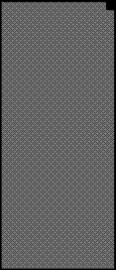

2022 BAHRAIN GRAND PRIX

18 - 20 March 2022

From The FIA Formula One Race Director Document 22

To All Teams, All Officials Date 19 March 2022

Time 13:30

Title Race Director's Note - Post-Qualifying Procedures

Description Race Director's Note - Post-Qualifying Procedures

Enclosed BRN DOC 22 - Race Director's Note - Post-Qualifying Procedures .pdf

Niels Wittich

The FIA Formula One Race Director

2022 BAHRAIN GRAND PRIX

18 – 20 March 2022

From The FIA Formula One Race Director Document 22

To All Teams, All Officials Date 19 March 2022

Time 13:30

NOTE TO TEAMS: POST QUALIFYING PROCEDURE

The Post-Qualifying interview procedure requires the top three (3) drivers to be interviewed in the Pit Lane

in front of the FIA Garages once they have got out of their cars.

Should either of your drivers be among the top three (3) at the end of qualifying we would like to ask for

your co-operation in following the procedure below:

• If they take the chequered flag at the end of Q3, the fastest three (3) drivers should proceed directly to

the Pit Lane where the 1, 2, 3 boards which will be located at the pit lane entry in front of the Race

Control Tower.

• Other than the team mechanics (with cooling fans if necessary), officials and FIA pre-approved

television crews and up to four (4) FIA approved photographers, no one else will be allowed in this

designated area at this time (no driver physios nor team PR personnel). At the sole discretion of the

FIA Media Delegate, the team-embedded photographer of the pole position driver may also be

permitted in the Parc Fermé area at this time.

• Once out of their cars, the top three (3) Drivers will be weighed by the FIA. Each Driver must remain

fully attired until after they have been weighed (e.g: Helmet, Gloves, etc).

• After the Drivers have been weighed, the Post-Qualifying interviews will take place in this designated

area. The interviewer will be selected by the Commercial Rights Holder.

• If one (1) of the top three (3) drivers is already in the Pit Lane at the end of the session, the team should

ensure that they go directly to the designated area once the other drivers have arrived there.

• At the end of the live interviews the pole position driver will be led to the backdrop in front of the FIA

Garages for the Pirelli Pole Position Award photo opportunity.

• The top three (3) drivers will then be escorted by the FIA Media Delegate to the FIA Press Conference

located on the first floor of the Pit Garage Complex.

• At the end of the FIA Press Conference, the top three (3) drivers will go to the TV pen, located at the

pit entry end of the paddock and they may be accompanied by their press officers, who should wait to

collect their drivers at the back of the press conference room.

• Drivers eliminated in Q1 and Q2, drivers classified from 4th to 10th in Q3 and drivers who did not

participate to Q1 but are eligible to race must also attend the TV pen interview session after they have

been weighed by the FIA at the end of the last part of qualifying in which they participated.

• Any Driver classified from 4th and beyond who does not have a session for the written media organised

after Qualifying must be available for interviews at the written media zone adjacent to the TV pen once

their TV interviews have concluded.

Please see the attached Qualifying - Parc Fermé Diagram.

Niels Wittich FIA Formula One Race Director

1/2

2022 Bahrain Grand Prix Parc Ferme - Qualifying

Photographers Waiting Area

Podium

FIA F1 Backdrop Backdrop 2nd Fireman Remaining finishers Fence 1st parked here

TV RF 3rd Cameraman

Fence

Approved Photographers

Pit Wall Pit Wall

Version 1 – 18 March 2022

