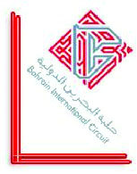

2022 BAHRAIN GRAND PRIX

18 - 20 March 2022

From The FIA Formula One Race Director Document 35

To All Teams, All Officials Date 20 March 2022

Time 15:20

Title Race Director's Note - Pre-Race Procedure

Description Race Director's Note - Pre-Race Procedure

Enclosed BRN DOC 35 - Race Director's Note - Pre-Race Procedure.pdf

Niels Wittich

The FIA Formula One Race Director

2021 B G P AHRAIN RAND RIX

18 – 20 March 2022

From The FIA Formula One Race Director Document 35

To All Teams, All Officials Date 20 March 2022

Time 15:20

NOTE TO TEAMS: PRE-RACE AND NATIONAL ANTHEM PROCEDURE

Please find below a summary of the requirements for the Pre-Race activities and National Anthem, which

must be followed in order to ensure the orderly running of these procedures.

17.42:00 All drivers (no team representatives or dignitaries) must be in position at the front of the grid

for moment in support of UNICEF emergency appeal

17.43:00 Drivers move to National Anthem Position. For the duration of the National Anthem all Drivers

must remain attired only in their race suits.

17:44:00 The National Anthem.

Failure to comply with these procedures will be reported to the Stewards.

Please see the attached National Anthem Diagram.

Niels Wittich

FIA Formula One Race Director

1/2

