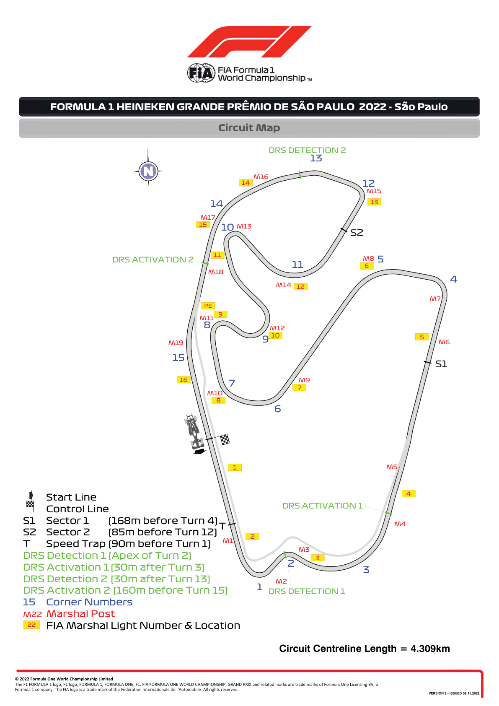
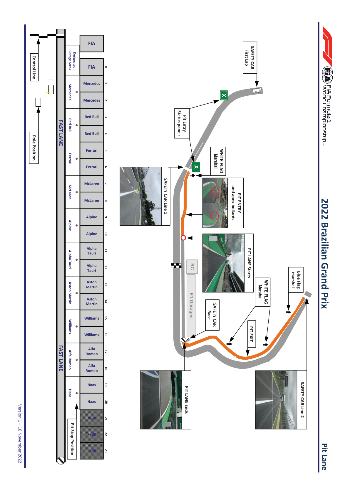
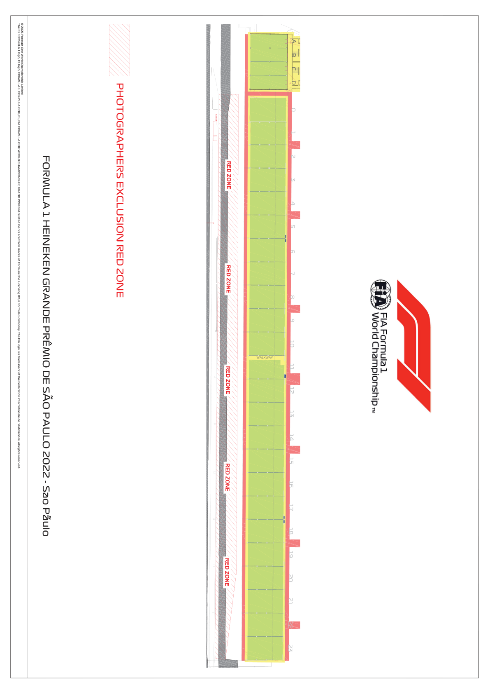

2022 BRAZILIAN GRAND PRIX

10 - 13 November 2022

From The FIA Formula One Race Director Document 3

To All Teams, All Officials Date 10 November 2022

Time 10:56

Title Event Notes - Circuit Map, Pit Lane Drawing and Red Zone

Description Circuit Map, Pit Lane Drawing and Red Zone

Enclosed BRA DOC 3 - Circuit Map and Pit Lane Drawing and Red Zone.pdf

Niels Wittich

The FIA Formula One Race Director

