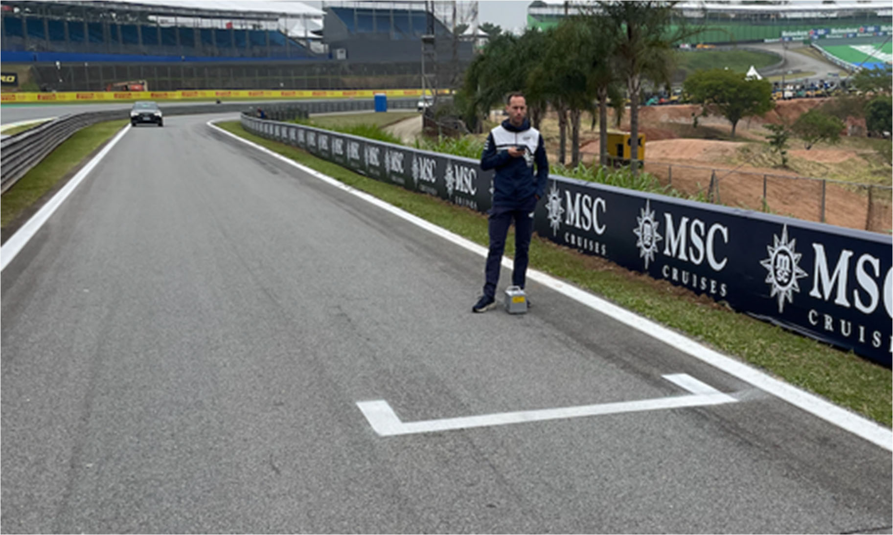
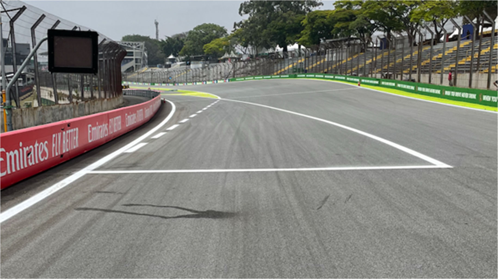
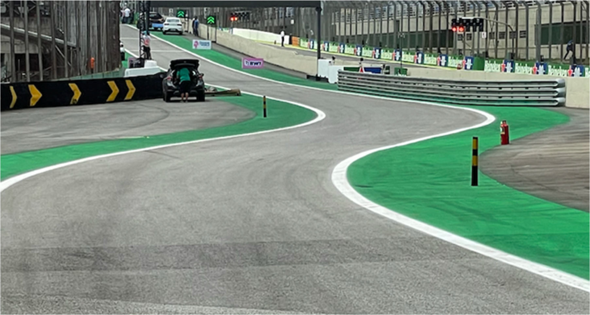

2022 BRAZILIAN GRAND PRIX

10 - 13 November 2022

From The FIA Formula One Race Director Document 30

To All Teams, All Officials Date 12 November 2022

Time 15:20

Title Race Director's Event Notes V3

Description Race Director's Event Notes V3

Enclosed BRA DOC 30 - Event Notes V3.pdf

Niels Wittich

The FIA Formula One Race Director

2022 B G P RAZILIAN RAND RIX

10 – 13 November 2022

From The FIA Formula One Race Director Document 30

To All Officials, All Teams Date 12 November 2022

Time 15:20

EVENT NOTES V3 (Changes in light blue) General Instructions

1) Track light panels

The FIA track light panels have been installed in the positions shown on the circuit map. In

accordance with Appendix H to the ISC the light signals have the same meaning as flag signals.

2) Drivers leaving their pit stop position in the pit lane

For safety reasons, no car should be driven from its pit stop position at any time unless:

a) It has first been driven into the pit stop position having just entered the pit lane from the track,

and;

b) It is then driven immediately back onto the track from the pit stop position.

3) Observing yellow flags during free practice and qualifying

3.1 Double waved: Any driver passing through a double waved yellow marshalling sector must reduce speed significantly and be prepared to change direction or stop. In order for the stewards to be

satisfied that any such driver has complied with these requirements it must be clear that he has not

attempted to set a meaningful lap time, for practical purposes any driver in a double yellow sector

will have that lap time canceled.

3.2 Single waved: Drivers should reduce their speed and be prepared to change direction. It must be clear that a driver has reduced speed and, in order for this to be clear, a driver would be expected

to have braked earlier and/or discernibly reduced speed in the relevant marshalling sector.

4) Laps during qualifying and reconnaissance laps

4.1 In order to ensure that cars are not driven unnecessarily slowly on in laps during and after the end of qualifying or during reconnaissance laps when the pit exit is opened for the Sprint and the Race,

drivers must stay below the maximum time set by the FIA between the Safety Car lines shown on

the pit lane map.

You will be informed of the maximum time after the first free practice session.

5) Article 55.14

“In order to avoid the likelihood of accidents before the safety car returns to the pits, from the point

at which the lights on the car are turned out drivers must proceed at a pace which involves no erratic

acceleration or braking nor any manoeuvre which is likely to endanger other drivers or impede the

1

restart”.

6) Parc Fermé Cameras

The Parc Fermé cameras must be uncovered and operational at all times during the Event.

7) Lapping during the Sprint and the Race

The ISC requires drivers who are caught by another car about to lap him to allow the faster driver

past at the first available opportunity. The F1 Marshalling System has been developed in order to

ensure that the point at which a driver is shown blue flags is consistent, rather than trusting the ability

of marshals to identify situations that require blue flags.

The system will be set to give a pre-warning when the faster car is within 3.0s of the car about to be

lapped, this should be used by the team of the slower car to warn their driver he is soon going to be

lapped and that allowing the faster car through should be considered a priority. When the faster car

is within 1.2s of the car about to be lapped blue flags will be shown to the slower car (in addition to

blue light panels, blue cockpit lights and a message on the timing monitors) and the driver must allow

the following driver to overtake at the first available opportunity.

It should be noted that the aim of using F1MS is ensure consistent application of the rules, additional

instructions may also be given by race control when necessary.

Event Specific Instructions

8) Formula 1 Sporting Regulations Article 23.1

In accordance with the provisions of Article 23.1 b), this Event is an Open Event.

9) Specific Technical Procedures

Please note that from 2022 the FIA have introduced an Appendix Index File which contains all the

relevant and active Appendix documents, Technical and Sporting Directives. The latest version of

this Index file (“2022 Formula 1 Appendix – iss 8 – 2022-10-14.xlsx”) and all relevant documents can

be found on the FIA SFTP site.

10) Positioning of the car on track during Free Practices and Qualifying

To help mitigate any differences in speed, cars on out or slow laps are requested to stay offline

where possible between Turns 10 and 12.

11) Practice starts

11.1 Practice starts may only be carried out on the asphalt on the LHS of the fast lane at the pit exit and, for the avoidance of doubt, this includes any time the pit exit is open for the Sprint and the Race.

2

There will be marshals on the left behind the guardrail in the pit exit who will wave white flags when

a car is stopped for the purpose of carrying out a practice start.

11.2 For reasons of safety and sporting equity, cars may not stop in the fast lane at any time the pit exit is open without a justifiable reason (a practice start is not considered a justifiable reason).

11.3 Any driver intending to carry out a practice start at the pit exit must drive to the allocated place as quick as possible without slowing to carry out “burn-outs” or any associated pre-start routine.

11.4 Additionally, practice starts may be carried out on the track at the end of the free practice sessions. Any car on the track when the chequered flag is shown may then complete another lap and, instead

of entering the pits, proceed to the grid and carry out a practice start.

11.5 All drivers carrying out a practice start must do so by pulling as far forward on the grid as possible and, if necessary, should wait for others to carry out a start before getting to a grid position further

forward. Under no circumstances should a driver make a practice start if another car is still stationary

in front of him on the same side of the grid.

11.6 If any driver appears to be disregarding any of the above a red flag will be displayed and the possibility to carry out any further starts will be immediately terminated.

12) Lines at the Pit Entry and Pit Exit

12.1 In accordance with Chapter 4, Article 4 and 5 of Appendix L to the ISC drivers must follow the procedures at pit entry and pit exit.

12.2 For safety reasons, drivers must keep to the left of the solid white line at the pit entry when they are entering the pits.

3

Additionally, drivers must keep to the left of the 1st bollard and to the right of the 2nd bollard at the

pit entry.

13) DRS

DRS Detection will be automatically disabled in each individual zone if any of the light panels in that

particular zone are displaying yellow. The zones and corresponding light panels are as follows:

a) DRS Activation 1: Panels 3, 4, 5

b) DRS Activation 2: Panels 15, 16, 1, 2

14) Track Limits

14.1 In accordance with the provisions of Article 33.3, the white lines define the track edges. During Qualifying, the Sprint and the Race, each time a driver fails to negotiate with the track limits, this will

result in that lap time being invalidated by the Stewards.

4

15) Fire extinguishers around the circuit

Indicated by white boards with a red letter “F” attached to the debris fences and barriers.

16) Places to remove cars from the track

Indicated by fluorescent orange panels/paintings on the barriers.

17) Removing cars from the grid

Through the gates in the pit wall adjacent to grid position 17 and adjacent to garage 7.

18) Race Suspension

In case of a race suspension, cars will be stopped in the fast lane of the pits in front of the pit exit

lights.

19) Car number light panels for the start

On the right-hand side of the grid.

20) Guest access to the grid

For the start of the race and after the end of the race, teams are responsible to ensure that guests

do not cross the teams’ garages and access the pit lane before all cars are on the grid or have

reached Parc Fermé.

21) Changes to the Circuit after 2021

21.1 Turn 1: At the end of the run-off area a new section of concrete barriers with tyres has been installed.

21.2 Turn 6 & 7: On RHS of the apex of both corners a strip of grasscrete has been installed. On LHS in the transition of the run-off between Turn 6 and /, new guardrail and a new concrete wall

has been installed. On LHS of Turn 7 a small surface repair was done.

21.3 Turn 10 until Turn 14: New guardrail and debris fence was installed along the entire stretch

21.4 Main Straight: Two new pit wall gates at the start line and in front of garage 7. On RHS a new grooving section to prevent aquaplaning has been performed.

Niels Wittich

The FIA Formula One Race Director

5
