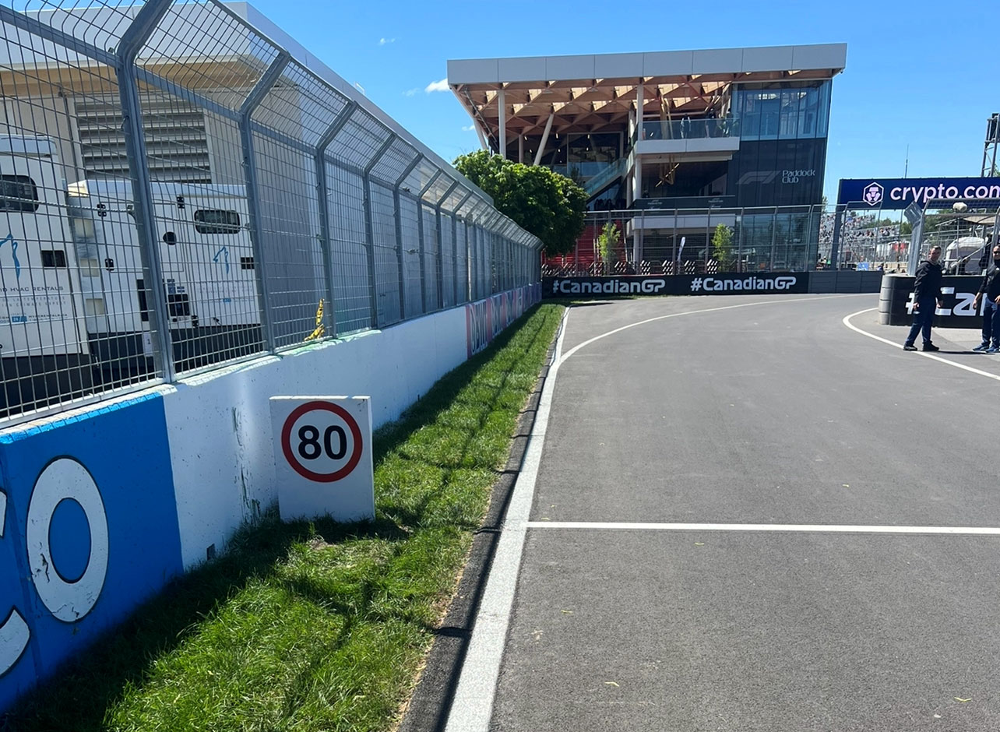

2022 CANADIAN GRAND PRIX

16 - 19 June 2022

From The FIA Formula One Race Director Document 61

To All Teams, All Officials Date 19 June 2022

Time 11:55

Title Race Director's Event Notes V3

Description Race Director's Event Notes V3

Enclosed CAN DOC 61 - Event Notes v3.pdf

Eduardo Freitas

The FIA Formula One Race Director

2022 C G P ANADIAN RAND RIX

16 – 19 June 2022

From The FIA Formula One Race Director Document 61

To All Teams, All Officials Date 19 June 2022

Time 11:55

EVENT NOTES V3 (Changes in light blue) General Instructions

1) Track light panels

The FIA track light panels have been installed in the positions shown on the circuit map. In

accordance with Appendix H to the ISC the light signals have the same meaning as flag signals.

2) Drivers leaving their pit stop position in the pit lane

For safety reasons, no car should be driven from its pit stop position at any time unless:

a) It has first been driven into the pit stop position having just entered the pit lane from the track, and;

b) It is then driven immediately back onto the track from the pit stop position.

3) Observing yellow flags during free practice and qualifying

3.1 Double waved: Any driver passing through a double waved yellow marshalling sector must reduce speed significantly and be prepared to change direction or stop. In order for the stewards to be

satisfied that any such driver has complied with these requirements it must be clear that he has not

attempted to set a meaningful lap time, for practical purposes any driver in a double yellow sector

will have that lap time deleted.

3.2 Single waved: Drivers should reduce their speed and be prepared to change direction. It must be clear that a driver has reduced speed and, in order for this to be clear, a driver would be expected

to have braked earlier and/or discernibly reduced speed in the relevant marshalling sector.

4) Laps during qualifying and reconnaissance laps

In order to ensure that cars are not driven unnecessarily slowly during all laps of the qualifying

sessions or during reconnaissance laps when the pit exit is opened for the race, drivers must stay

below the maximum time set by the FIA between the Safety Car lines shown on the pit lane map.

You will be informed of the maximum time after the second free practice session.

1

5) Article 55.14

(…) In order to avoid the likelihood of accidents before the safety car returns to the pits, from the

point at which the lights on the car are turned out drivers must proceed at a pace which involves no

erratic acceleration or braking nor any maneuvers which is likely to endanger other drivers or impede

the restart.(…)

6) Parc Fermé Cameras

The Parc Fermé cameras must be uncovered and operational at all times during the Event.

7) Lapping during the race

The ISC requires drivers who are caught by another car about to lap him to allow the faster driver

past at the first available opportunity. The F1 Marshalling System has been developed in order to

ensure that the point at which a driver is shown blue flags is consistent, rather than trusting the ability

of marshals to identify situations that require blue flags.

The system will be set to give a pre-warning when the faster car is within 3.0s of the car about to be

lapped, this should be used by the team of the slower car to warn their driver he is soon going to be

lapped and that allowing the faster car through should be considered a priority. When the faster car

is within 1.2s of the car about to be lapped blue flags will be shown to the slower car (in addition to

blue light panels, blue cockpit lights and a message on the timing monitors) and the driver must allow

the following driver to overtake at the first available opportunity.

It should be noted that the aim of using F1MS is ensure consistent application of the rules, additional

instructions may also be given by race control when necessary.

Event Specific Instructions

8) Formula 1 Sporting Regulations Article 23.1

In accordance with the provisions of Article 23.1b), this Event is an Open Event.

9) Specific Technical Procedures

Please note that from 2022 the FIA have introduced an Appendix Index File which contains all the

relevant and active Appendix documents, Technical and Sporting Directives. The latest version of

this Index file (“2022 Formula 1 Appendix – iss 6 – 2022-05-16.xlsx”) and all relevant documents can

be found on the FIA SFTP site.

2

10) Support Races team barrier placement and Movements

Team barrier placement prior to and during all support category practice sessions and races: No

more than three meters from the garages.

It is not permitted to push cars to the weighing area at any time a support category is in the pit lane.

Support Crews and Trolleys will be released into pit lane no earlier than 20 minutes prior to the

opening of pit exit for their respective sessions.

Support Category competition vehicles will be released from the marshalling area no earlier than 15

minutes prior to the opening of pit exit for their respective sessions.

11) Practice starts

11.1 Practice starts may be carried out in the pit exit on the left-hand side after the pit exit lights. For the avoidance of doubt, this includes any time the pit exit is open for the race. Drivers must leave

adequate room on their right for another driver to pass.

11.2 For reasons of safety and sporting equity, cars may not stop in the fast lane at any time the pit exit is open without a justifiable reason (a practice start is not considered a justifiable reason).

11.3 Additionally, practice starts may be carried out on the track at the end of each free practice session. Any car on the track when the chequered flag is shown may then complete another lap and, instead

of entering the pits, proceed to the grid and carry out a practice start.

11.4 All drivers carrying out a practice start must do so by pulling as far forward on the grid as possible and, if necessary, should wait for others to carry out a start before getting to a grid position further

forward. Under no circumstances should a driver make a practice start if another car is still stationary

in front of him on the same side of the grid.

11.5 If any driver appears to be disregarding any of the above a red flag will be displayed and the possibility to carry out any further starts will be immediately terminated.

12) Lines at the Pit Entry and Pit Exit

12.1 In accordance with Chapter 4, Article 4 and 5 of Appendix L to the ISC drivers must follow the procedures at pit entry and pit exit.

13) DRS

DRS Detection will be automatically disabled in each individual zone if any of the light panels in that

particular zone are displaying yellow. The zones and corresponding light panels are as follows:

a) DRS Activation 1: Panels 7, 8, 9.

b) DRS Activation 2: Panels 12, 13, 14.

c) DRS Activation 3: Panels 15, 1.

14) Track Limits

In accordance with the provisions of Article 33.3, the white lines define the track edges.

Cutting the chicanes:

Any driver who fails to negotiate turn 9 and passes completely to the left of the orange apex kerb

must keep completely to the left of the orange speed bump and the orange block/bollard on the exit

of the corner and re-join the track at the far end of the asphalt run-off area.

Any driver who fails to negotiate turn 14 and passes completely to the left of the orange apex kerb

must keep completely to the left of the orange speed bump and the orange block/bollard on the exit

of the corner and re-join the track at the far end of the asphalt run-off area.

3

14.1 Each time any car fails to negotiate turn 9 and/or turn 14 by using the track as described above, teams will be informed via the official messaging system.

14.2 On the third occasion of a driver failing to negotiate turn 9 and/or turn 14 by using the track during the Race, he will be shown a black and white flag, any further cutting will then be reported to the

Stewards.

14.3 The above requirements will not automatically apply to any driver who is judged to have been forced off the track, each such case will be judged individually.

14.4 In all cases detailed above, the driver must only re-join the track when it is safe to do so and without gaining a lasting advantage.

15) Fire extinguishers around the circuit

Indicated by white boards with a red fire extinguisher.

16) Places where drivers may leave the track

Indicated by white boards with a green running man image attached to the debris fences.

Should a car stop on the track during a session, it is recommended that the driver keeps all their

protective clothing (Helmet, Gloves, etc) on until they have returned to their garage.

Once you exit via one of the openings or exit windows, please wait near the exit point you have used,

a marshal will soon join you. A “moped shuttle service” is in place to able a driver to return to the pit

lane. This covers both sides of the track.

17) Places to remove cars from the track

Indicated by long fluorescent orange paintings on the barriers.

18) Removing cars from the grid

Cars may only be removed from the grid via the pit exit.

19) Race Suspension

In case of a race suspension, cars will be stopped in the fast lane of the pits in front of the pit exit

lights.

20) Car number light panels for the start

On the left-hand side of the grid.

21) Changes to the circuit

21.1 Replacement of the drainage in the pit lane.

21.2 The pit entry, pit lane and pit exit have been resurfaced.

21.3 Improvement to the pit lane wall.

21.4 Safety car line 1 is located closer to pit entry.

21.5 Safety car line 2 has been moved further down the track towards the exit of turn 2.

21.6 The pit entry white line has been shortened.

21.7 Replacement of the starting platform and the photographers’ platform

21.8 An additional access gate between the pit lane and the starting straight has been added.

21.9 The area on the right of the pit lane, prior to the garages, where emergency vehicles are located, has been suitably resurfaced with bitumen.

21.10 The ‘grasscrete’ installed at turn 9 on driver’s right is removed and replaced with asphalt.

21.11 All kerbs and speed bumps will be sandblasted to their original surface to remove the significant layers of built-up paint.

4

21.12 The guardrail on driver’s left, under the overpass bridge prior to turn 8, has been replaced.

21.13 Additional debris fence has been installed on driver’s right wall between turns 10 and 11 to create additional protection for the Marshals working in this location.

21.14 The angle of the concrete wall approaching the turn 13 driver's right has been modified to avoid impact with the apex kerb in the event of an incident.

21.15 Some openings in debris fences for Marshals have been reduced.

21.16 The level of the concrete surface inside the pit lane has been rectified.

22) Overnight Tyre Blankets

In addition to the minimum heating times and temperatures specified in the Pirelli Event Preview,

Competitors will be permitted to leave their tyres wrapped in blankets and heating to a maximum

temperature of 30 °C throughout the nights in order to minimise any issues relating to the colder

overnight ambient temperatures.

23) Miscellaneous

23.1 For the start of the Race, teams are responsible to ensure that guests do not cross the teams’ garages and access the pit lane before all cars are on the grid.

For the end of the Race teams are responsible to ensure guest do not cross the teams’ garages

and access the pit lane before all cars have reached the Parc Fermé.

23.2 Due to the wind, Pit entry speed limit signal, has been moved from the left-hand side to the right- hand side of the line where the speed limit starts.

Eduardo Freitas

The FIA Formula One Race Director

5
