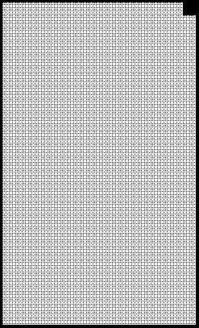

2022 EMILIA ROMAGNA GRAND PRIX

21 - 24 April 2022

From The FIA Formula One Race Director Document 16

To All Teams, All Officials Date 22 April 2022

Time 15:10

Title Race Director's Note - Post-Qualifying Procedures

Description Race Director's Note - Post-Qualifying Procedures

Enclosed EMI DOC 16 - Post-Qualifying Procedures.pdf

Niels Wittich

The FIA Formula One Race Director

2022 E R G P MILIA OMAGNA RAND RIX

21 – 24 April 2022

From The FIA Formula One Race Director Document 16

To All Teams, All Officials Date 22 April 2022

Time 15:10

NOTE TO TEAMS: POST QUALIFYING PROCEDURE

The Post-Qualifying interview procedure requires the top three (3) drivers to be interviewed in the Pit Lane

in front of the FIA Garages once they have got out of their cars.

Should either of your drivers be among the top three (3) at the end of qualifying we would like to ask for

your co-operation in following the procedure below:

• If they take the chequered flag at the end of Q3, the fastest three (3) drivers should proceed directly to

the Pit Lane where the 1, 2, 3 boards which will be located at the pit lane entry in front of the Race

Control Tower.

• Other than the team mechanics (with cooling fans if necessary), officials and FIA pre-approved

television crews and the four (4) FIA approved photographers, no one else will be allowed in this

designated area at this time (no driver physios nor team PR personnel). At the sole discretion of the

FIA Media Delegate, the team-embedded photographer of the pole position driver may also be

permitted in the Parc Fermé area at this time.

- Once out of their cars, the top three (3) Drivers will be weighed by the FIA. Each Driver must remain

fully attired until after they have been weighed (e.g: Helmet, Gloves, etc).

• After the Drivers have been weighed, the Post-Qualifying interviews will take place in this designated

area. The interviewer will be selected by the Commercial Rights Holder.

• If one (1) of the top three (3) drivers is already in the Pit Lane at the end of the session, the team should

ensure that he goes directly to the designated area once the other drivers have arrived there.

• At the end of the live interviews the drivers will be led to the backdrop underneath the podium for the

Top 3 and Pirelli Award photo opportunities.

• Drivers eliminated in Q1 and Q2, drivers classified from 4th to 10th in Q3 and drivers who did not

participate to Q1 but are eligible to race must attend the TV interview session in the paddock behind

the FIA garages after they have been weighed by the FIA at the end of the last part of qualifying in

which they participated.

• The top three drivers must also attend the TV interview session after they have completed their parc

fermé interviews.

Please see the attached Qualifying - Parc Fermé Diagram.

Niels Wittich

The FIA Formula One Race Director

 

gniyfilauQ

2202

lirpA 22– - 1 emreF noisreV

craP

srehpargotohp aera devorppA

gnitiaw

xirP

dn dr dnarG 2 3 ts 1

angamoR

ailimE

namaremaC ecneF FR srehpargotohP 2202 pordkcaB VT muidoP

AIF

ecneF
