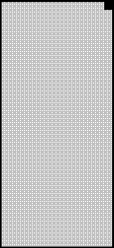
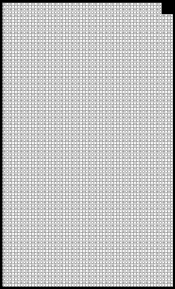
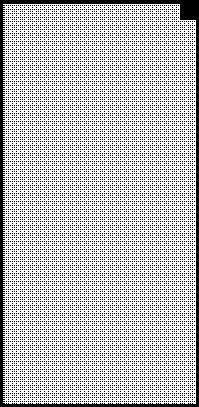

2022 EMILIA ROMAGNA GRAND PRIX

21 - 24 April 2022

From The FIA Formula One Race Director Document 44

To All Teams, All Officials Date 24 April 2022

Time 10:25

Title Race Director's Note - Post-Race Procedures

Description Race Director's Note - Post-Race Procedures

Enclosed EMI DOC 44 - Post-Race Procedures.pdf

Niels Wittich

The FIA Formula One Race Director

2022 E R G P MILIA OMAGNA RAND RIX

21 – 24 April 2022

From The FIA Formula One Race Director Document 44

To All Teams, All Officials Date 24 April 2022

Time 10:25

NOTE TO TEAMS: POST RACE INTERVIEW & PODIUM CEREMONY PROCEDURE

In addition to the provisions of the 2022 Formula 1 Sporting Regulations – Appendix 5 Podium Ceremony,

the Podium Ceremony procedure detailed below must be followed.

Post-Race Interview and Podium Ceremony Procedure:

 The master of ceremonies will be appointed by the FIA to conduct and take responsibility for the

entire podium ceremony.

 Drivers who finish the race in the top three positions will be required to return to Pit Lane where they

will find the boards showing positions from 1, 2, 3 in front of the Race Control Tower.

 Other than the team mechanics (with cooling fans if necessary), officials and FIA pre-approved

television crews and FIA approved photographers, no one else will be allowed in the designated

area at this time (no driver physios nor team PR personnel). At the sole discretion of the FIA Media

Delegate, the team-embedded photographer of the winning driver may also be permitted in the

designated area. All other approved photographers must remain outside of the designated area for

the duration of the Parc Fermé and Podium procedure.

 Competitors are reminded of Article 63.2 of the Sporting Regulations – “For the duration of the Post

Race Interviews and Podium Ceremony Procedure, the Drivers finishing in race in positions 1, 2, 3

must remain attired only in their Driving Suits, 'done up' to the neck, not opened to the waist.”

 Please note that there will be a slight change to the procedure starting from this event, and

drivers will be called immediately for their post-race interviews as soon as they get out of

their cars – there will not be any cool-down facilities in the Parc Fermé. The post-race interviews

will take place in the designated area, and the interviewer will be selected by the Commercial Rights

Holder.

 Drivers must not interfere with Parc Fermé protocols in any way.

 Once the interviews have been completed, the Drivers will be immediately escorted to the cool down

area on the first floor of the Race Control Tower, where they will be weighed by the FIA. Each Driver

must be fully attired while they are weighed (e.g.: Helmet, Gloves, etc.).

 Each Driver will be given their Pirelli Caps.

 The drivers will then be escorted to the permanent Podium area where the 1, 2, 3 Rostrum and Dias

will be located.

 When the Drivers are ready, an announcement for the Podium Ceremony will take place with the 3rd

and 2nd placed Drivers introduced to move to their respective Podium Dias steps.

 The Winning Driver will then be announced who will move to his position on the Podium.

1

 The National Anthems will then take place and flags will be displayed.

 Dignitaries will present the trophies on the podium as arranged by the Master of Ceremonies.

 The Trophy Presentations will take place in the following order:

o Winning Driver (On the Podium)

o A representative of the Winning Constructor (On the Podium)

o 2nd Place Driver (On the Podium)

o 3rd Place Driver (On the Podium)

 The Podium Celebrations will then take place.

 Following the Podium Ceremony, the top three (3) drivers will be escorted by the FIA Media Delegate

to the TV pen located at the pit entry end of the paddock where they may be accompanied by their

press officers.

 At the end of the TV pen, the top three (3) drivers will go to the FIA Press Conference, located on

the first floor of the Pit Garage Complex at the pit exit end of the paddock.

 Drivers from 4th and beyond must proceed directly to the TV pen immediately after they have been

weighed in the Parc Fermé, located in the FIA garage. Each Driver must remain fully attired until

after they have been weighed (e.g.: Helmet, Gloves, etc.).

 Any Driver from 4th and beyond who does not have a session for the written media organised after

the race must be available for interview at the written media zone adjacent to the TV pen once their

TV interviews have concluded.

 Drivers who retire during the race are required to go to the TV pen (and written media pen if they do

not have a session for the written media orgainised after the race) as soon as they have come back

into the paddock.

Please see the attached Post Race Podium Ceremony and Parc Fermé Diagram.

Niels Wittich

The FIA Formula 1 Race Director

2

2022 Emilia Romagna Grand Prix Parc Ferme - Race

Approved

photographers

waiting area

Podium

F1 Backdrop

2nd e c Remaining finishers n e 1st F parked here

TV RF Cameraman 3rd

Fence

Photographers

Version 1 – 21 April 2022
