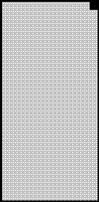
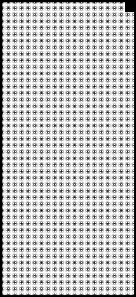

2022 EMILIA ROMAGNA GRAND PRIX

21 - 24 April 2022

From The FIA Formula One Race Director Document 34

To All Teams, All Officials Date 23 April 2022

Time 15:00

Title Race Director's Note - Post-Sprint Procedures

Description Race Director's Note - Post-Sprint Procedures

Enclosed EMI DOC 34 - Post-Sprint Procedures.pdf

Niels Wittich

The FIA Formula One Race Director

2022 E R G P MILIA OMAGNA RAND RIX

21 – 24 April 2022

From The FIA Formula One Race Director Document 34

To All Teams, All Officials Date 23 April 2022

Time 15:00

NOTE TO TEAMS: POST SPRINT PROCEDURE

The Post-Sprint interview procedure requires the top three (3) drivers to be interviewed in the Pit Lane

they have got out of their cars. Should either of your drivers be among the top three (3) at the end of the

Sprint we would like to ask for your co-operation in following the procedure below:

• Once they receive the chequered flag, Drivers who finish the Sprint in the top three (3) positions will be

required to return to the Pit Lane where they will find the boards showing positions from 1, 2, 3 located

at the pit entry.

• All remaining cars must enter Pit Lane and park in front of the FIA garages.

• Other than the team mechanics (with cooling fans if necessary), officials and FIA pre-approved

television crews and the four (4) FIA approved photographers, no one else will be allowed in the

designated area at this time (no driver physios nor team PR personnel). At the sole discretion of the

FIA Media Delegate, the team-embedded photographer of the pole position driver may also be

permitted in the designated area at this time.

 Once out of their cars, the top three (3) Drivers will be weighed by the FIA. Each Driver must remain

fully attired until after they have been weighed (e.g: Helmet, Gloves, etc).

 Drivers must not interfere with Parc Fermé protocols in any way.

 After the Drivers have been weighed, they will be escorted to the “Sprint Ceremony” area in the Pit

Lane. During the Sprint Ceremony, the Drivers will be interviewed and presented with their Sprint

awards.

 Once the interviews are concluded, the top three (3) Drivers will be escorted by the FIA Media Delegate

to the FIA Press Conference located on the first floor of the paddock building at the pit exit end of the

paddock.

 At the end of the FIA Press Conference, the top three (3) drivers will go to the TV pen, located at the

Pit Entry end of the Paddock behind the FIA Garages and they may be accompanied by their press

officers, who should wait to collect their drivers at the back of the press conference room.

 Drivers classified from 4th and beyond must proceed directly to the TV pen immediately after they have

been weighed in the Parc Fermé, located in the FIA garage. Each Driver must remain fully attired until

after they have been weighed (e.g.: Helmet, Gloves, etc.).

 Any Driver from 4th and beyond who does not have a virtual session for the written media organized

after the Sprint Qualifying session must be available for interviews at the written media zone adjacent

1

to the TV pen once their TV interviews have concluded.

 Drivers who retire during the Sprint Qualifying session are required to go to the TV pen and written

media zone as soon as they have come back into the paddock.

Niels Wittich

The FIA Formula One Race Director

2

2022 Emilia Romagna Grand Prix Parc Ferme - Sprint

Podium

Backdrop

2nd Remaining finishers

parked here 1st TV RF Cameraman

3rd

Photographers

Version 2 – 23 April 2022
