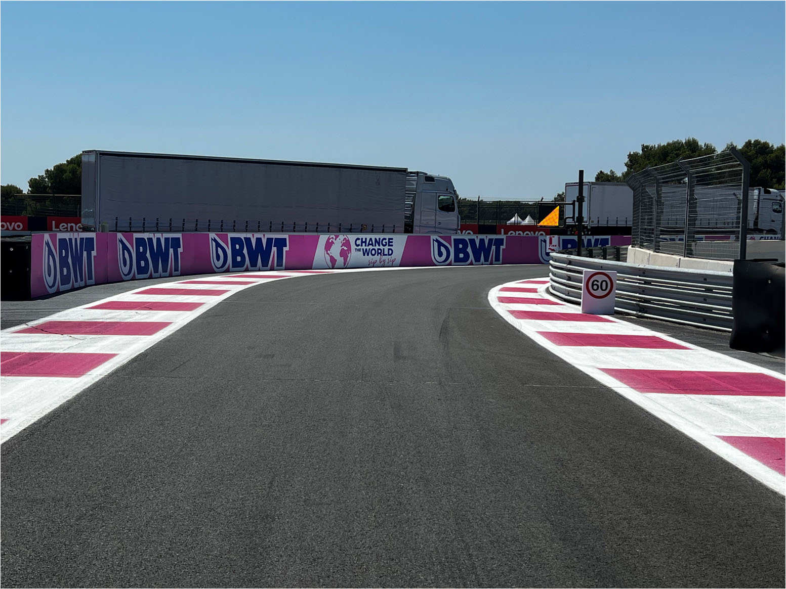
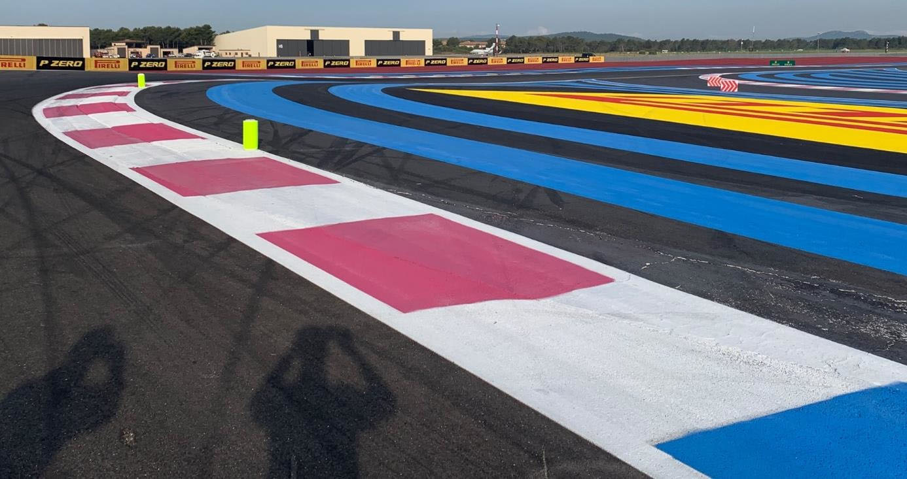
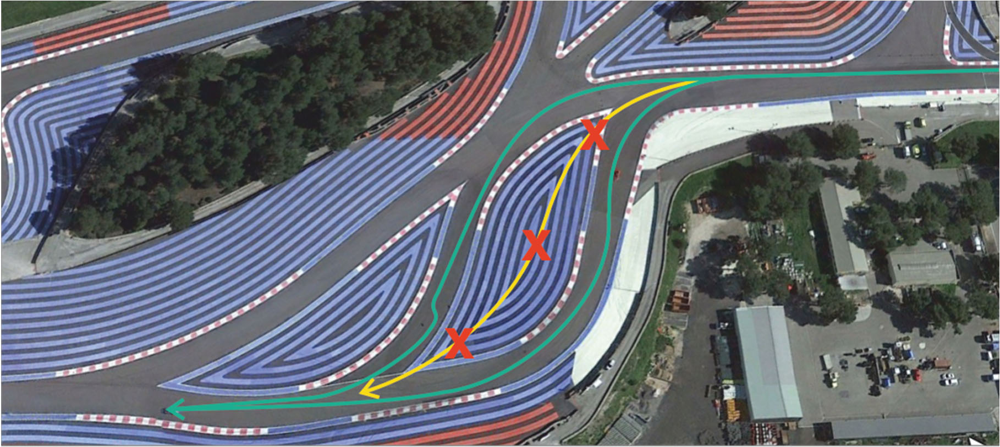
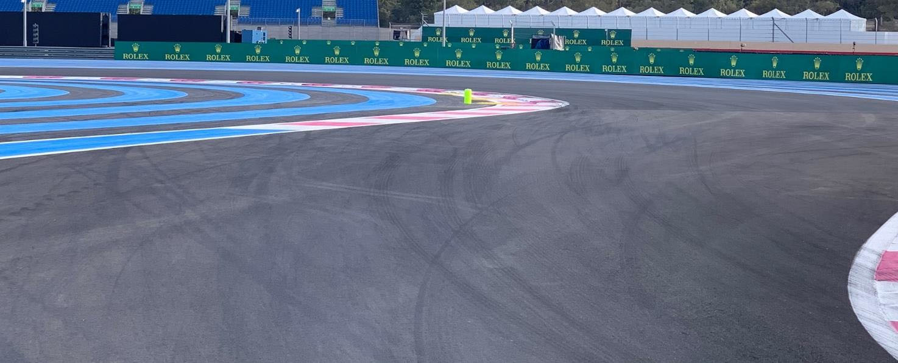
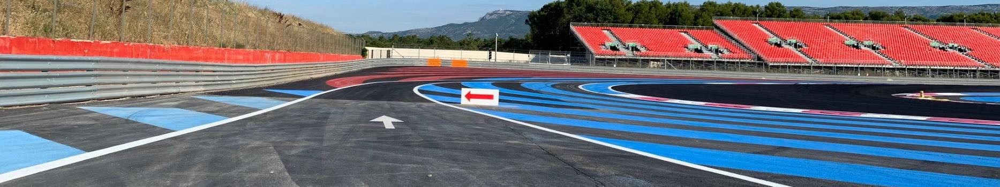
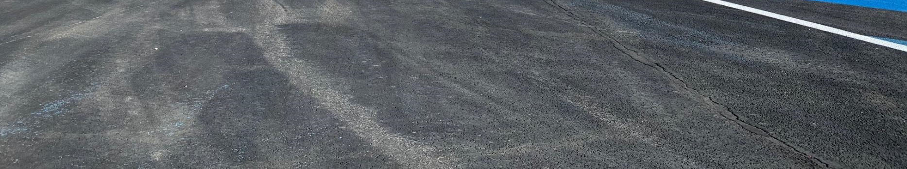
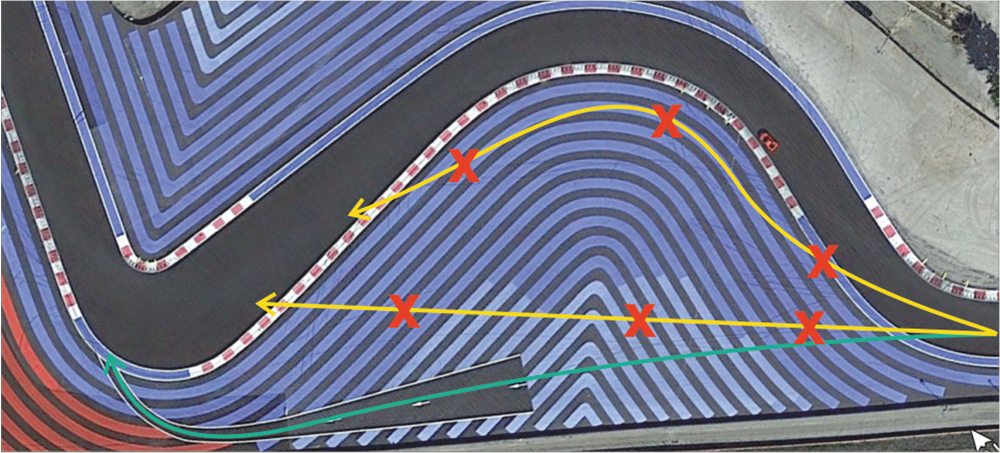

2022 FRENCH GRAND PRIX

21 - 24 July 2022

From The FIA Formula One Race Director Document 7

To All Teams, All Officials Date 21 July 2022

Time 18:30

Title Race Director's Event Notes

Description Race Director's Event Notes

Enclosed FRA DOC 7 - Event Notes.pdf

Eduardo Freitas

The FIA Formula One Race Director

2022 F G P RENCH RAND RIX

21 – 24 July 2022

From The FIA Formula One Race Director Document 7

To All Teams, All Officials Date 21 July 2022

Time 18:30

EVENT NOTES General Instructions

1) Track light panels

The FIA track light panels have been installed in the positions shown on the circuit map. In

accordance with Appendix H to the ISC the light signals have the same meaning as flag signals.

2) Drivers leaving their pit stop position in the pit lane

For safety reasons, no car should be driven from its pit stop position at any time unless:

a) It has first been driven into the pit stop position having just entered the pit lane from the track,

and;

b) It is then driven immediately back onto the track from the pit stop position.

3) Observing yellow flags during free practice and qualifying

3.1 Double waved: Any driver passing through a double waved yellow marshalling sector must reduce speed significantly and be prepared to change direction or stop. In order for the stewards to be

satisfied that any such driver has complied with these requirements it must be clear that he has not

attempted to set a meaningful lap time, for practical purposes any driver in a double yellow sector

will have that lap time deleted.

3.2 Single waved: Drivers should reduce their speed and be prepared to change direction. It must be clear that a driver has reduced speed and, in order for this to be clear, a driver would be expected

to have braked earlier and/or discernibly reduced speed in the relevant marshalling sector.

4) Laps during qualifying and reconnaissance laps

4.1 In order to ensure that cars are not driven unnecessarily slowly on in laps during and after the end of qualifying or during reconnaissance laps when the pit exit is opened for the sprint and the race,

drivers must stay below the maximum time set by the FIA between the Safety Car lines shown on

the pit lane map.

You will be informed of the maximum time after the second free practice session.

5) Article 55.14

(…) In order to avoid the likelihood of accidents before the safety car returns to the pits, from the

point at which the lights on the car are turned out drivers must proceed at a pace which involves no

erratic acceleration or braking nor any manoeuvre which is likely to endanger other drivers or impede

the restart.(…) 1

6) Parc Fermé Cameras

The Parc Fermé cameras must be uncovered and operational at all times during the Event.

7) Lapping during the race

The ISC requires drivers who are caught by another car about to lap him to allow the faster driver

past at the first available opportunity. The F1 Marshalling System has been developed in order to

ensure that the point at which a driver is shown blue flags is consistent, rather than trusting the ability

of marshals to identify situations that require blue flags.

The system will be set to give a pre-warning when the faster car is within 3.0s of the car about to be

lapped, this should be used by the team of the slower car to warn their driver he is soon going to be

lapped and that allowing the faster car through should be considered a priority. When the faster car

is within 1.2s of the car about to be lapped blue flags will be shown to the slower car (in addition to

blue light panels, blue cockpit lights and a message on the timing monitors) and the driver must allow

the following driver to overtake at the first available opportunity.

It should be noted that the aim of using F1MS is ensure consistent application of the rules, additional

instructions may also be given by race control when necessary.

Event Specific Instructions

8) Formula 1 Sporting Regulations Article 23.1

In accordance with the provisions of Article 23.1b), this Event is an Open Event.

9) Specific Technical Procedures

Please note that from 2022 the FIA have introduced an Appendix Index File which contains all the

relevant and active Appendix documents, Technical and Sporting Directives. The latest version of

this Index file (“2022 Formula 1 Appendix – iss 6 – 2022-05-16.xlsx”) and all relevant documents can

be found on the FIA SFTP site.

10) Support Races team barrier placement and Movements

Team barrier placement prior to and during all support category practice sessions and races: No

more than approximately two meters from the garages (white line painted in front of the frontal pit

shutter).

It is not permitted to push cars to the weighing area at any time a support category is in the pit lane.

Support Crews and Trolleys will be released into Pit Lane no earlier than 20 minutes prior to the

opening of Pit Exit for their respective sessions.

Support Category competition vehicles will be released from the marshalling area no earlier than 15

minutes prior to the opening of Pit Exit for their respective sessions.

2

11) Positioning of the car on track during Free Practices and Qualifying

In the event of fast approaching cars, drivers are permitted to go offline after Turn 12 and bear totally

to the left, until before Turn 14 to avoid any high-speed differential between the cars on track.

12) Practice starts

12.1 Practice starts may be carried out just before pit exit lights, on the right-hand side (in the slow lane of the second part of the pit lane) and for avoidance of doubt, this includes any time the pit exit is

open for the race.

12.2 Practice starts may be carried out on the track at the end of each free practice session. Any car on the track when the chequered flag is shown may then complete another lap and, instead of entering

the pits, proceed to the grid and carry out a practice start.

12.3 All drivers carrying out a practice start must do so by pulling as far forward on the grid as possible and, if necessary, should wait for others to carry out a start before getting to a grid position further

forward. Under no circumstances should a driver make a practice start if another car is still stationary

in front of him on the same side of the grid.

12.4 If any driver appears to be disregarding any of the above a red flag will be displayed and the possibility to carry out any further starts will be immediately terminated.

13) Lines at the Pit Entry and Pit Exit

13.1 In accordance with Chapter 4, Article 4 and 5 of Appendix L to the ISC drivers must follow the procedures at pit entry and pit exit.

13.2 Drivers leaving the track to enter the pit entry road, must pass on the right-hand side of the bollard placed on SC line 1.

13.3 At Pit Entry, after the 60km/h on drivers’ right hand-side there is a TSP. If this TSP displays a double waved yellow flag, it means that the segment of the pit entry road ahead is blocked. Consequently,

drivers should take extra care and prepare to stop if necessary. This TSP is to be disregarded by

the drivers on track.

3

14) Pit Lane Speed

As foreseen in Article 34.7 of the Sporting Regulations for this event the maximum speed in the pit

lane is amended to 60 km/h.

15) DRS

DRS Detection will be automatically disabled in each individual zone if any of the light panels in that

particular zone are displaying yellow. The zones and corresponding light panels are as follows:

a) DRS Activation 1: Panels 7, 8, 9

b) DRS Activation 2: Panels 18, 19, 1, 2

16) Track Limits

In accordance with the provisions of Article 33.3, the white lines define the track edges. During

Qualifying and the Race, each time a driver fails to negotiate with the exit of Turn 10, will result in

that lap time and the immediately following lap time being invalidated by the Stewards.

16.1 Turns 1 and 2

Any driver who fails to negotiate Turn 2 by using the track, and who passes completely to the right

of the first fluorescent yellow bollard on the apex of the corner, must keep completely to the right of

the fluorescent yellow bollard and re-join the track by driving through the two arrays of blocks in the

runoff by passing to the right of the first and to the left of the second.

4

16.2 Turns 3 – 5 Any driver who fails to negotiate Turn 4 by using the track, and who passes completely to the left of

the fluorescent yellow bollard on the apex of the corner, must keep completely to the left of the

fluorescent yellow bollard and re-join the track by driving to the left of the block in the runoff prior to

Turn 5.

BEAR LEFT TO RE-JOIN

AFTER APEX AT T5

5

16.3 Turns 8 and 9 Any driver going straight on at Turn 8 must re-join the track by driving through the four arrays of

blocks in the escape road, to the left of the first, to the right of the second, to the left of the third and

to the right of the fourth.

17) Fire extinguishers around the circuit

Indicated by white boards with a red fire extinguisher image attached to the debris fences and

barriers.

18) Places to remove cars from the track

Indicated by orange panels on the barriers. If it is safe to do so, ideally drivers should try to stop on

the left-hand side of the track. Please bear in mind that drivers should wear their overalls, gloves

and balaclava wen being transported back to the pits.

19) Finishing the Race

For the purposes of finishing the Race, pursuant to Article 59.1 of the FIA Formula One Sporting

Regulations, the “Line” referred to will be the Control Line on the track and not the Pit Lane.

20) Removing cars from the grid

Through the two gates in the pit wall adjacent to grid positions 1 and 16.

21) Race Suspension

In case of a race suspension, cars will be stopped in the fast lane of the pits in front of the pit exit

lights.

22) Car number light panels for the start

On the right-hand side of the grid.

23) Guest access to the grid

For the start of the race and after the end of the race, teams are responsible to ensure that guests

do not cross the teams’ garages and access the pit lane before all cars are on the grid or have

reached Parc Fermé.

6

24) Changes to the circuit

24.1 A gravel bed has been installed at the exit of T7.

24.2 A TSP dedicated to indicating the obstruction of the pit entry road has been installed.

24.3 The runoff at T2 was releveled.

Eduardo Freitas

The FIA Formula One Race Director

7
