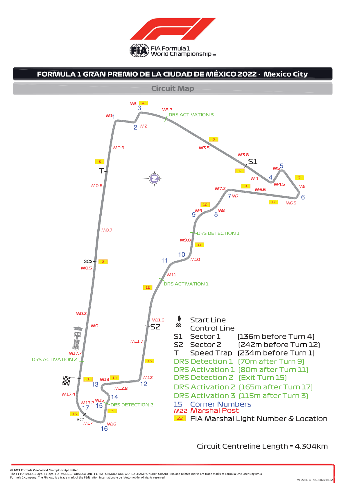
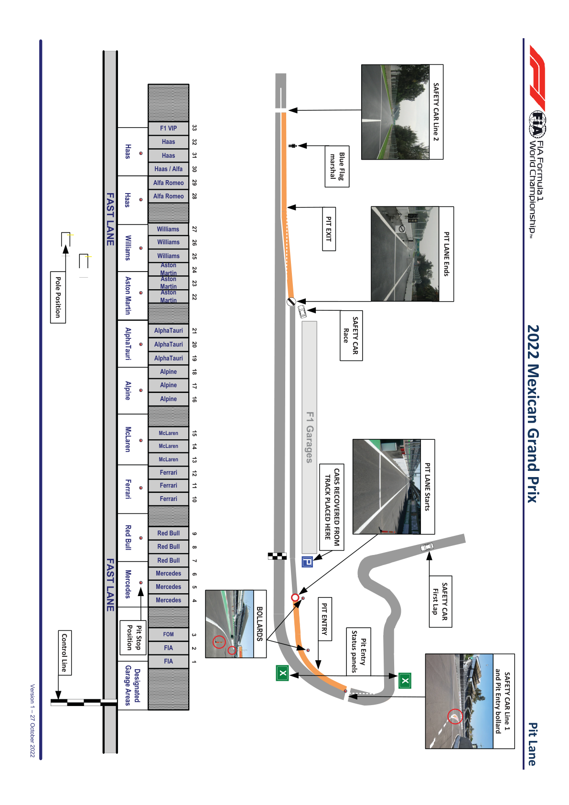
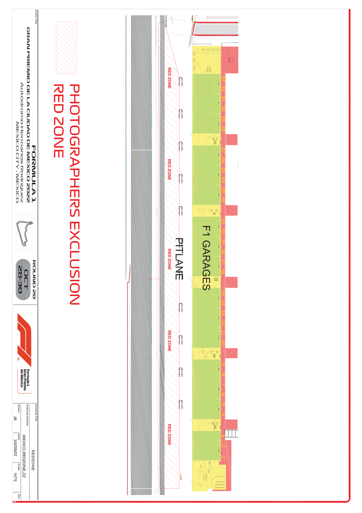

2022 MEXICAN GRAND PRIX

27 - 30 October 2022

From The FIA Formula One Race Director Document 2

To All Teams, All Officials Date 27 October 2022

Time 12:15

Title Event Notes - Circuit Map, Pit Lane Drawing and Red Zone

Description Event Notes - Circuit Map, Pit Lane Drawing and Red Zone

Enclosed MEX DOC 2 - Event Notes - Circuit Map and Pit Lane Drawing and Red Zone.pdf

Niels Wittich

The FIA Formula One Race Director

