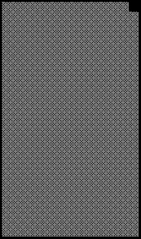

2022 SAUDI ARABIAN GRAND PRIX

24 - 27 March 2022

From The FIA Formula One Race Director Document 29

To All Teams, All Officials Date 26 March 2022

Time 16:10

Title Race Director's Note - Post-Qualifying Procedures

Description Race Director's Note - Post-Qualifying Procedures

Enclosed KSA DOC 29 - Race Director's Note - Post-Qualifying Procedures .pdf

Niels Wittich

The FIA Formula One Race Director

2022 S A G P AUDI RABIAN RAND RIX

24 – 27 March 2022

From The FIA Formula One Race Director Document 29

To All Teams, All Officials Date 26 March 2022

Time 16:10

NOTE TO TEAMS: POST QUALIFYING PROCEDURE

The Post-Qualifying interview procedure requires the top three (3) drivers to be interviewed on the Grid

once they have got out of their cars.

Should either of your drivers be among the top three (3) at the end of qualifying we would like to ask for

your co-operation in following the procedure below:

• If they take the chequered flag at the end of Q3, the fastest three (3) drivers should stay on the track

and proceed directly to the Grid, where the 1, 2, 3 boards which will be located in the vicinity of Grid

Position 23.

• Other than the team mechanics (with cooling fans if necessary), officials and FIA pre-approved

television crews and FIA approved photographers, no one else will be allowed in this designated area

at this time (no driver physios nor team PR personnel). At the sole discretion of the FIA Media Delegate,

the team-embedded photographer of the pole position driver may also be permitted in the designated

area at this time.

- Once out of their cars, the top three (3) Drivers will be weighed in the designated area by the FIA. Each

Driver must remain fully attired until after they have been weighed (e.g: Helmet, Gloves, etc).

• After the Drivers have been weighed, the Post-Qualifying interviews will take place in this designated

area. The interviewer will be selected by the Commercial Rights Holder.

• If one (1) of the top three (3) drivers is already in the Pit Lane at the end of the session, the team should

ensure that they go directly to the designated area once the other drivers have arrived there.

• At the end of the live interviews the drivers will be led to the backdrop in front of the FIA Garages for

the Top 3 and Pirelli Pole Position Award photo opportunities.

• The top three (3) drivers will then be escorted by the FIA Media Delegate to the FIA Press Conference

located on Media Island via golf buggy.

• At the end of the FIA Press Conference, the top three (3) drivers will be taken via golf buggy to the TV

pen, located at the pit entry end of the paddock and they may be accompanied by their press officers,

who should wait to collect their drivers at the back of the press conference room.

• Drivers eliminated in Q1 and Q2, drivers classified from 4th to 10th in Q3 and drivers who did not

participate to Q1 but are eligible to race must also attend the TV pen interview session after they have

been weighed by the FIA at the end of the last part of qualifying in which they participated.

• Any Driver classified from 4th and beyond who does not have a session for the written media organised

after Qualifying must be available for interviews at the written media zone adjacent to the TV pen once

their TV interviews have concluded.

1/3

Please see the attached Qualifying - Parc Fermé Diagram.

Niels Wittich

The FIA Formula One Race Director

2/3

gniyfilauQ

2202

hcraM muidoP 52– - emreF 1 noisreV

craP

llaW

tiP

xirP segarag

dnarG

maeT

namaremaC FR naibarA VT

ts 1 dr dn 3 2 noitisop iduaS

32

dirG 2202

AIF

pordkcaB AIF

llaW srac ereh tiP gniniameR dekrap
