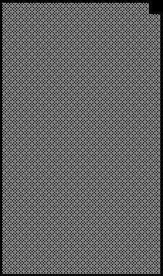

2022 SAUDI ARABIAN GRAND PRIX

24 - 27 March 2022

From The FIA Formula One Race Director Document 47

To All Teams, All Officials Date 27 March 2022

Time 17:35

Title Race Director's Note - Post-Race Procedures

Description Race Director's Note - Post-Race Procedures

Enclosed KSA DOC 47 - Race Director's Note - Post-Race Procedures.pdf

Niels Wittich

The FIA Formula One Race Director

2022 S A G P AUDI RABIAN RAND RIX

24 - 27 March 2022

From The FIA Formula One Race Director Document 47

To All Teams, All Officials Date 27 March 2022

Time 17:35

NOTE TO TEAMS: POST RACE INTERVIEW & PODIUM CEREMONY PROCEDURE

In addition to the provisions of the 2022 Formula 1 Sporting Regulations – Appendix 5 Podium Ceremony,

the Podium Ceremony procedure detailed below must be followed.

Post-Race Interview and Podium Ceremony Procedure:

- The master of ceremonies will be appointed by the FIA to conduct and take responsibility for the

entire podium ceremony.

- Drivers who finish the race in the top three positions will be required to return to Pit Lane where they

will find the boards showing positions from 1, 2, 3 at the Pit Exit end of the Pit Lane. The boards for

positions 2 and 3 will be located in front of the Podium, and the winning driver board will be positioned

on top of an LED floor directly in front of this. The winning driver must drive slowly onto this screen

and park in front of the position 1 board.

- Other than the team mechanics (with cooling fans if necessary), officials and FIA pre-approved

television crews and FIA approved photographers, no one else will be allowed in the designated

area at this time (no driver physios nor team PR personnel). At the sole discretion of the FIA Media

Delegate, the team-embedded photographer of the winning driver may also be permitted in the

designated area. All other approved photographers must remain outside of the designated area for

the duration of the Parc Fermé and Podium procedure.

- Once out of their cars, the top three Drivers will be weighed by the FIA near their cars. Each Driver

must remain fully attired until after they have been weighed (e.g.: Helmet, Gloves, etc.).

- Competitors are reminded of Article 63.2 of the Sporting Regulations – “For the duration of the Post

Race Interviews and Podium Ceremony Procedure, the Drivers finishing in race in positions 1, 2, 3

must remain attired only in their Driving Suits, 'done up' to the neck, not opened to the waist.”

- After the Drivers have been weighed, the post-race interviews will take place in this designated area,

and the interviewer will be selected by the Commercial Rights Holder.

- Drivers must not interfere with Parc Fermé protocols in any way.

- Once the interviews have been completed, the Drivers will be escorted to the cool down room, where

water and towels will be available.

- Each Driver will be given their Pirelli Caps.

- The drivers will then be escorted to the permanent Podium area where the 1, 2, 3 Rostrum and Dias

will be located.

- When the Drivers are ready, an announcement for the Podium Ceremony will take place with the 3rd

and 2nd placed Drivers introduced to move to their respective Podium Dias steps.

- The Winning Driver will then be announced who will move to his position on the Podium.

- The National Anthems will then take place and flags will be displayed.

- Dignitaries will present the trophies on the podium as arranged by the Master of Ceremonies.

1/3

- The Trophy Presentations will take place in the following order:

o Winning Driver (On the Podium)

o A representative of the Winning Constructor (On the Podium)

o 2nd Place Driver (On the Podium)

o 3rd Place Driver (On the Podium)

- The Podium Celebrations will then take place.

- Competitors are reminded of Article 63.3 of the Sporting Regulations – “For the duration of the TV

pen interviews and FIA Post Race Press Conference, all Drivers finishing must remain attired in their

respective teams’ uniform only.”

- Following the Podium Ceremony, the top three (3) drivers will be escorted by the FIA Media Delegate

to the TV pen located at the pit entry end of the paddock where they may be accompanied by their

press officers.

- At the end of the TV pen, the top three (3) drivers will go to the FIA Press Conference via golf buggy,

located on Media Island.

- Drivers classified from 4th and beyond must proceed directly to the TV pen immediately after they

have been weighed in the Parc Fermé, located in the FIA garage. Each Driver must remain fully

attired until after they have been weighed (e.g.: Helmet, Gloves, etc.).

- Any Driver classified from 4th and beyond who does not have a session for the written media

organized after the race must be available for interview at the written media zone adjacent to the TV

pen once their TV interviews have concluded.

- Drivers who retired during the race are required to go to the TV pen as soon as they have come back

into the paddock.

Please see the attached Post Race Podium Ceremony and Parc Fermé Diagram.

Niels Wittich

The FIA Formula One Race Director

2/3

ecaR

2202 - hcraM emreF pordkcaB 52– 1 noisreV craP namaremaC FR 1F VT

ecneF llaW ts dn dr 1 2 3 muidoP tiP

Fence xirP srehpargotohP devorppA aera gnitiaw

dnarG

saaH

naibarA

3/3 iduaS

2202 segarag

maeT

llaW AIF srac ereh tiP

gniniameR dekrap
