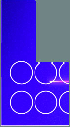
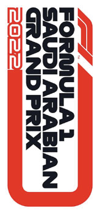

2022 SAUDI ARABIAN GRAND PRIX

24 - 27 March 2022

From The FIA Formula One Race Director Document 46

To All Teams, All Officials Date 27 March 2022

Time 17:21

Title Race Director's Note - Pre-Race Procedures

Description Race Director's Note - Pre-Race Procedures

Enclosed KSA DOC 46 - Race Director's Note - Pre-Race Procedures .pdf

Niels Wittich

The FIA Formula One Race Director

2021 S A G P AUDI RABIAN RAND RIX

24 – 27 March 2022

From The FIA Formula One Race Director Document 46

To All Teams, All Officials Date 27 March 2022

Time 17:20

NOTE TO TEAMS: PRE-RACE AND NATIONAL ANTHEM PROCEDURE

Please find below a summary of the requirements for the Pre-Race activities and National Anthem, which

must be followed in order to ensure the orderly running of these procedures.

19.43:00 Drivers move to National Anthem Position. For the duration of the National Anthem all Drivers

must remain attired only in their race suits.

19:44:00 The National Anthem.

Failure to comply with these procedures will be reported to the Stewards.

Please see the attached National Anthem Diagram.

Niels Wittich

The FIA Formula One Race Director

1/2

2/2
