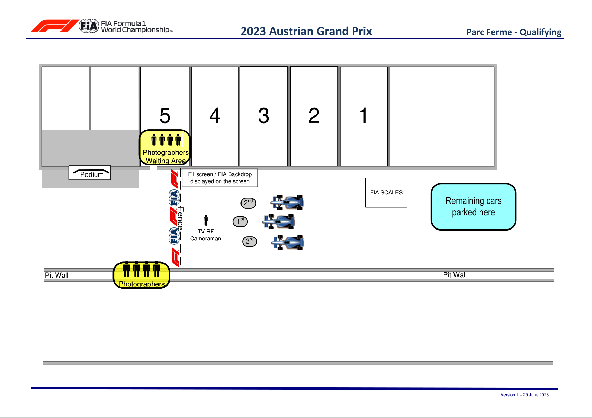

2023 AUSTRIAN GRAND PRIX

30 June - 02 July 2023

From The FIA Formula One Media Delegate Document 19

To All Teams, All Officials Date 30 June 2023

Time 14:50

Title Post-Qualifying Procedure

Description Post-Qualifying Procedure

Enclosed AUT DOC 19 - Post-Qualifying Procedures.pdf

Tom Wood

The FIA Formula One Media Delegate

2023 A G P USTRIAN RAND RIX

30 June – 02 July 2023

From The FIA Formula One Media Delegate Document 19

To All Officials, All Teams Date 30 June 2023

Time 14:50

NOTE TO TEAMS: POST QUALIFYING INTERVIEW PROCEDURE

The Post-Qualifying procedure requires the top three (3) drivers to be interviewed once they have got out

of their cars. Should either of your drivers be among the top three (3) at the end of qualifying we would like

to ask for your co-operation in ensuring the procedure below is followed:

• If they take the chequered flag at the end of Q3, the fastest three (3) drivers should return to the Pit

Lane where they will find the boards from 1,2,3 in front of the FIA garages.

• Other than the team mechanics (with cooling fans if necessary), officials and FIA pre-approved

television crews and the four (4) FIA approved photographers, no one else will be allowed in this

designated area at this time (no driver physios nor team PR personnel). At the sole discretion of

the FIA Media Delegate, the team-embedded photographer of the pole position driver may also be

permitted in the Parc Fermé area at this time.

• Once out of their cars, the top three (3) Drivers will be weighed by the FIA. Each Driver must remain

fully attired until after they have been weighed (e.g: Helmet, Gloves, etc).

• After the Drivers have been weighed, the Post-Qualifying interviews will take place in this designated

area. The interviewer will be selected by the Commercial Rights Holder.

• If any of the top three (3) drivers is in the Pit Lane at the end of the session, the team should ensure

that they go directly to the designated area once the other drivers have arrived there.

• At the end of the live interviews the drivers will be led to the backdrop for the Top 3 and Pirelli Award

photo opportunities.

• The top three (3) drivers will then conduct a pooled TV interview at the back of the FIA Garages. They

will then be escorted by the FIA Media Delegate to the FIA Press Conference located on the ground

floor of the media centre building on the opposite side of the track to the paddock.

• Drivers eliminated in Q1 and Q2, drivers classified from 4th to 10th in Q3 and drivers who did not

participate in Q1 but are eligible to race must also conduct a pooled TV interview immediately after they

have been weighed by the FIA at the end of the last part of qualifying in which they participated. This

will take place at the back of the FIA garage.

Please see the attached Qualifying - Parc Fermé Diagram.

1

Tom Wood

The FIA Formula One Media Delegate

2

