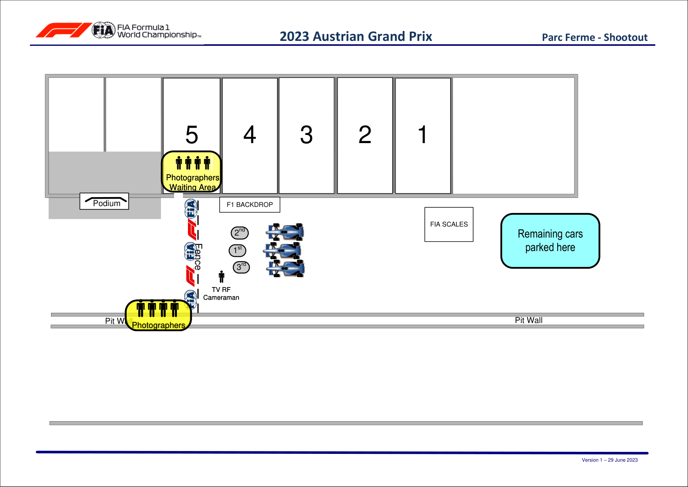

2023 AUSTRIAN GRAND PRIX

30 June - 02 July 2023

From The FIA Formula One Media Delegate Document 33

To All Teams, All Officials Date 01 July 2023

Time 12:10

Title Post-Sprint Shootout Procedure

Description Post-Sprint Shootout Procedure

Enclosed AUT DOC 33 - Post-Sprint Shootout Procedures.pdf

Tom Wood

The FIA Formula One Media Delegate

2023 A G P USTRIAN RAND RIX

30 June – 02 July 2023

From The FIA Formula One Media Delegate Document 33

To All Officials, All Teams Date 01 July 2023

Time 12:10

NOTE TO TEAMS: POST SPRINT SHOOTOUT INTERVIEW PROCEDURE

The Post-Sprint Shootout procedure requires the fastest driver to be interviewed once they have got out

of their car. We would like to ask for your co-operation in ensuring the procedure below is followed:

• If they take the chequered flag at the end of SQ3, the fastest three (3) drivers should return to the Pit

Lane where they will find the boards from 1,2,3 in front of the FIA Garages.

• Other than the team mechanics (with cooling fans if necessary), officials and FIA pre-approved

television crews and the four (4) FIA approved photographers, no one else will be allowed in this

designated area at this time (no driver physios nor team PR personnel). At the sole discretion of

the FIA Media Delegate, the team-embedded photographer of the pole position driver may also be

permitted in the Parc Fermé area at this time.

• Once out of their cars, the top three (3) Drivers will be weighed by the FIA. Each Driver must remain

fully attired until after they have been weighed (e.g: Helmet, Gloves, etc).

• After the Drivers have been weighed, the Post-Sprint Shootout interview with the fastest driver only will

take place in this designated area. The interviewer will be selected by the Commercial Rights Holder.

• If the fastest driver is in the Pit Lane at the end of the session, the team should ensure that they go

directly to the designated area once the other drivers have arrived there.

• At the end of the live interviews the fastest driver will be led to the backdrop for a Pirelli Award photo

opportunity.

• The top three (3) drivers will then conduct a pooled TV interview at the back of the FIA Garages. There

will be no Press Conference following the Sprint Shootout.

• Drivers eliminated in SQ1 and SQ2, drivers classified from 4th to 10th in SQ3 and drivers who did not

participate in SQ1 but are eligible to race must conduct a pooled TV interview immediately after they

have been weighed by the FIA at the end of the last part of the Sprint Shootout in which they

participated. This will take place directly behind the FIA garage.

Please see the attached Sprint Shootout - Parc Fermé Diagram.

Tom Wood

The FIA Formula One Media Delegate

1

