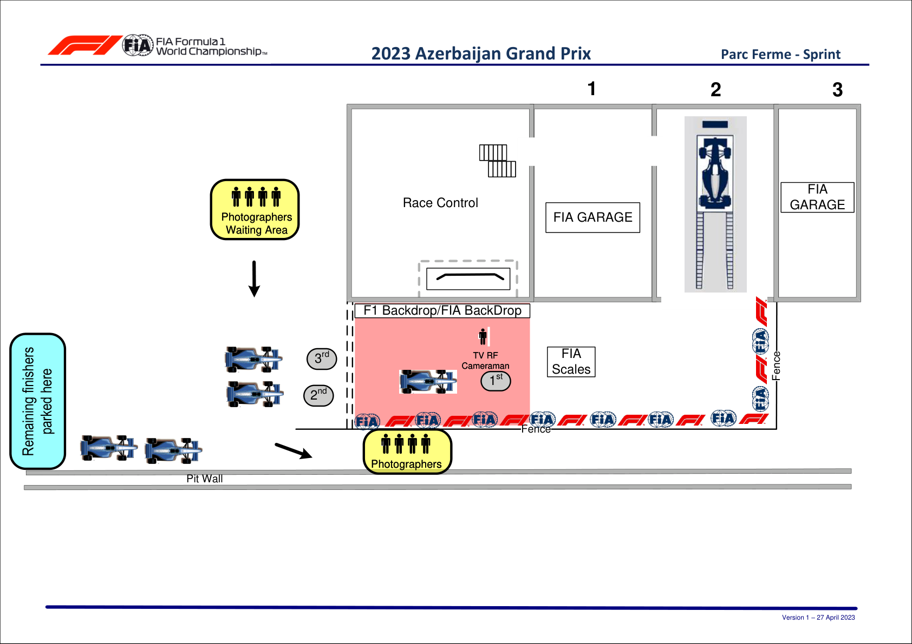

2023 AZERBAIJAN GRAND PRIX

28 - 30 April 2023

From The FIA Formula One Media Delegate Document 18

To All Teams, All Officials Date 28 April 2023

Time 15:20

Title Post-Sprint Procedure

Description Post-Sprint Procedure

Enclosed AZE DOC 18 - Post-Sprint Procedures.pdf

Tom Wood

The FIA Formula One Media Delegate

2023 A G P ZERBAIJAN RAND RIX

28 – 30 April 2023

From The FIA Formula One Media Delegate Document 18

To All Officials, All Teams Date 28 April 2023

Time 15:20

NOTE TO TEAMS: POST SPRINT INTERVIEW PROCEDURE

The Post-Sprint procedure requires the top three (3) drivers to be interviewed once they have got out of

their cars. Should either of your drivers be among the top three (3) at the end of the Sprint we would like

to ask for your co-operation in ensuring the procedure below is followed:

• After taking the chequered flag, the top three (3) drivers should return to the Pit Lane where they will

find the boards from 1,2,3.

• Other than the team mechanics (with cooling fans if necessary), officials and FIA pre-approved

television crews and the four (4) FIA approved photographers, no one else will be allowed in this

designated area at this time (no driver physios nor team PR personnel). At the sole discretion of

the FIA Media Delegate, the team-embedded photographer of the pole position driver may also be

permitted in the Parc Fermé area at this time.

• Once out of their cars, the top three (3) Drivers will be weighed by the FIA. Each Driver must remain

fully attired until after they have been weighed (e.g: Helmet, Gloves, etc).

• After the Drivers have been weighed, the Post-Sprint interviews will take place in this designated area.

The interviewer will be selected by the Commercial Rights Holder.

• The top three (3) drivers will then be escorted by the FIA Media Delegate to the FIA Press Conference

located on the first floor of the Hilton Hotel adjacent to the paddock.

• At the end of the FIA Press Conference, the top three (3) drivers will be taken to the TV pen, located in

at the Pit Entry end of the paddock, and they may be accompanied by their press officers, who should

wait to collect their drivers at the back of the Press Conference Room.

• Drivers from 4th and beyond must proceed directly to the TV pen after they have been weighed in the

Parc Fermé. Each Driver must remain fully attired until after they have been weighed (e.g.: Helmet,

Gloves, etc.).

• Any Driver from 4th and beyond who does not have a session for the written media organised after the

Sprint must be available for interview at the written media zone adjacent to the TV pen once their TV

interviews have concluded.

• Drivers who retire during the Sprint are required to go to the TV pen (and written media pen if they do

not have a session for the written media organised after the race) as soon as they have come back into

the paddock.

Please see the attached Qualifying - Parc Fermé Diagram.

1

Tom Wood

The FIA Formula One Media Delegate

2

