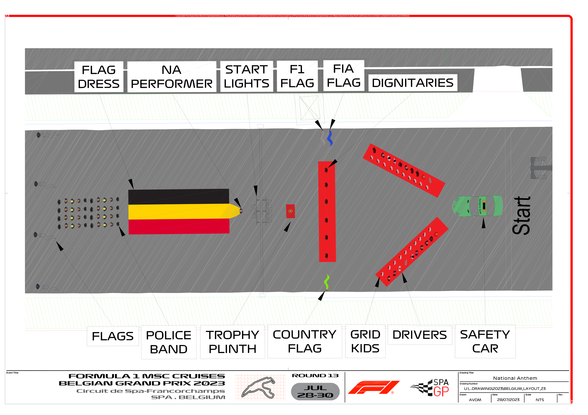

2023 BELGIAN GRAND PRIX

28 - 30 July 2023

From The FIA Formula One Media Delegate Document 53

To All Teams, All Officials Date 30 July 2023

Time 10:30

Title Pre-Race Procedure

Description Pre-Race Procedure

Enclosed BEL DOC 53 - Pre-Race Procedures.pdf

Tom Wood

The FIA Formula One Media Delegate

2023 B G P ELGIAN RAND RIX

28 – 30 July 2023

From The FIA Formula One Media Delegate Document 53

To All Officials, All Teams Date 30 July 2023

Time 10:30

NOTE TO TEAMS: PRE-RACE AND NATIONAL ANTHEM PROCEDURE

Please find below a summary of the requirements for the Pre-Race activities and National Anthem, which

must be followed in order to ensure the orderly running of these procedures.

14:44:00 Drivers move to National Anthem Position. For the duration of the National Anthem all Drivers

must remain attired only in their race suits.

14:46:00 The National Anthem.

Failure to comply with these procedures will be reported to the Stewards.

Please see the attached National Anthem Diagram.

Tom Wood

The FIA Formula One Media Delegate

1

