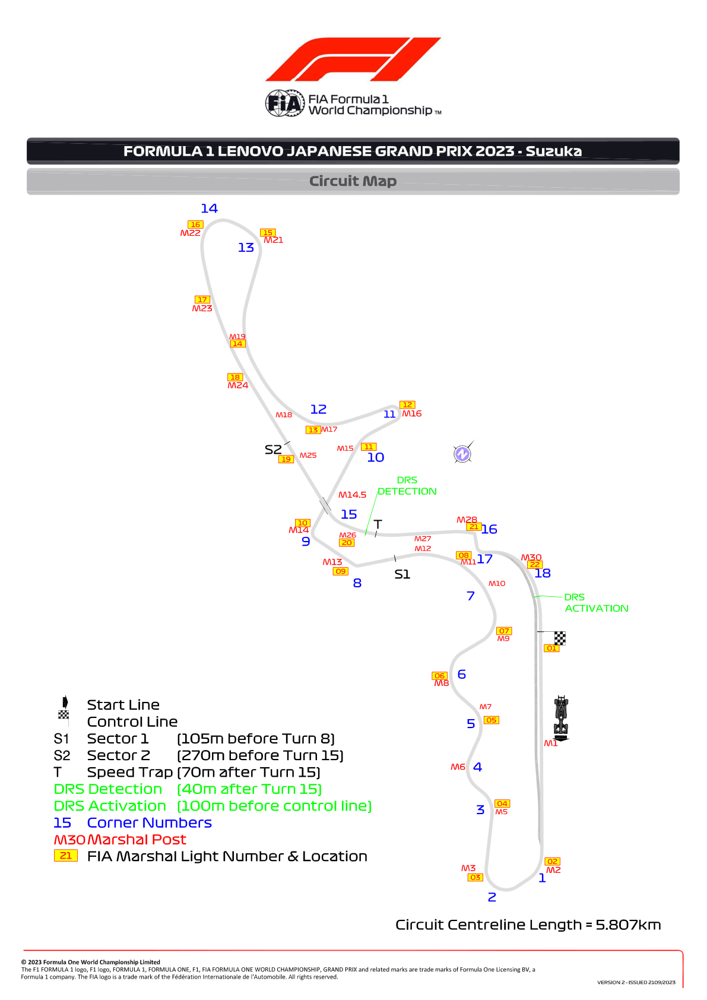
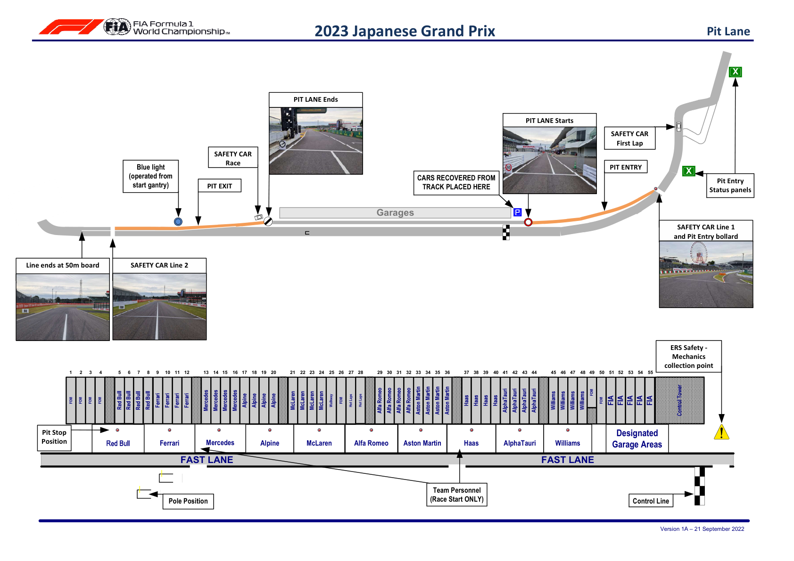
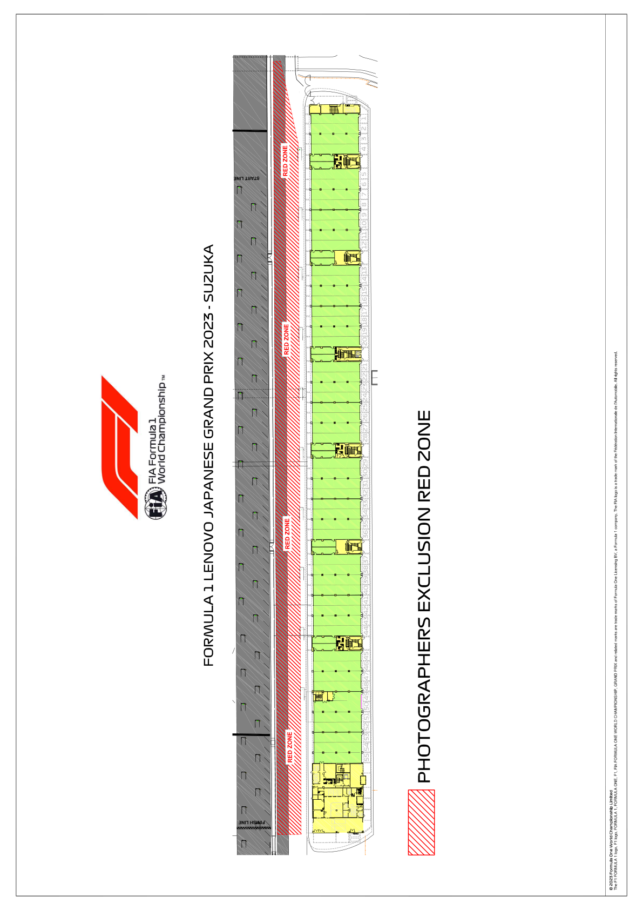

2023 JAPANESE GRAND PRIX

22 - 24 September 2023

From The FIA Formula One Race Director Document 2

To All Teams, All Officials Date 21 September 2023

Time 12:15

Title Event Notes - Circuit Map, Pit Lane Drawing and Red Zone

Description Circuit Map, Pit Lane Drawing and Red Zone

Enclosed JPN DOC 2 - Circuit Map Pit Lane and Red Zone.pdf

Niels Wittich

The FIA Formula One Race Director

