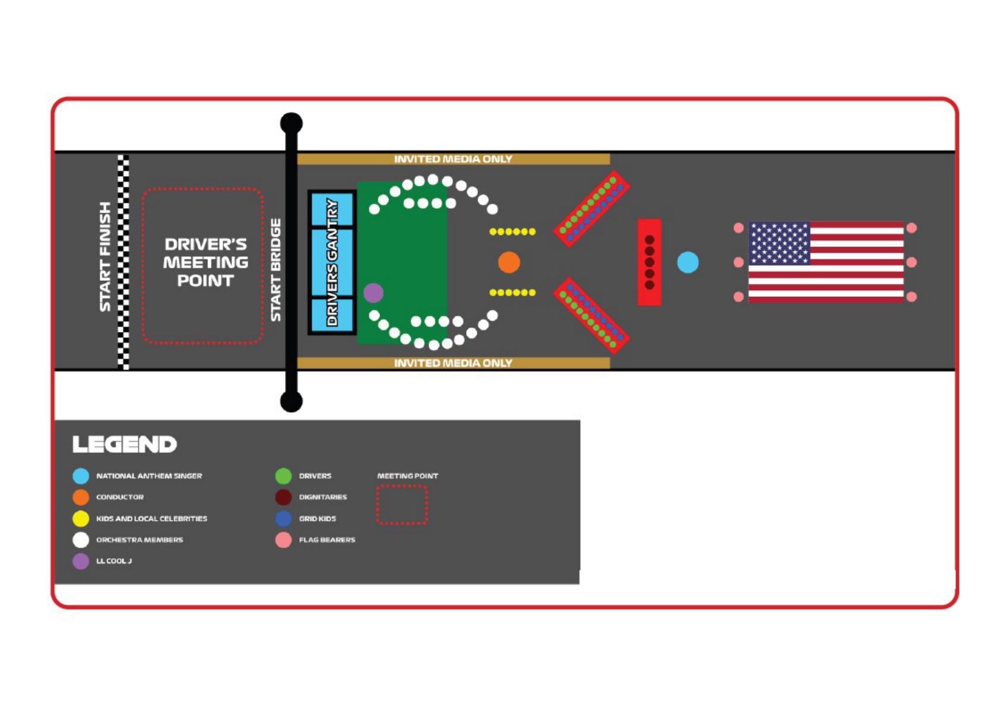

2023 MIAMI GRAND PRIX

05 - 07 May 2023

From The FIA Formula One Media Delegate Document 35

To All Teams, All Officials Date 06 May 2023

Time 19:50

Title Pre-Race Procedure

Description Pre-Race Procedure

Enclosed MIA DOC 35 - Pre-Race Procedures.pdf

Tom Wood

The FIA Formula One Media Delegate

2023 M G P IAMI RAND RIX

05 – 07 May 2023

From The FIA Formula One Media Delegate Document 35

To All Officials, All Teams Date 06 May 2023

Time 19:50

NOTE TO TEAMS: PRE-RACE AND NATIONAL ANTHEM PROCEDURE

Please find below a summary of the requirements for the Pre-Race activities and National Anthem, which

must be followed in order to ensure the orderly running of these procedures.

This race will feature a driver introduction ceremony organised by FOM. Drivers will be introduced and

then walk to a designated space as per the Start Grid Layout (attached). For the duration of the ceremony

and National Anthem all Drivers must remain attired only in their race suits.

There will then be a celebrity to introduce the national anthem and once the anthem is complete, drivers

will return to their cars. Please ensure your drivers are on standby at the times indicated below.

15:07:00 Logan Sargeant, Nyck de Vries, Kevin Magnussen, Alexander Albon

15:08:00 Yuki Tsunoda, Zhou Guanyu, Pierre Gasly, Esteban Ocon

15:09:00 Valtteri Bottas, Oscar Piastri, Nico Hulkenberg, Lando Norris

15:10:00 Lance Stroll, George Russell, Charles Leclerc, Carlos Sainz

15:11:00 Lewis Hamilton, Fernando Alonso, Sergio Perez, Max Verstappen

15:16:00 The National Anthem.

Failure to comply with these procedures will be reported to the Stewards.

Please see the attached National Anthem Diagram.

Tom Wood

The FIA Formula One Media Delegate

1

