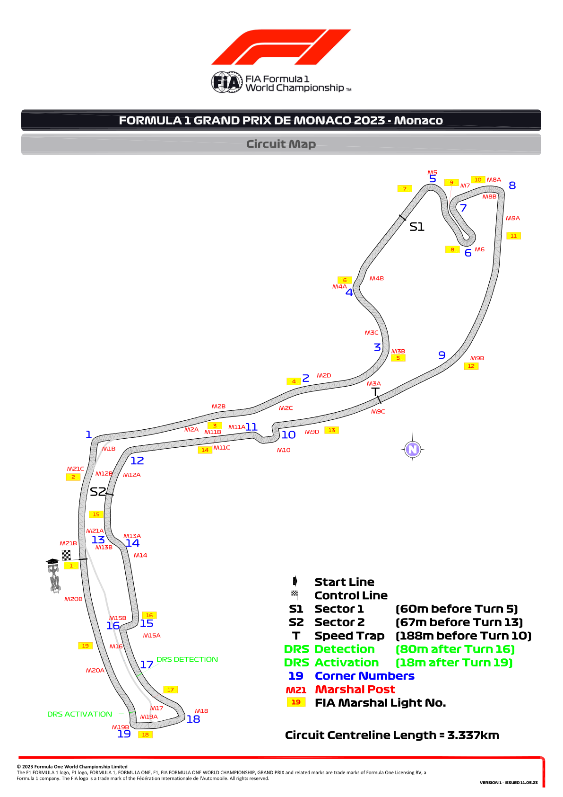
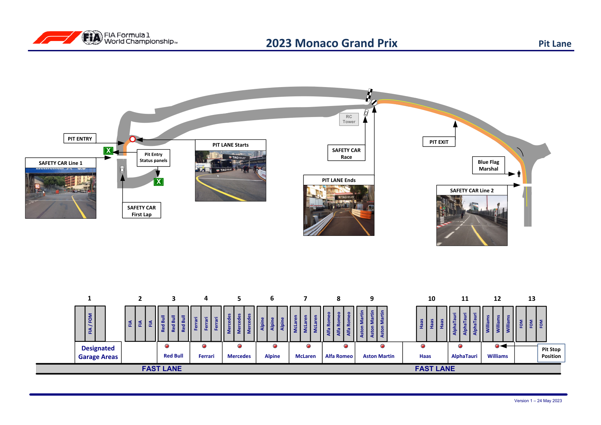
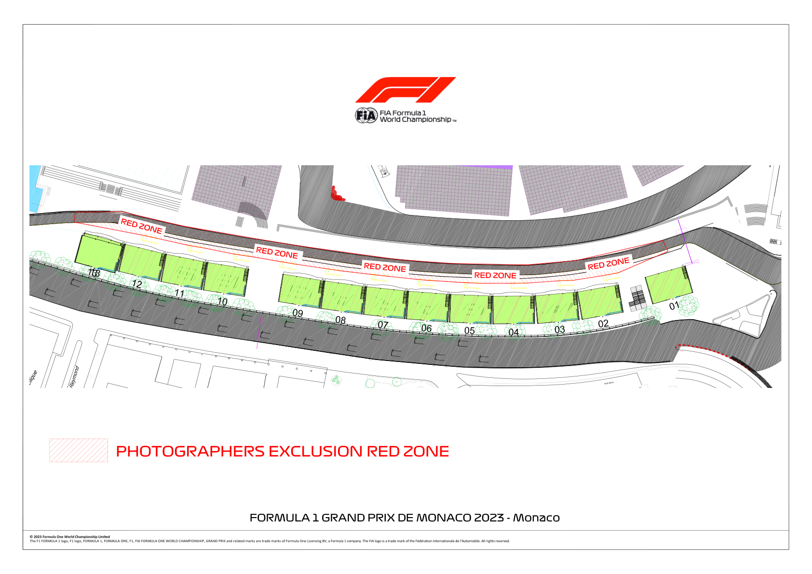
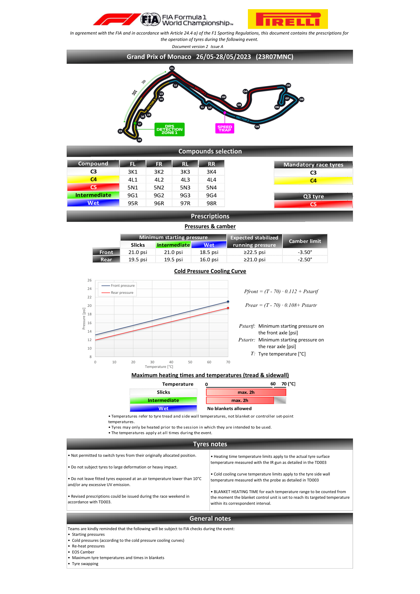

2023 MONACO GRAND PRIX

26 - 28 May 2023

From The FIA Formula One Race Director Document 3

To All Teams, All Officials Date 24 May 2023

Time 16:15

Title Event Notes - Circuit Map, Pit Lane, Red Zone and Pirelli Preview

Description Event Notes - Circuit Map, Pit Lane, Red Zone and Pirelli Preview

Enclosed MCO DOC 3 - Circuit Map Pit Lane Red Zone and Pirelli Preview.pdf

Niels Wittich

The FIA Formula One Race Director

