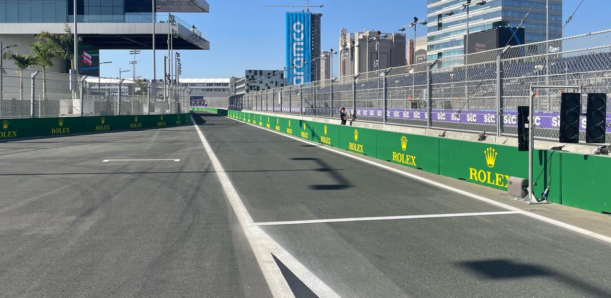
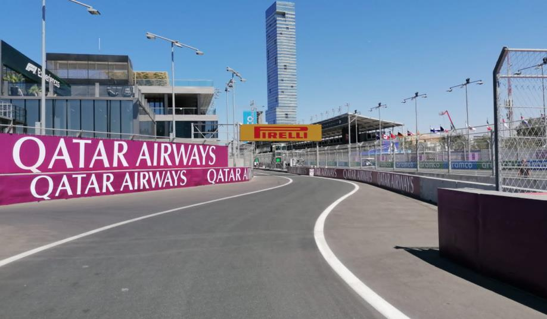

2023 SAUDI ARABIAN GRAND PRIX

17 - 19 March 2023

From The FIA Formula One Race Director Document 13

To All Teams, All Officials Date 17 March 2023

Time 14:45

Title Race Director's Event Notes V2

Description Race Director's Event Notes V2

Enclosed 2023 Saudi Arabian Grand Prix - Event Notes v2.pdf

Niels Wittich

The FIA Formula One Race Director

2023 S A G P AUDI RABIAN RAND RIX

17 – 19 March 2023

From The FIA Formula One Race Director Document 13

To All Officials, All Teams Date 17 March 2023

Time 14:45

EVENT NOTES V2 (Changes in light blue) General Instructions

1) Track light panels

The FIA track light panels have been installed in the positions shown on the circuit map. In

accordance with Appendix H to the ISC the light signals have the same meaning as flag signals.

2) Drivers leaving their pit stop position in the pit lane

For safety reasons, no car should be driven from its pit stop position at any time unless:

a) It has first been driven into the pit stop position having just entered the pit lane from the track,

and;

b) It is then driven immediately back onto the track from the pit stop position.

3) Observing yellow flags

3.1 Single waved: Drivers reduce their speed and be prepared to change direction. It must be clear that a driver has reduced speed and, in order for this to be clear, a driver would be expected to have

braked earlier and/or discernibly reduced speed in the relevant marshalling sector.

3.2 Double waved: Any driver passing through a double waved yellow marshalling sector must reduce speed significantly and be prepared to change direction or stop. In order for the stewards to be

satisfied that any such driver has complied with these requirements it must be clear that he has not

attempted to set a meaningful lap time. Furthermore, during qualifying any driver in a double yellow

sector will have that lap time cancelled.

4) Laps during qualifying and reconnaissance laps

4.1 In order to ensure that cars are not driven unnecessarily slowly on in laps during and after the end of qualifying or during reconnaissance laps when the pit exit is opened for the race, drivers must stay

below the maximum time set by the FIA between the Safety Car lines shown on the pit lane map.

You will be informed of the maximum time after the second free practice session.

5) Article 55.14

“In order to avoid the likelihood of accidents before the safety car returns to the pits, from the point

at which the lights on the car are turned out drivers must proceed at a pace which involves no erratic

acceleration or braking nor any manoeuvre which is likely to endanger other drivers or impede the

restart”.

1

6) Parc Fermé Cameras

The Parc Fermé cameras must be uncovered and operational at all times during the Event.

7) Lapping during the race

The ISC requires drivers who are caught by another car about to lap him to allow the faster driver

past at the first available opportunity. The F1 Marshalling System has been developed in order to

ensure that the point at which a driver is shown blue flags is consistent, rather than trusting the ability

of marshals to identify situations that require blue flags.

The system will be set to give a pre-warning when the faster car is within 3.0s of the car about to be

lapped, this should be used by the team of the slower car to warn their driver he is soon going to be

lapped and that allowing the faster car through should be considered a priority. When the faster car

is within 1.2s of the car about to be lapped blue flags will be shown to the slower car (in addition to

blue light panels, blue cockpit lights and a message on the timing monitors) and the driver must allow

the following driver to overtake at the first available opportunity.

It should be noted that the aim of using F1MS is ensure consistent application of the rules, additional

instructions may also be given by race control when necessary.

8) Article 19.4

In accordance with the provisions of Article 19.4 a), upon permission given by the Technical

Delegate, it is considered acceptable to connect the umbilical to the cars and close the HV

contactors (TR 5.26.5) for the sole purpose of checking the car ERS safety status, during the pre-

race car display period.

Event Specific Instructions

9) Formula 1 Sporting Regulations Article 23.1

In accordance with the provisions of Article 23.1 b), this Event is an Open Event.

10) FIA Outside Scales Times

Should the outside scales be set-up at the pit-lane entrance, these will be available for teams to use at any time outside the curfew times and the Parc Fermé cover-up times, except for the 30 minutes preceding the start of the Qualifying session and if there are support competitions using the pit lane.

11) Specific Technical Procedures

Please note that the FIA have introduced an Appendix Index File which contains all the relevant and

active Appendix documents, Technical and Sporting Directives. The latest version of this Index file

(“2023 Formula 1 Appendix – iss 2 – 2023-02-23.xlsx”) and all relevant documents can be found on

the FIA SFTP site.

2

12) Support Races team barrier placement and Movements

Team barrier placement prior to and during all support category practice sessions and races:

No more than two (2) metres from the garages. Please make sure that your pit stop gantry arms are

moved back towards garage during all Support Race Activity.

It is not permitted to push cars to the weighing area at any time a support category is in the pit lane.

Support Crews and Trolleys will be released into Pit Lane no earlier than 20 minutes prior to the

opening of Pit Exit for their respective sessions.

Support Category competition vehicles will be released from the marshalling area no earlier than 15

minutes prior to the opening of Pit Exit for their respective sessions.

13) Testing of Double Yellow Flag Delta during VSC after Free Practice 1 and 2

After all cars have taken the chequered flag, a Double Yellow Sector will be activated followed by a

preceding Single Yellow Sector. Approximately after 10 seconds VSC will be activated. This will be

active until all cars returned to the pit lane after carrying out their practice starts.

14) Positioning of the car on track during Free Practices and Qualifying

To help mitigate any differences in speed, cars on out or slow laps are requested to stay offline

where possible between Turns 18 and 20, and between Turns 25 and 27.

15) Practice starts

15.1 Practice starts may only be carried out on the asphalt on the LHS of the fast lane immediately after the pit exit line and, for the avoidance of doubt, this includes any time the pit exit is open for the race.

15.2 For reasons of safety and sporting equity, cars may not stop in the fast lane at any time the pit exit is open without a justifiable reason (a practice start is not considered a justifiable reason).

15.3 Additionally, practice starts may be carried out on the track at the end of each free practice session. Any car on the track when the chequered flag is shown may then complete another lap and, instead

of entering the pits, proceed to the grid and carry out a practice start.

15.4 All drivers carrying out a practice start must do so by pulling as far forward on the grid as possible and, if necessary, should wait for others to carry out a start before getting to a grid position further

forward. Under no circumstances should a driver make a practice start if another car is still stationary

in front of him on the same side of the grid.

15.5 If any driver appears to be disregarding any of the above a red flag will be displayed and the possibility to carry out any further starts will be immediately terminated.

3

16) Lines at the Pit Entry and Pit Exit

16.1 In accordance with Chapter 4, Article 4 and 6 of Appendix L to the ISC drivers must follow the procedures at pit entry and pit exit.

16.2 The dashed white line across pit entry and pit exit marks the track edge line.

16.3 Except in a case of force majeure (accepted as such by the Stewards), the crossing by any part of the tyre, in any direction, of the painted area between the pit entry and the track, by a driver is

prohibited.

16.4 For safety reasons drivers must keep to the right of the solid white line after the pit entry when they are entering the pits.

17) DRS

DRS Detection will be automatically disabled in each individual zone if any of the light panels in that

particular zone are displaying yellow. The zones and corresponding light panels are as follows:

a) DRS Activation 1: Panels 12, 13, 14

b) DRS Activation 2: Panels 16, 17, 18, 19

c) DRS Activation 3: Panels 20, 21, 1, 2

18) Track Limits

18.1 In accordance with the provisions of Article 33.3, the white lines define the track edges. During Qualifying and the Race, each time a driver fails to negotiate with the track limits, this will result in

that lap time being invalidated by the Stewards.

4

19) Fire extinguishers around the circuit

Indicated by white boards with a red letter “F” or a red fire extinguisher attached to the debris fences

and barriers.

20) Places to remove cars from the track

Indicated by fluorescent orange panels/paintings on the barriers.

21) Removing cars from the grid

Through the gates in the pit wall adjacent to grid positions 1, 13 and 24.

22) Race Suspension

In case of a race suspension, cars will be stopped in the fast lane of the pits in front of the pit exit

lights.

23) Car number light panels for the start

On the left-hand side of the grid.

24) Guest access to the grid

For the start of the race and after the end of the race, teams are responsible to ensure that guests

do not cross the teams’ garages and access the pit lane before all cars are on the grid or have

reached Parc Fermé.

25) Changes to the Circuit

• Turn 3: Painted kerb. • Turn 4: Steel plate removed. • Turn 5: The existing mobile steel kerb has been replaced by a permanent concrete bevelled kerb. At the back of the kerb an asphalt transmission has been constructed with not more than 4% inclination. • Turn 8: New alignment of wall, offset to old wall 7.80 m. • Turn 8: The existing mobile steel kerbs (apex and exit) have been replaced by a permanent concrete bevelled kerb. • Turn 10: New alignment of wall, offset to old wall 9.40 m. • Turn 10: The existing mobile steel kerbs (apex and exit) has been replaced by a permanent concrete bevelled kerb. • Turn 11: A row of grey TECPRO Barriers have been installed at the inside of Turn 11 exit on drivers left from the vehicle opening to the end of the track light posts. • Turn 11: A “Rumble strip” has been added behind to the verge at RHS. • Turn 14: New alignment of wall, offset to old wall 5.80 m. • Turn 14: Painted kerb and “rumble strip” has been added to the verge. • Turn 16: Steel plate removed. • Turn 17: The existing mobile steel kerb has been replaced by a permanent concrete bevelled kerb. • Turn 19: A painted kerb and “rumble line” has been added in the verge. • Turn 20: New alignment of wall, offset to old wall 3.70 m. • Turn 20: Painted kerb and “rumble strip” has been added to the verge. • Turn 21: Painted kerb and “rumble strip” has been added to the verge. • Turn 22: Steel plate removed. • Turn 22/23: Turn 22 starts approx. 10 m later, Turn 23 moved by approx. 5 m. The existing mobile steel kerbs have been replaced by a permanent concrete bevelled kerb. This is the only layout modification. • Turn 24: Steel plate removed.

5

Niels Wittich

The FIA Formula One Race Director

6
