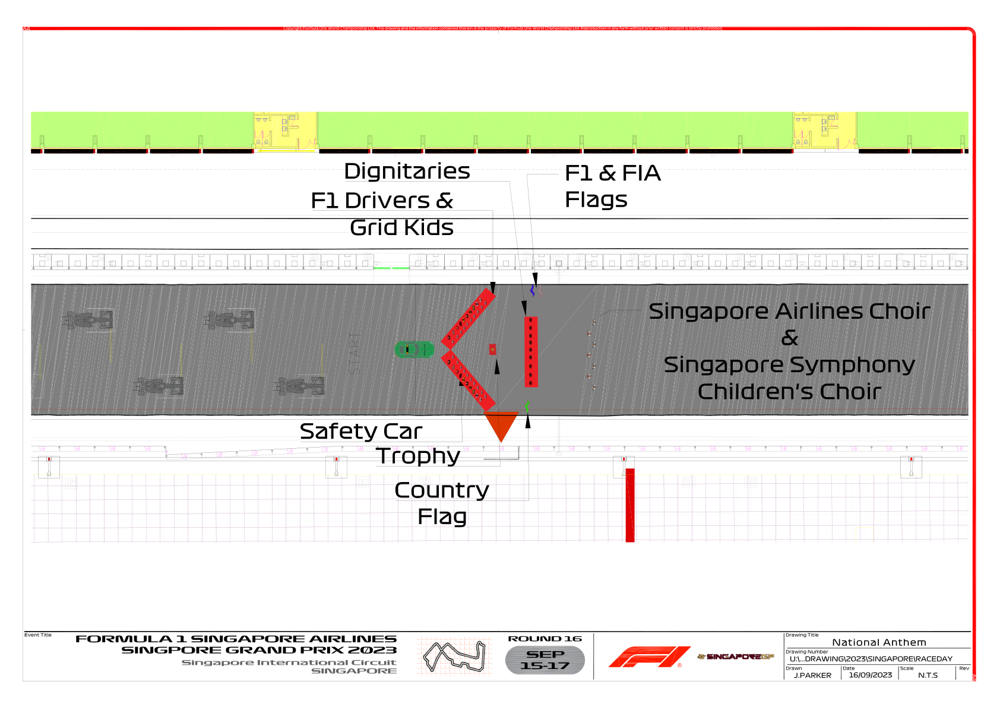

2023 SINGAPORE GRAND PRIX

15 - 17 September

From The FIA Formula One Media Delegate Document 36

To All Teams, All Officials Date 17 September 2023

Time 17:25

Title Pre-Race Procedure

Description Pre-Race Procedure

Enclosed SGP DOC 36 - Pre-Race Procedures.pdf

Tom Wood

The FIA Formula One Media Delegate

2023 S G P INGAPORE RAND RIX

15 – 17 September 2023

From The FIA Formula One Media Delegate Document 36

To All Officials, All Teams Date 17 September 2023

Time 17:25

NOTE TO TEAMS: PRE-RACE AND NATIONAL ANTHEM PROCEDURE

Please find below a summary of the requirements for the Pre-Race activities and National Anthem, which

must be followed in order to ensure the orderly running of these procedures.

19:44:00 Drivers move to National Anthem Position. For the duration of the National Anthem all Drivers

must remain attired only in their race suits.

19:45:00 Minute of Silence in Remembrance of the victims of the natural disasters in Morocco and Libya.

19:46:00 The National Anthem.

Failure to comply with these procedures will be reported to the Stewards.

Please see the attached National Anthem Diagram.

Tom Wood

The FIA Formula One Media Delegate

1

