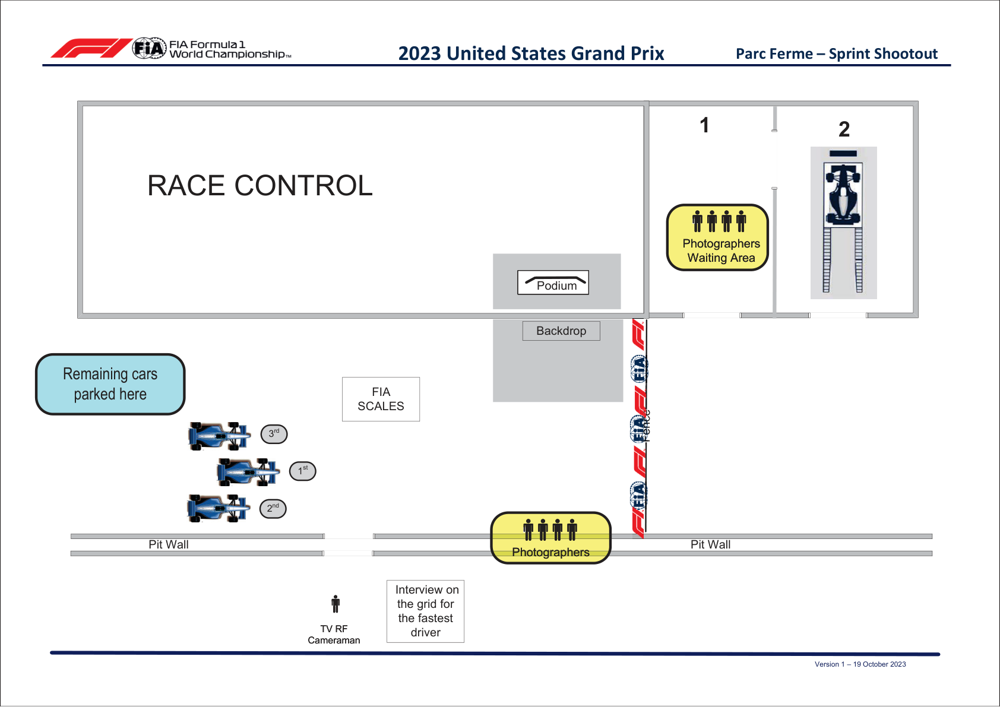

2023 UNITED STATES GRAND PRIX

20 - 22 October 2023

From The FIA Formula One Media Delegate Document 22

To All Teams, All Officials Date 21 October 2023

Time 08:10

Title Post-Sprint Shootout Procedure

Description Post-Sprint Shootout Procedure

Enclosed USA DOC 22 - Post-Sprint Shootout Procedures.pdf

Tom Wood

The FIA Formula One Media Delegate

2023 U S G P NITED TATES RAND RIX

20 – 22 October 2023

From The FIA Formula One Media Delegate Document 22

To All Officials, All Teams Date 21 October 2023

Time 08:10

NOTE TO TEAMS: POST SPRINT SHOOTOUT PROCEDURE

The Post-Sprint Shootout procedure requires the fastest driver to be interviewed once he has got out of

his car. We would like to ask for your co-operation in ensuring the procedure below is followed:

• If they take the chequered flag at the end of SQ3, the fastest three (3) drivers should return to the Pit

Lane where they will find the boards from 1,2,3 in front of Race Control.

• Other than the team mechanics (with cooling fans if necessary), officials and FIA pre-approved

television crews and the four (4) FIA approved photographers, no one else will be allowed in this

designated area at this time (no driver physios nor team PR personnel). At the sole discretion of

the FIA Media Delegate, the team-embedded photographer of the fastest driver may also be permitted

in the Parc Fermé area at this time.

- Once out of their cars, the top three (3) Drivers will be weighed by the FIA. Each Driver must remain

fully attired until after they have been weighed (e.g: Helmet, Gloves, etc).

• After the Drivers have been weighed, the Post-Sprint Shootout interview with the fastest driver only will

take place on the track. The interviewer will be selected by the Commercial Rights Holder.

• If the fastest driver is in the Pit Lane at the end of the session, the team should ensure that he goes

directly to the designated area once the other drivers have arrived there.

• At the end of the live interview the fastest driver will be led to the backdrop for a Pirelli Award photo

opportunity.

• The top three (3) drivers will then conduct a pooled TV interview at the back of the FIA Garages. There

will be no Press Conference following the Sprint Shootout.

• Drivers eliminated in SQ1 and SQ2, drivers classified from 4th to 10th in SQ3 and drivers who did not

participate in SQ1 but are eligible to race must conduct a pooled TV interview immediately after they

have been weighed by the FIA at the end of the last part of the Sprint Shootout in which they

participated. This will take place directly behind the FIA garage.

For drivers positioned outside the top three (3) at the end of Sprint Shootout we would like to remind you

of point 15 of the Race Director’s notes and ask for your co-operation in ensuring the procedure below is

followed:

• Any drivers who finished participating in the Sprint Shootout sessions after SQ1 and SQ2 must proceed

to the FIA scales through the pit lane immediately after they have returned to the team’s garage. The

drivers may not drink anything or do anything which increases their weight before it is recorded by the

FIA.

• Any driver, who stops on the track during the qualifying sessions and is not required to visit the Medical

1

Centre, must proceed to the FIA scales to get his weight recorded before returning to his team.

• Drivers who finish within the top 10 must proceed to the FIA scales immediately when out of their cars

without contact with any other person.

Please see the attached Sprint Shootout - Parc Fermé Diagram.

Tom Wood

The FIA Formula One Media Delegate

2

