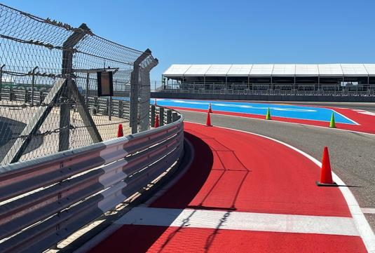

2023 UNITED STATES GRAND PRIX

20 - 22 October 2023

From The FIA Formula One Race Director Document 4

To All Teams, All Officials Date 19 October 2023

Time 15:20

Title Race Director's Event Notes

Description Race Director's Event Notes

Enclosed 2023 United States Grand Prix - Event Notes.pdf

Niels Wittich

The FIA Formula One Race Director

2023 U S G P NITED TATES RAND RIX

20 – 22 October 2023

From The FIA Formula One Race Director Document 4

To All Officials, All Teams Date 19 October 2023

Time 15:20

EVENT NOTE General Instructions

1) Track light panels

The FIA track light panels have been installed in the positions shown on the circuit map. In accordance with Appendix H to the ISC the light signals have the same meaning as flag signals.

2) Drivers leaving their pit stop position in the pit lane

For safety reasons, no car should be driven from its pit stop position at any time unless:

a) It has first been driven into the pit stop position having just entered the pit lane from the track, and; b) It is then driven immediately back onto the track from the pit stop position.

3) Observing yellow flags

3.1 Single waved: Drivers reduce their speed and be prepared to change direction. It must be clear that a driver has reduced speed and, in order for this to be clear, a driver would be expected to have braked earlier and/or discernibly reduced speed in the relevant marshalling sector.

3.2 Double waved: Any driver passing through a double waved yellow marshalling sector must reduce speed significantly and be prepared to change direction or stop. In order for the stewards to be satisfied that any such driver has complied with these requirements it must be clear that he has not attempted to set a meaningful lap time. Furthermore, during qualifying or the sprint shootout, any driver in a double yellow sector will have that lap time cancelled.

3.3 Double Waved during VSC or SC: Any driver passing through a double waved yellow marshalling sector during a VSC or SC, in addition to the requirements in 3.2 above, must remain positive of the SECU delta time in the sector concerned.

4) Laps during Qualifying, Sprint Shootout and Reconnaissance Laps

4.1 In order to ensure that cars are not driven unnecessarily slowly on in laps during and after the end of qualifying, shootout or during reconnaissance laps when the pit exit is opened for the race, drivers must stay below the maximum time set by the FIA between the Safety Car lines shown on the pit lane map.

Teams and Drivers will be informed of the maximum time after the first practice session.

4.2 For the safe and orderly conduct of the Event, other than in exceptional circumstances accepted as such by the Stewards, any driver that exceeds the maximum time from the Second Safety Car Line to the First Safety Car Line on ANY lap during and after the end of the qualifying session or sprint shootout, including in-laps and out-laps, may be deemed to be going unnecessarily slowly. For the avoidance of doubt, this does not supersede Article 33.4 and Article 37.5 of the FIA Formula One Sporting Regulations, which apply to the entire Circuit, furthermore this includes the pit lane as well.

1

Incidents will normally be investigated after the qualifying session or shootout.

5) Article 55.14

“In order to avoid the likelihood of accidents before the safety car returns to the pits, from the point at which the lights on the car are turned out drivers must proceed at a pace which involves no erratic acceleration or braking nor any manoeuvre which is likely to endanger other drivers or impede the restart”.

6) Parc Fermé

6.1 The Parc Fermé cameras must be always uncovered and operational during the Event. 6.2 No more than three (3) team personnel per car are permitted into the Parc Fermé area for the sole purpose of fitting cooling fans and any work required by the FIA.

7) Lapping during the sprint and the race

The ISC requires drivers who are caught by another car to allow the faster driver past at the first available opportunity. The F1 Marshalling System has been developed in order to ensure that the point at which a driver is shown blue flags is consistent, rather than trusting the ability of marshals to identify situations that require blue flags.

The system will be set to give a pre-warning when the faster car is within 3.0s of the car about to be lapped, this should be used by the team of the slower car to warn their driver he is soon going to be lapped and that allowing the faster car through should be considered a priority. When the faster car is within 1.2s of the car about to be lapped blue flags will be shown to the slower car (in addition to blue light panels, blue cockpit lights and a message on the timing monitors) and the driver must allow the following driver to overtake at the first available opportunity.

It should be noted that the aim of using F1MS is ensure consistent application of the rules, additional instructions may also be given by race control when necessary.

8) Article 19.4

In accordance with the provisions of Article 19.4 a), upon request by the Technical Delegate, the Teams are required to connect the umbilical to the cars and close the HV contactors (TR 5.26.5) for the sole purpose of checking the car ERS safety status, every morning immediately after the covers are removed and the cars are under parc fermé conditions. The umbilical must then remain connected, and the car powered up until the end of the pre-race car display period.

Event Specific Instructions

9) Formula 1 Sporting Regulations Article 23.1

In accordance with the provisions of Article 23.1 b), this Event is an Open Event.

10) FIA Outside Scales Times

Should the outside scales be set-up at the pit-lane entrance, these will be available for teams to use at any time outside the curfew times and the Parc Fermé cover-up times, except for the 30 minutes preceding the start of the Qualifying session and if there are support competitions using the pit lane.

2

11) Specific Technical Procedures

Please note that the FIA have introduced an Appendix Index File which contains all the relevant and active Appendix documents, Technical and Sporting Directives. The latest version of this Index file (“2023 Formula 1 Appendix – iss 4 – 2023-08-22.xlsx”) and all relevant documents can be found on the FIA SFTP site.

Competitors are hereby required to ensure compliance with these directives for the safe and orderly conduct of the Event.

12) Support Races team barrier placement and Movements

Team barrier placement prior to and during all support category practice sessions and races: On the white line on the second break in the concrete apron. Approximately ten (10) meters from the garages. It is not permitted to push cars to the weighing area at any time a support category is in the pit lane. Support Crews and Trolleys will be released into Pit Lane no earlier than 20 minutes prior to the opening of Pit Exit for their respective sessions. Support Category competition vehicles will be released from the marshalling area no earlier than 15 minutes prior to the opening of Pit Exit for their respective sessions.

13) Practice starts

13.1 During the Free Practice session and the reconnaissance lap(s) for the sprint and the race, practice starts may be only carried out on the LHS of the fast lane at the pit exit.

13.2 Additionally, practice starts may be carried out on the track after the end of the free practice session. Any car on the track when the chequered flag is shown may then complete another lap and, instead of entering the pits, proceed to the grid and carry out a practice start.

13.3 All drivers carrying out a practice start must do so by pulling as far forward on the grid as possible and, if necessary, should wait for others to carry out a start before getting to a grid position further forward. Under no circumstances should a driver make a practice start if another car is still stationary in front of him on the same side of the grid.

13.4 If any driver appears to be disregarding any of the above a red flag will be displayed and the possibility to carry out any further starts will be immediately terminated.

14) Lines at the Pit Entry and Pit Exit

14.1 In accordance with Chapter 4, Article 4 and 6 of Appendix L to the ISC drivers must follow the procedures at pit entry and pit exit.

14.2 At pit entry drivers must keep to the left of the bollard at the pit entry when they are entering the pits.

14.3 There is a small warning light on LHS at the pit entry which will be operated if a car is stopped or going slowly around the corner of the pit entry.

3

15) Post-Qualifying drivers weighing

Any driver who finished participating in the qualifying sessions after Q1 and Q2 must proceed through the pit lane directly to the FIA scales immediately after they have returned to their team’s garage. The drivers may not drink anything or do anything which increases their weight before it is recorded by the FIA. Any driver, who stops on the track during the qualifying sessions and is not required to visit the Medical Centre, must proceed to the FIA scales to get his weight recorded before returning to his team. Drivers who finish within the top 10 must proceed to the FIA scales immediately when out of their cars without contact with any other person.

16) DRS

DRS Detection will be automatically disabled in each individual zone if any of the light panels in that zone are displaying yellow. The zones and corresponding light panels are as follows:

a) DRS Activation 1: Panels 11, 12, 13, 14

b) DRS Activation 2: Panels 20, 1, 2, 3

17) Track Limits

In accordance with the provisions of Article 33.3, the white lines define the track edges. During Qualifying, Sprint Shootout, Sprint and the Race, each time a driver fails to negotiate with the track limits, this will result in that lap time being invalidated by the Stewards.

18) Fire extinguishers around the circuit

Indicated by white boards with a red letter “F” attached to the debris fences.

19) Places to remove cars from the track

Indicated by fluorescent orange panels/paintings on the barriers.

20) Removing cars from the grid

Cars may be removed from the grid through the gates adjacent to grid position 2 and 14.

21) Sprint or Race Suspension

In case of a sprint or race suspension, cars will be stopped in the fast lane of the pits in front of the pit exit lights.

22) Car number light panels for the start

On the left-hand side of the grid.

23) Guest access to the grid For the start of the race and after the end of the race, teams are responsible to ensure that guests do not cross the teams’ garages and access the pit lane before all cars are on the grid or have reached Parc Fermé.

24) Changes to the Circuit • Reduction of the width of the gravel trap in Turn 2 and realignment of guardrail. • Resurfacing entry Turn 12 until exit Turn 12. • Resurfacing from entry Turn 14 until exit Turn 16.

4

Niels Wittich

The FIA Formula One Race Director

5
