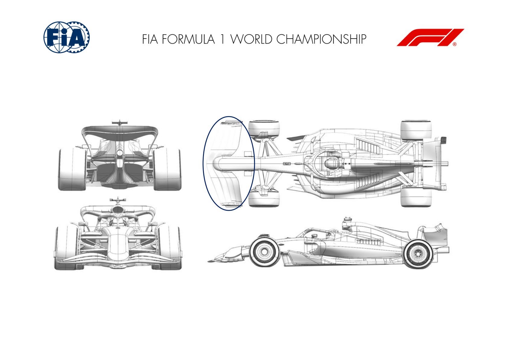
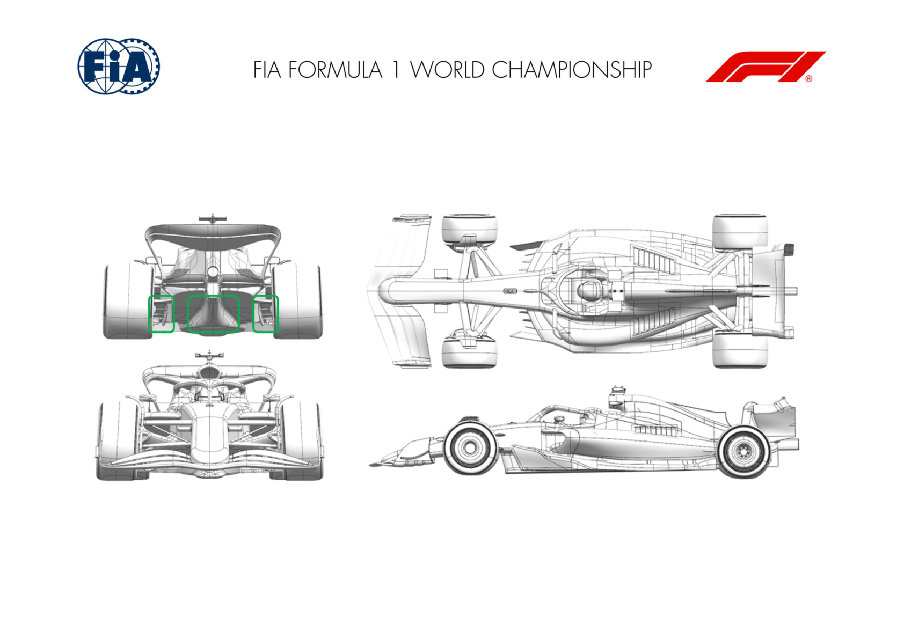

2024 ABU DHABI GRAND PRIX

06 - 08 December 2024

From The FIA Formula One Media Delegate Document 12

To All Teams, All Officials Date 06 December 2024

Time 10:54

Title Car Presentation Submissions

Description Car Presentation Submissions

Enclosed 2024 Abu Dhabi Grand Prix - Car Presentation Submissions.pdf

Roman De Lauw

The FIA Formula One Media Delegate

Car Presentation – R24 Abu Dhabi Grand Prix

Red Bull Racing

No updates submitted for this event.

Car Presentation – 2024 Abu Dhabi Grand Prix

*Mercedes-AMG PETRONAS F1 Team*

No updates submitted for this event.

Car Presentation – Abu Dhabi Grand Prix

*SCUDERIA FERRARI*

No updates submitted for this event.

Car Presentation – Abu Dhabi Grand Prix

McLaren Formula 1 Team

No updates submitted for this event.

Car Presentation – Abu Dhabi Grand Prix

Aston Martin Aramco F1 Team

No updates submitted for this event.

Car Presentation – Abu Dhabi Grand Prix

BWT Alpine F1 Team

No updates submitted for this event.

Car Presentation – Abu Dhabi Grand Prix

*Williams Racing*

No updates submitted for this event.

Car Presentation – Abu Dhabi Grand Prix

Visa Cash App RB

| No. | Updated component | Primary reason for update | Geometric differences | Description |
| --- | --- | --- | --- | --- |
| 1 | Front Wing | Performance - Flow Conditioning | New mainplane elements, flap & endplates | The loading distribution across the front wing is modified to promote better quality flow to the rest of the car. |

Car Presentation – Abu Dhabi Grand Prix

KICK Sauber F1 Team

| No. | Updated component | Primary reason for update | Geometric differences | Description |
| --- | --- | --- | --- | --- |
| 1 | Floor Body | Performance - Local Load | Adding volume to the rear floor body | the flow characteristics by reducing the losses in critical ride height conditions. |
| 2 | Rear Corner | Performance - Local Load | Repositioned rear brake duct lower deflector | The repositioned rear brake duct lower deflector is aiming to improve the rear tyre jet vortex control and increasing the overall efficiency of the diffuser. |

Car Presentation – 2024 Abu Dhabi Grand Prix

MONEYGRAM HAAS F1 TEAM

No updates submitted for this event.
