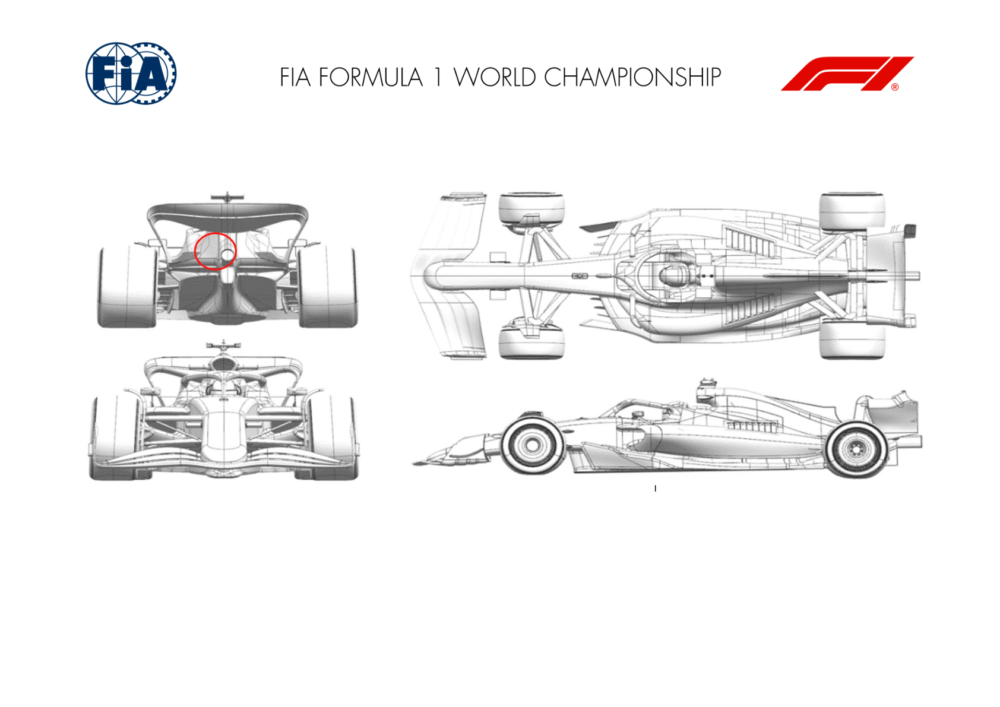
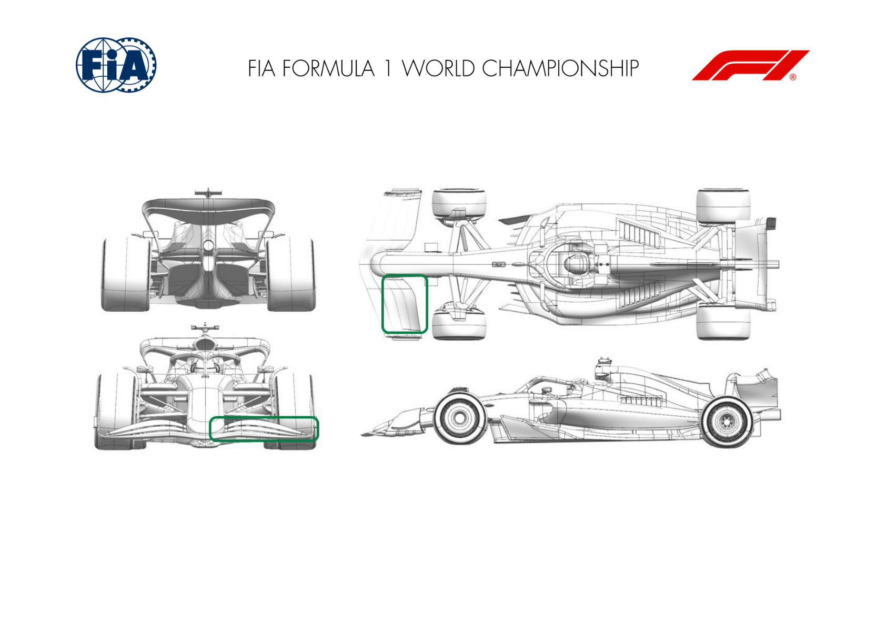
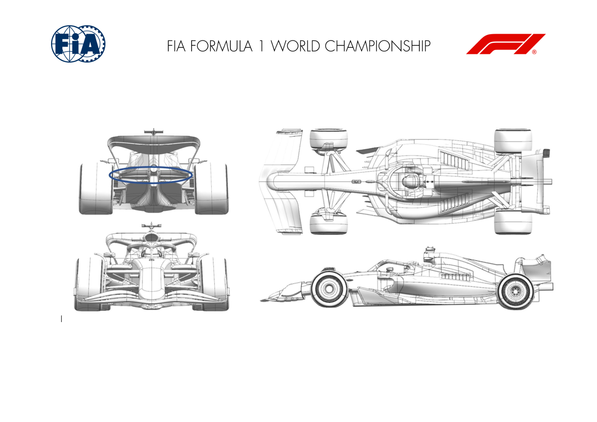
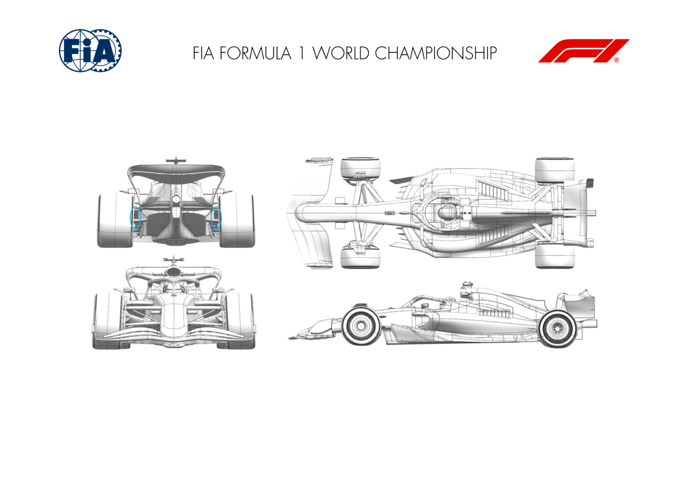
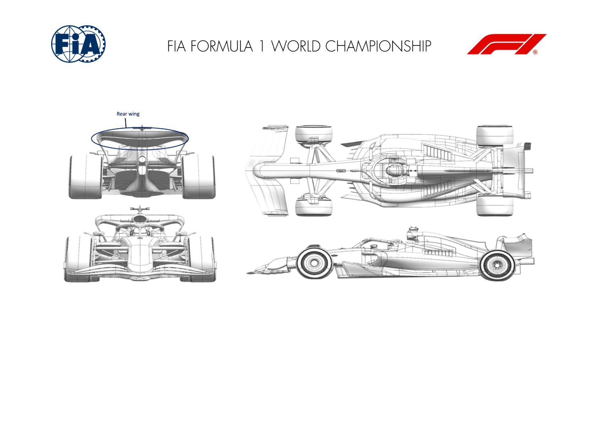
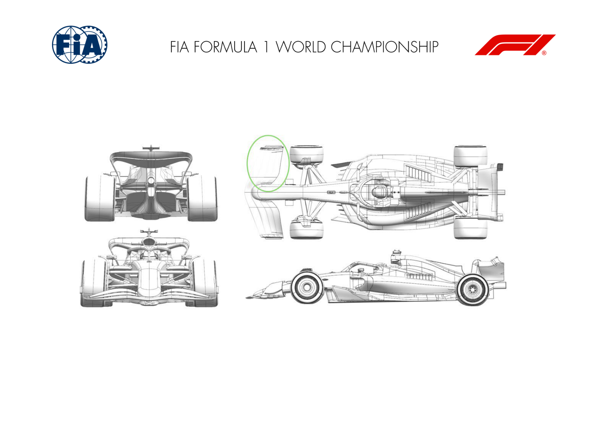

2024 AUSTRALIAN GRAND PRIX

22 - 24 March 2024

From The FIA Formula One Media Delegate Document 9

To All Teams, All Officials Date 22 March 2024

Time 10:24

Title Car Presentation Submissions

Description Car Presentation Submissions

Enclosed 24_AUS Car Presentation Submissions .pdf

Roman De Lauw

The FIA Formula One Media Delegate

CAR PRESENTATION – AUSTRALIAN GRAND PRIX

ORACLE RED BULL RACING

No updates submitted for this event.

MERCEDES-AMG PETRONAS FORMULA ONE TEAM

No updates submitted for this event.

SCUDERIA FERRARI

| No. | Updated component | Primary reason for update | Geometric differences | Description |
| --- | --- | --- | --- | --- |
| 1 | Rear Wing | Performance - Local Load | Addition of rear wing pylon side winglets | Not specific to the Albert Park circuit layout aerodynamic efficiency requirements, the addition of pylon winglets is a minor update and offers a small increase of local aerodynamic load. |

MCLAREN FORMULA 1 TEAM

No updates submitted for this event.

ASTON MARTIN ARAMCO FORMULA ONE TEAM

| No. | Updated component | Primary reason for update | Geometric differences | Description |
| --- | --- | --- | --- | --- |
| 1 | Front Wing | Performance - Local Load | The front wing flap has a revised twist distribution. | The revised twist changes the loading distribution across the span of the front wing for improved car performance. |

BWT ALPINE F1 TEAM

| No. | Updated component | Primary reason for update | Geometric differences | Description |
| --- | --- | --- | --- | --- |
| 1 | Beam Wing | Circuit specific - Drag Range | The single element beam wing component generates less downforce and drag than the biplane assembly due to the removal of the upper element. | This beam wing variant allows a further drag reduction if deemed optimum for overall lap time for a given circuit. |

WILLIAMS RACING

| No. | Updated component | Primary reason for update | Geometric differences | Description |
| --- | --- | --- | --- | --- |
| 1 | Rear Corner | Performance - Local Load | The exit scoop of the rear brake duct has changed in size. The length, position and camber of the winglet cluster that sits below the exit are all subtlely, and works correctly together. | The revised scoop/winglet system offers a small increase in local load and has also has a small effect to the local flow field. The additional load is result is a higher vertical load on the rear tyres. |

VISA CASH APP RB FORMULA ONE TEAM

| No. | Updated component | Primary reason for update | Geometric differences | Description |
| --- | --- | --- | --- | --- |
| 1 | Rear Wing |  | Performance - Local Load | Compared to Race 01, rear wing profiles have been redesigned to improve Cp profiles Improved efficient load generation & target drag level for event. |

KICK SAUBER F1 TEAM

| No. | Updated component | Primary reason for update | Geometric differences | Description |
| --- | --- | --- | --- | --- |
| 1 | Front Wing | Performance - Flow Conditioning | Redesigned third and fourth front wing elements | The redesigned front wing elements, in conjunction with the new endplate introduced in this race, improve the car's overall aerodynamic efficiency. |
| 2 | Front Wing Endplate | Performance - Flow Conditioning | Adjusted front wing endplate | The redesigned front wing enplates, in conjunction with the new elements introduced in this race, improve the car's overall aerodynamic efficiency. |

MONEYGRAM HAAS F1 TEAM

No updates submitted for this event.
