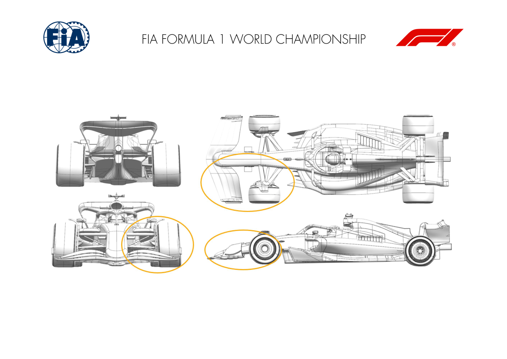

2024 AUSTRIAN GRAND PRIX

28 - 30 June 2024

From The FIA Formula One Media Delegate Document 6

To All Teams, All Officials Date 28 June 2024

Time 09:56

Title Car Presentation Submissions

Description Car Presentation Submissions

Enclosed 2024 Austrian Grand Prix - Car Presentation Submissions.pdf

Cameron Kelleher

The FIA Formula One Media Delegate

Car Presentation – Austrian Grand Prix

ORACLE RED BULL RACING

No updates submitted for this event.

MERCEDES-AMG PETRONAS FORMULA ONE TEAM

| No. | Updated component | Primary reason for update | Geometric differences | Description |
| --- | --- | --- | --- | --- |
| 1 | Beam Wing | Performance - Drag reduction | Decambered beam wing elements. | Reducing the beam wing element camber reduces load both locally and on the floor, resulting in less downforce and drag. |

SCUDERIA FERRARI

| No. | Updated component | Primary reason for update | Geometric differences | Description |
| --- | --- | --- | --- | --- |
| 1 | Cooling Louvres | Circuit specific - Cooling Range | Addition of extra cooling louvres panel | In anticipation of possible high ambient temperatures over the race week-end in Austria, an extra louvre option has be defined on the engine cover, increasing mass flow rate capacity but at an expense of aerodynamic efficiency |

MCLAREN FORMULA 1 TEAM

| No. | Updated component | Primary reason for update | Geometric differences | Description |
| --- | --- | --- | --- | --- |
| 1 | Front Wing | Performance - Flow Conditioning | New Front Wing geometry | The new Front Wing geometry improves flow Suspension geometry throughout various conditions resulting in improved aerodynamic load. |
| 2 | Front Suspension | Performance - Flow Conditioning | Updated Front Suspension | The new Front Suspension is designed around the new Front Wing geometry aimed at maximising the improved flow characteristics introduced with it. |

ASTON MARTIN ARAMCO FORMULA ONE TEAM

No updates submitted for this event.

BWT ALPINE F1 TEAM

No updates submitted for this event.

WILLIAMS RACING

No updates submitted for this event.

VISA CASH APP RB FORMULA ONE TEAM

| No. | Updated component | Primary reason for update | Geometric differences | Description |
| --- | --- | --- | --- | --- |
| 1 | Rear Corner | Performance - Flow Conditioning | The configuration of the winglets on the rear drum has been revised. | The winglets on the rear brake drum face generate load and help manage the flow at the back of the car. This update improves the performance of the flow conditioning elements. |

STAKE F1 TEAM KICK SAUBER

| No. | Updated component | Primary reason for update | Geometric differences | Description |
| --- | --- | --- | --- | --- |
| 1 | Beam Wing |  | Performance - Drag reduction | The new lower rear wing is our first single element lower rear wing of the season. The new lower rear wing has been introduced for the upcoming sprint weekend in Austria. The single element wing offers a small reduction in drag and will improve the aerodynamic efficiency of the car overall, in keeping with the requirements of the Austrian circuit and ones similar. |

MONEYGRAM HAAS F1 TEAM

No updates submitted for this event.
