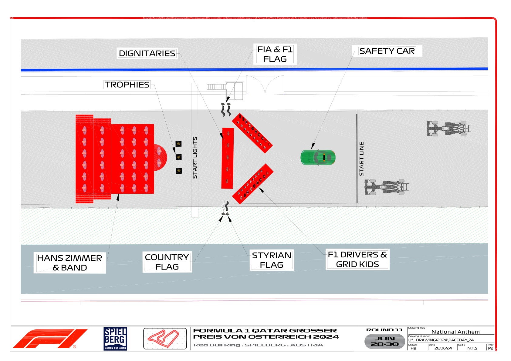

2024 AUSTRIAN GRAND PRIX

28 - 30 June 2024

From The FIA Formula One Media Delegate Document 60

To All Teams, All Officials Date 30 June 2024

Time 12:10

Title Pre-Race Procedure V2

Description Pre-Race Procedure V2

Enclosed 2024 Austrian Grand Prix - Pre-Race Procedure v2.pdf

Cameron Kelleher

The FIA Formula One Media Delegate

2024 AUSTRIAN GRAND PRIX

28 – 30 June 2024

From The FIA Formula One Media Delegate

To All Officials, All Teams Date 30 June 2024

Please find below a summary of the requirements for the Pre-Race activities and National Anthem, which must be followed in order to ensure the orderly running of these procedures.

14:44:00 Drivers move to National Anthem Position. For the duration of the National Anthem all Drivers must remain attired only in their race suits.

14:46:00 The National Anthem.

Failure to comply with these procedures will be reported to the Stewards. Please see the attached National Anthem Diagram.

Cameron Kelleher

The FIA Formula One Media Delegate

1

