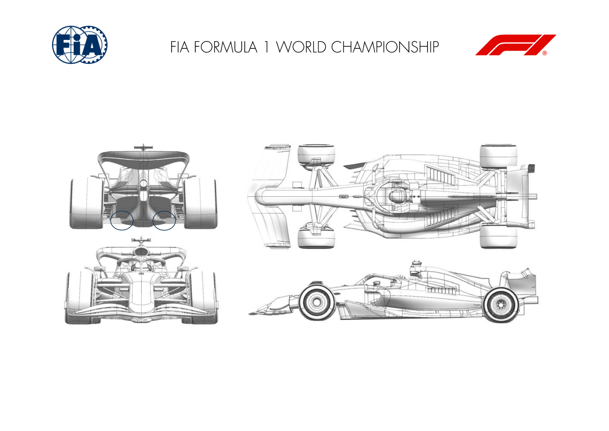

2024 AZERBAIJAN GRAND PRIX

13 - 15 September 2024

From The FIA Formula One Media Delegate Document 9

To All Teams, All Officials Date 13 September 2024

Time 10:52

Title Car Presentation Submissions

Description Car Presentation Submissions

Enclosed 2024 Azerbaijan Grand Prix - Car Presentation Submissions.pdf

Roman De Lauw

The FIA Formula One Media Delegate

Car Presentation – Azerbaijan Grand Prix

Red Bull Racing

| No. | Updated component | Primary reason for update | Geometric differences | Description |
| --- | --- | --- | --- | --- |
| 1 | Floor Body | Performance - Flow Conditioning | Floor tunnel geometry subtly revised by locally raising or lowering the surfaces. | Changes applied to improve the pressure gradients along the floor to improve the flow locally and downstream in all conditions. |

Car Presentation – Azerbaijan Grand Prix

Mercedes-AMG PETRONAS F1 Team

No updates submitted for this event.

Car Presentation – Azerbaijan Grand Prix

Scuderia Ferrari

No updates submitted for this event.

Car Presentation – Azerbaijan Grand Prix

McLaren Formula 1 Team

No updates submitted for this event.

Car Presentation – Azerbaijan Grand Prix

Aston Martin Aramco F1 Team

| No. | Updated component | Primary reason for update | Geometric differences | Description |
| --- | --- | --- | --- | --- |
| 1 | Rear Corner | Performance - Local Load | The trim to the bottom edge of the lower deflector has been revised. | The revised lower deflector bottom edge geometry modifies the local flowfield around the rear part of the floor improving its performance. |

Car Presentation – Azerbaijan Grand Prix

BWT Alpine F1 Team

No updates submitted for this event.

Car Presentation – Azerbaijan Grand Prix

Williams Racing

No updates submitted for this event.

Car Presentation – Azerbaijan Grand Prix

Visa Cash App RB

| No. | Updated component | Primary reason for update | Geometric differences | Description |
| --- | --- | --- | --- | --- |
| 1 | Front Wing | Circuit specific - Balance Range | Reduced camber flap compared to previous low- balance components. | This less cambered front flap reduces the amount of overall load generated by the front wing assembly, to efficiently balance the car at circuits which are both low-drag and low-balance. |

Front wing

Car Presentation – Azerbaijan Grand Prix

Stake F1 Team KICK Sauber

No updates submitted for this event.

Car Presentation – Azerbaijan Grand Prix

Moneygram Haas F1 Team

No updates submitted for this event.
